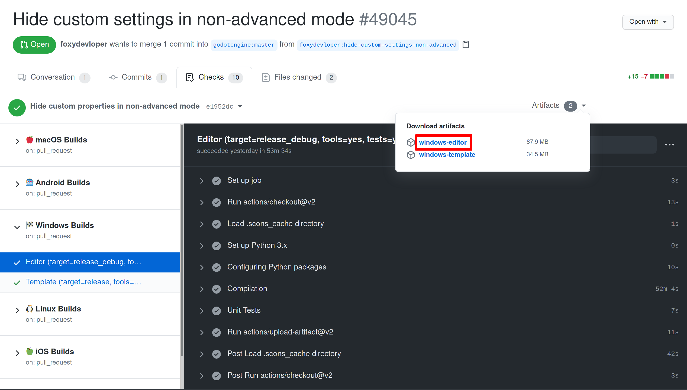
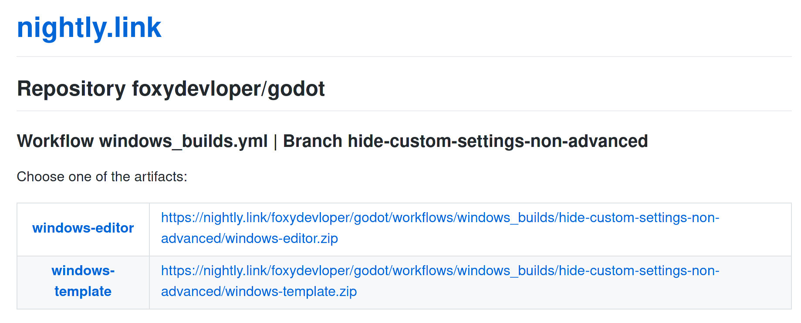

Testing pull requests
=====================

Many people are developing new features or fixing bugs on GitHub.
To help with engine development, you may be asked to test those pull requests
with a Godot build that includes code from the pull request in question.

Thanks to GitHub Actions, all `pull requests ( https://github.com/godotengine/godot/pulls )`
have continuous builds available. These builds let you try out pull requests
without having to compile anything from source.

Downloading a compiled build
----------------------------

You can download pull request builds from GitHub Actions. Since only signed in
users may download builds directly from GitHub Actions, the procedure varies
depending on whether you have a GitHub account or not.

.. note::

    Due to a GitHub Actions limitation, builds are only available for 90 days
    after the pull request was last updated. If you still wish to try a
    pull request locally, you can
    `compile the pull request branch from source ( doc_testing_pull_requests_compile )`
    instead.

If you have a GitHub account
^^^^^^^^^^^^^^^^^^^^^^^^^^^^

- Open the pull request page. Click the **Checks** tab near the top of the page:

- In the list of platforms that appears on the left, select your platform by clicking
  it then choose the type of build you need (editor or export template).
  If in doubt, select an editor build:

- Click the **Artifacts** dropdown on the right of the page then click the artifact's
  name to download it:

- Extract the ZIP archive then run the executable.
  Note that Windows and macOS binaries are not code signed.
  This means you may have to bypass a security warning before you can run the executable.
  If you frequently test pull request builds, it may be better to disable
  Windows SmartScreen or `disable macOS Gatekeeper ( https://disable-gatekeeper.github.io/ )` permanently.

If you don't have a GitHub account
^^^^^^^^^^^^^^^^^^^^^^^^^^^^^^^^^^

If you don't have a GitHub account and can't sign up for one,
you can use the third-party `nightly.link ( https://nightly.link )` service
to generate a universal download link.

- Open the pull request page. Click the *fork*'s branch name near the top of the page:

- Now that you are on the fork's branch page, click the `.github` folder at the top of the file list.
  Then, click on the `workflows` folder (whicb is inside the `.github` folder).
  Click the workflow file for the platform you wish to download artifacts for.
  *After* clicking on the file (which opens the file view), copy the page URL from your browser's address bar.

- Open the `nightly.link ( https://nightly.link )` website and paste the URL you just copied
  into the text field located below the heading **Paste a GitHub link, get a nightly.link!**.
  After pasting the URL, click **Get links** on the right.
  If the the format of the URL you pasted is correct, you should be presented
  with a page like this:

- Click the URL of the artifact you wish to download.

- Extract the ZIP archive then run the executable.
  Note that Windows and macOS binaries are not code signed.
  This means you may have to bypass a security warning before you can run the executable.
  If you frequently test pull request builds, it may be better to disable
  Windows SmartScreen or `disable macOS Gatekeeper ( https://disable-gatekeeper.github.io/ )` permanently.

Compiling a pull request branch from source
-------------------------------------------

This approach may be needed for pull requests that were last updated more than
90 days ago, or to test on platforms and configurations that are not supported
by Godot's GitHub Actions setup.

- Open the pull request page. Click the *fork*'s branch name near the top of the page:

- Now that you are on the fork's branch page, click the green **Code** button on the right of the page
  then choose **Download ZIP** in the dropdown:

- Extract the ZIP archive and follow the `compiling ( toc-devel-compiling )` instructions
  for your operating system.
