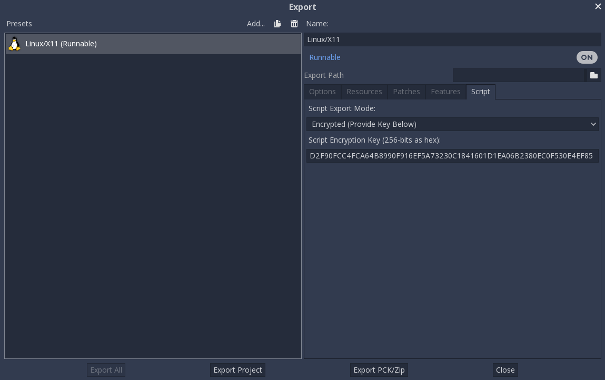

.. _doc_compiling_with_script_encryption_key:

Compiling with script encryption key
====================================


The export dialog gives you the option to encrypt your scripts with a 256-bit
AES key when releasing your project. This will make sure your scripts are not
stored in plain text and can not easily be ripped by some script kiddie.

Of course, the key needs to be stored in the binary, but if it's compiled,
optimized and without symbols, it would take some effort to find it.

For this to work, you need to build the export templates from source,
with that same key.

.. warning::

    This will **not** work if you use official, precompiled export templates.
    It is absolutely **required** to compile your own export templates to use
    PCK encryption.

Step by step
------------

1. Generate a 256-bit AES key in hexadecimal format. You can use the aes-256-cbc variant from
   `this service <https://asecuritysite.com/encryption/keygen>`_.

   Alternatively, you can generate it yourself using
   `OpenSSL <https://www.openssl.org/>` command-line tools:

   ::

       openssl rand -hex 32 > godot.gdkey

   The output in `godot.gdkey` should be similar to:

   ::

       # NOTE: Do not use the key below! Generate your own key instead.
       aeb1bc56aaf580cc31784e9c41551e9ed976ecba10d315db591e749f3f64890f

   You can generate the key without redirecting the output to a file, but
   that way you can minimize the risk of exposing the key.

2. Set this key as environment variable in the console that you will use to
   compile Godot, like this:


bash Linux/macOS

``` export SCRIPT_AES256_ENCRYPTION_KEY="your_generated_key" ```

bat Windows (cmd)

``` set SCRIPT_AES256_ENCRYPTION_KEY=your_generated_key ```

bat Windows (PowerShell)

``` $env:SCRIPT_AES256_ENCRYPTION_KEY="your_generated_key" ```

3. Compile Godot export templates and set them as custom export templates
   in the export preset options.

4. Set the encryption key in the **Script** tab of the export preset:

   

5. Export the project. The game should run with encrypted scripts now.

Troubleshooting
---------------

If you get an error like below, it means the key wasn't properly included in
your Godot build. Godot is encrypting the scripts during export, but can't read
them at runtime.

::

   ERROR: open_and_parse: Condition "String::md5(md5.digest) != String::md5(md5d)" is true. Returning: ERR_FILE_CORRUPT
      At: core/io/file_access_encrypted.cpp:103
   ERROR: load_byte_code: Condition ' err ' is true. returned: err
      At: modules/gdscript/gdscript.cpp:755
   ERROR: load: Condition ' err != OK ' is true. returned: RES()
      At: modules/gdscript/gdscript.cpp:2135
   ERROR: Failed loading resource: res://Node2D.gde
      At: core/io/resource_loader.cpp:279
   ERROR: poll: res://Node2D.tscn:3 - Parse Error: [ext_resource] referenced nonexistent resource at: res://Node2D.gd
      At: scene/resources/scene_format_text.cpp:439
   ERROR: load: Condition ' err != OK ' is true. returned: RES()
      At: core/io/resource_loader.cpp:202
   ERROR: Failed loading resource: res://Node2D.tscn
      At: core/io/resource_loader.cpp:279
   ERROR: Failed loading scene: res://Node2D.tscn
      At: main/main.cpp:1727
   WARNING: cleanup: ObjectDB Instances still exist!
        At: core/object.cpp:2081
   ERROR: clear: Resources Still in use at Exit!
      At: core/resource.cpp:425
