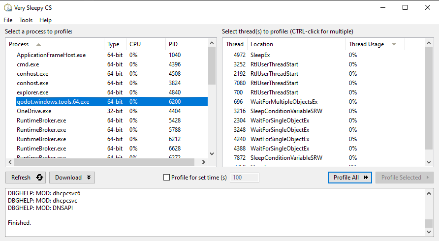
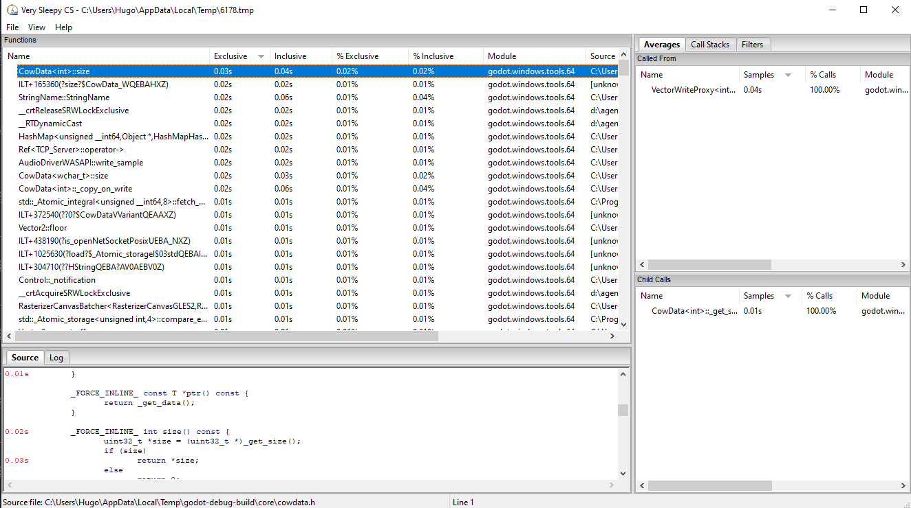
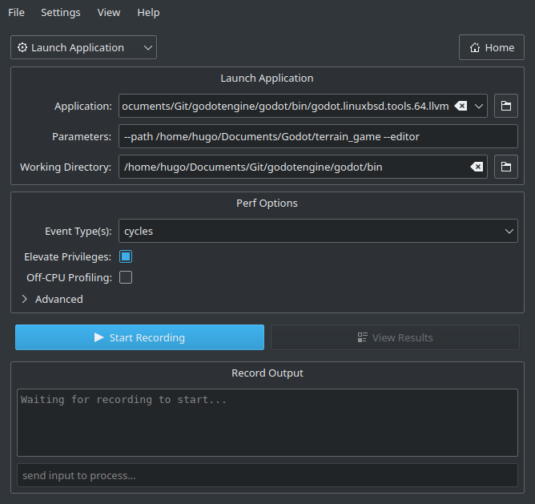
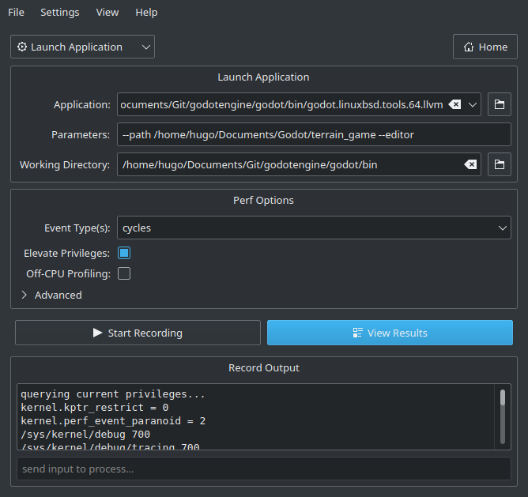
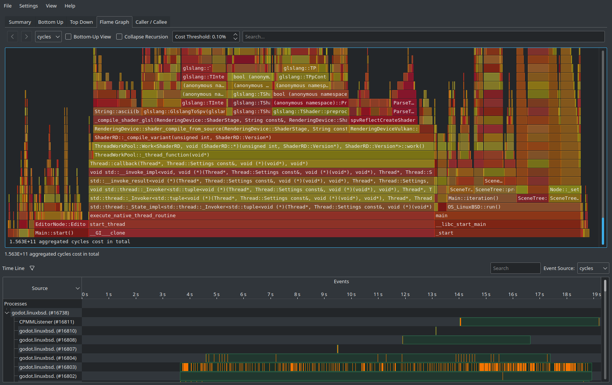
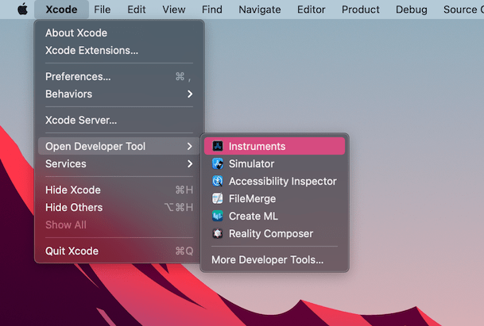
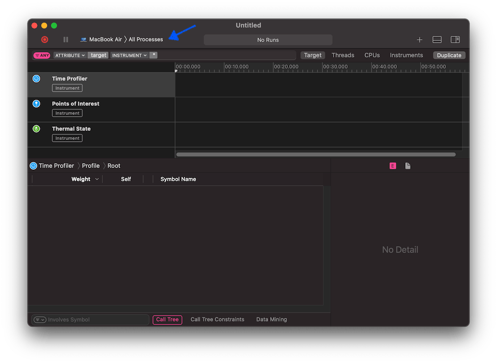
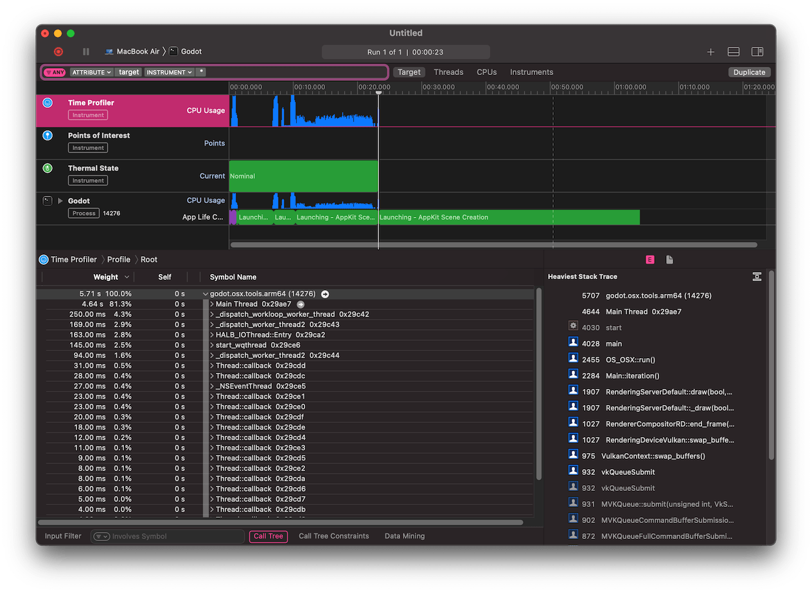

.. _doc_using_cpp_profilers:

Using C++ profilers
===================

To optimize Godot's performance, you need to know what to optimize first.
To this end, profilers are useful tools.

.. note::

    There is a built-in GDScript profiler in the editor, but using C++ profiler
    may be useful in cases where the GDScript profiler is not accurate enough
    or is missing information due to bugs in the profiler.

Recommended profilers
---------------------

- `VerySleepy ( http://www.codersnotes.com/sleepy/ )` (Windows only)
- `HotSpot ( https://github.com/KDAB/hotspot )` (Linux only)
- `Xcode Instruments ( https://developer.apple.com/xcode/ )` (macOS only)

These profilers may not be the most powerful or flexible options, but their
standalone operation and limited feature set tends to make them easier to use.

Setting up Godot
----------------

To get useful profiling information, it is **absolutely required** to use a Godot
build that includes debugging symbols. Official binaries do not include debugging
symbols, since these would make the download size significantly larger.

To get profiling data that best matches the production environment, you should
compile binaries with the following SCons options:

- For editor binaries: `target=release_debug use_lto=yes`
- For debug export templates: `target=release_debug use_lto=yes`
- For release export templates: `tools=no target=release debug_symbols=yes`
  - `debug_symbols=yes` is required as export templates are stripped from debugging symbols by default.

It is possible to run a profiler on less optimized builds (e.g. `target=debug` without LTO),
but results will naturally be less representative of real world conditions.

.. warning::

    Do *not* strip debugging symbols on the binaries using the `strip` command
    after compiling the binaries. Otherwise, you will no longer get useful
    profiling information when running a profiler.

Benchmarking startup/shutdown times
-----------------------------------

If you're looking into optimizing Godot's startup/shutdown performance,
you can tell the profiler to use the `--quit` command line option on the Godot binary.
This will exit Godot just after it finished starting.
The `--quit` option works with `--editor`, `--project-manager` or
`--path <path to project directory )` (which runs a project directly).

.. seealso::

    See `doc_command_line_tutorial` for more command line arguments
    supported by Godot.

Profiler-specific instructions
------------------------------

VerySleepy
^^^^^^^^^^

- Start the Godot editor or your project first.
  If you start the project manager, make sure to edit or run a project first.
  Otherwise, the profiler will not track the child process since the project manager
  will spawn a child process for every project edited or run.
- Open VerySleepy and select the Godot executable in the list of processes on the left:

- Click the **Profile All** button on the right to start profiling.
- Perform the actions you wish to profile in the editor or project. When you're done, click **Stop** (*not* Abort).
- Wait for the results window to appear.
- Once the results window appears, filter the view to remove external modules (such as the graphics driver).
  You can filter by module by finding a line whose **Module** matches the Godot
  executable name, right-clicking that line then choosing
  **Filter Module to <Godot executable name>** in the dropdown that appears.
- Your results window should now look something like this:

HotSpot
^^^^^^^

- Open HotSpot. Click **Record Data**:

- In the next window, specify the path to the Godot binary that includes debug symbols.
- Specify command line arguments to run a specific project, with or without the editor.
- The path to the working directory can be anything if an absolute path is used
  for the `--path` command line argument. Otherwise, it must be set to that
  the relative path to the project is valid.
- Make sure **Elevate Privileges** is checked if you have administrative privileges.
  While not essential for profiling Godot, this will ensure all events can be captured.
  Otherwise, some events may be missing in the capture.
  Your settings should now look something like this:

- Click **Start Recording** and perform the actions you wish to profile in the editor/project.
- Quit the editor/project normally or use the **Stop Profiling** button in HotSpot
  to stop profiling early. Stopping profiling early can result in cleaner profiles
  if you're not interested in the engine's quit procedure.
- Click **View Results** and wait for the profiling visualization to be generated:

- Use the tabs at the top to navigate between the different views. These views
  show the same data, but in different ways. The **Flame Graph** tab is a good
  way to see which functions take up the most time at a glance. These functions
  are therefore the most important ones to optimize, since optimizing them will
  improve performance the most.
- At the bottom of all tabs except **Summary**, you will also see a list of CPU threads
  started by the engine among with the CPU utilization for each thread.
  This lets you see threads that can be a bottleneck at a given point in time.

.. note::

    If you don't want the startup procedure to be included in the profile, you
    can also attach HotSpot to a running process by clicking **Record Data**
    then setting the **Launch Application** dropdown option to **Attach To
    Process(es)**.

    This process attachment-based workflow is similar to the one used by VerySleepy.

Xcode Instruments
^^^^^^^^^^^^^^^^^

- Open Xcode. Select **Open Developer Tool** - **Instruments** from the **Xcode** app menu:
- Double-click on **Time Profiler** in the **Instruments** window:

- In the Time Profiler window, click on the **Target** menu, select **Choose target...**
  and specify the path to the Godot binary, command line arguments and environment variables
  in the next window.

- You can also attach the Time Profiler to a running process by selecting it from the **Target**
  menu.

- Click the **Start an immediate mode recording** button to start profiling.

- Perform the actions you wish to profile in the editor or project. When you're done,
  click the **Stop** button.

- Wait for the results to appear.
- At the bottom of the window you will see a call tree for all CPU threads started, and
  the **Heaviest Stack Trace** overview.
- Select **Hide system libraries** in the **Call Tree** menu (at the bottom of window) to
  remove external modules.
- You can use the timeline at the top of the window to display details for the specific time period.

