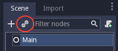
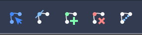
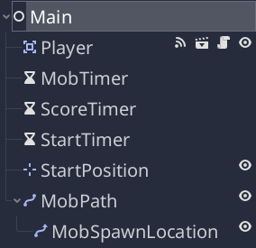

.. _doc_your_first_2d_game_the_main_game_scene:

The main game scene
===================

Now it's time to bring everything we did together into a playable game scene.

Create a new scene and add a `Node` named `Main`.
(The reason we are using Node instead of Node2D is because this node will
be a container for handling game logic. It does not require 2D functionality itself.)

Click the **Instance** button (represented by a chain link icon) and select your saved
`Player.tscn`.



Now, add the following nodes as children of `Main`, and name them as shown
(values are in seconds):

- `Timer` (named `MobTimer`) - to control how often mobs
  spawn
- `Timer` (named `ScoreTimer`) - to increment the score
  every second
- `Timer` (named `StartTimer`) - to give a delay before
  starting
- `Position2D` (named `StartPosition`) - to indicate
  the player's start position

Set the `Wait Time` property of each of the `Timer` nodes as follows:

- `MobTimer`: `0.5`
- `ScoreTimer`: `1`
- `StartTimer`: `2`

In addition, set the `One Shot` property of `StartTimer` to "On" and set
`Position` of the `StartPosition` node to `(240, 450)`.

Spawning mobs
~~~~~~~~~~~~~

The Main node will be spawning new mobs, and we want them to appear at a random
location on the edge of the screen. Add a `Path2D` node
named `MobPath` as a child of `Main`. When you select `Path2D`, you will
see some new buttons at the top of the editor:



Select the middle one ("Add Point") and draw the path by clicking to add the
points at the corners shown. To have the points snap to the grid, make sure "Use
Grid Snap" and "Use Snap" are both selected. These options can be found to the
left of the "Lock" button, appearing as a magnet next to some dots and
intersecting lines, respectively.


.. important:: Draw the path in *clockwise* order, or your mobs will spawn
               pointing *outwards* instead of *inwards*!


After placing point `4` in the image, click the "Close Curve" button and your
curve will be complete.

Now that the path is defined, add a `PathFollow2D`
node as a child of `MobPath` and name it `MobSpawnLocation`. This node will
automatically rotate and follow the path as it moves, so we can use it to select
a random position and direction along the path.

Your scene should look like this:



Main script
~~~~~~~~~~~

Add a script to `Main`. At the top of the script, we use `export
(PackedScene)` to allow us to choose the Mob scene we want to instance.

gdscript GDScript

```
    extends Node

    export(PackedScene) var mob_scene
    var score
```

We also add a call to `randomize()` here so that the random number
generator generates different random numbers each time the game is run:

gdscript GDScript

```
    func _ready():
        randomize()
```

Click the `Main` node and you will see the `Mob Scene` property in the Inspector
under "Script Variables".

You can assign this property's value in two ways:

- Drag `Mob.tscn` from the "FileSystem" dock and drop it in the **Mob Scene**
  property.
- Click the down arrow next to "[empty]" and choose "Load". Select `Mob.tscn`.

Next, select the `Player` node in the Scene dock, and access the Node dock on
the sidebar. Make sure to have the Signals tab selected in the Node dock.

You should see a list of the signals for the `Player` node. Find and
double-click the `hit` signal in the list (or right-click it and select
"Connect..."). This will open the signal connection dialog. We want to make a
new function named `game_over`, which will handle what needs to happen when a
game ends. Type "game_over" in the "Receiver Method" box at the bottom of the
signal connection dialog and click "Connect". Add the following code to the new
function, as well as a `new_game` function that will set everything up for a
new game:

gdscript GDScript

```
    func game_over():
        $ScoreTimer.stop()
        $MobTimer.stop()

    func new_game():
        score = 0
        $Player.start($StartPosition.position)
        $StartTimer.start()
```

Now connect the `timeout()` signal of each of the Timer nodes (`StartTimer`,
`ScoreTimer` , and `MobTimer`) to the main script. `StartTimer` will start
the other two timers. `ScoreTimer` will increment the score by 1.

gdscript GDScript

```
    func _on_ScoreTimer_timeout():
        score += 1

    func _on_StartTimer_timeout():
        $MobTimer.start()
        $ScoreTimer.start()
```

In `_on_MobTimer_timeout()`, we will create a mob instance, pick a random
starting location along the `Path2D`, and set the mob in motion. The
`PathFollow2D` node will automatically rotate as it follows the path, so we
will use that to select the mob's direction as well as its position.
When we spawn a mob, we'll pick a random value between `150.0` and
`250.0` for how fast each mob will move (it would be boring if they were
all moving at the same speed).

Note that a new instance must be added to the scene using `add_child()`.

gdscript GDScript

```
    func _on_MobTimer_timeout():
        # Create a new instance of the Mob scene.
        var mob = mob_scene.instance()

        # Choose a random location on Path2D.
        var mob_spawn_location = get_node("MobPath/MobSpawnLocation")
        mob_spawn_location.offset = randi()

        # Set the mob's direction perpendicular to the path direction.
        var direction = mob_spawn_location.rotation + PI / 2

        # Set the mob's position to a random location.
        mob.position = mob_spawn_location.position

        # Add some randomness to the direction.
        direction += rand_range(-PI / 4, PI / 4)
        mob.rotation = direction

        # Choose the velocity for the mob.
        var velocity = Vector2(rand_range(150.0, 250.0), 0.0)
        mob.linear_velocity = velocity.rotated(direction)

        # Spawn the mob by adding it to the Main scene.
        add_child(mob)
```

.. important:: Why `PI`? In functions requiring angles, Godot uses *radians*,
               not degrees. Pi represents a half turn in radians, about
               `3.1415` (there is also `TAU` which is equal to `2 * PI`).
               If you're more comfortable working with degrees, you'll need to
               use the `deg2rad()` and `rad2deg()` functions to convert
               between the two.

Testing the scene
~~~~~~~~~~~~~~~~~

Let's test the scene to make sure everything is working. Add this `new_game`
call to `_ready()`:

gdscript GDScript

```
    func _ready():
        randomize()
        new_game()
```

Let's also assign `Main` as our "Main Scene" - the one that runs automatically
when the game launches. Press the "Play" button and select `Main.tscn` when
prompted.

.. tip:: If you had already set another scene as the "Main Scene", you can right
         click `Main.tscn` in the FileSystem dock and select "Set As Main Scene".

You should be able to move the player around, see mobs spawning, and see the
player disappear when hit by a mob.

When you're sure everything is working, remove the call to `new_game()` from
`_ready()`.

What's our game lacking? Some user interface. In the next lesson, we'll add a
title screen and display the player's score.
