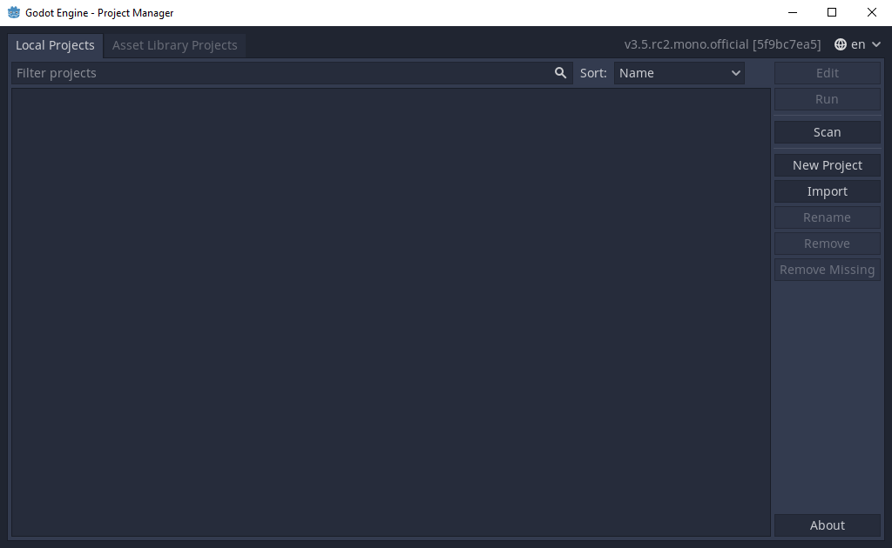
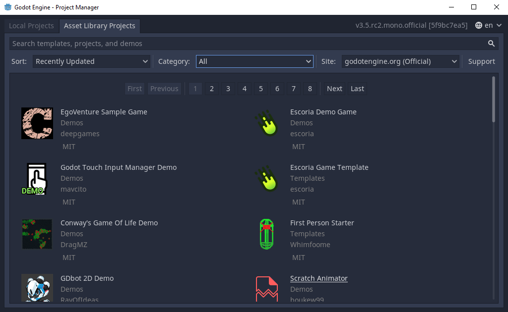
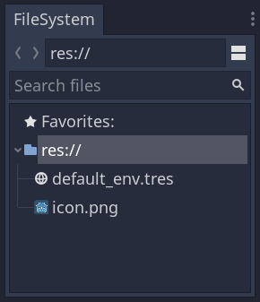
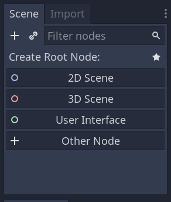
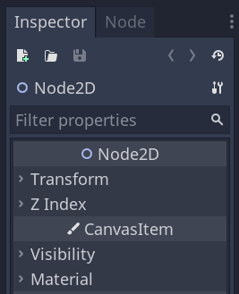
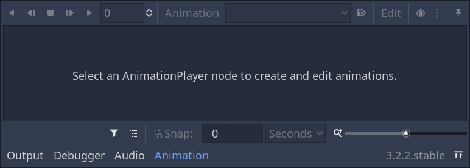
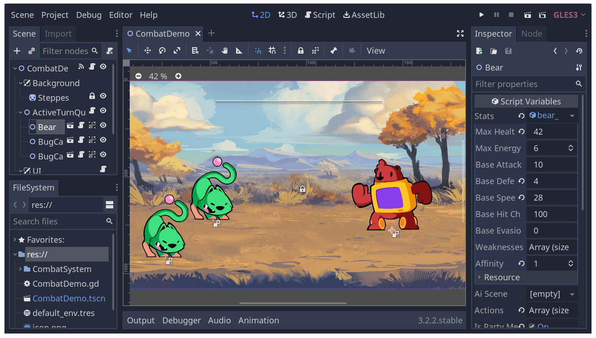
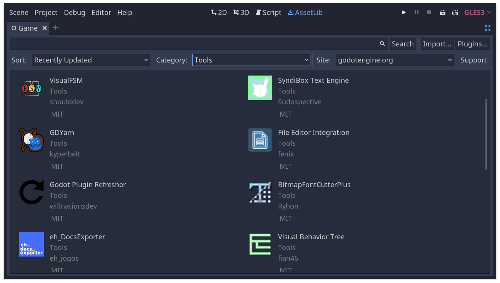
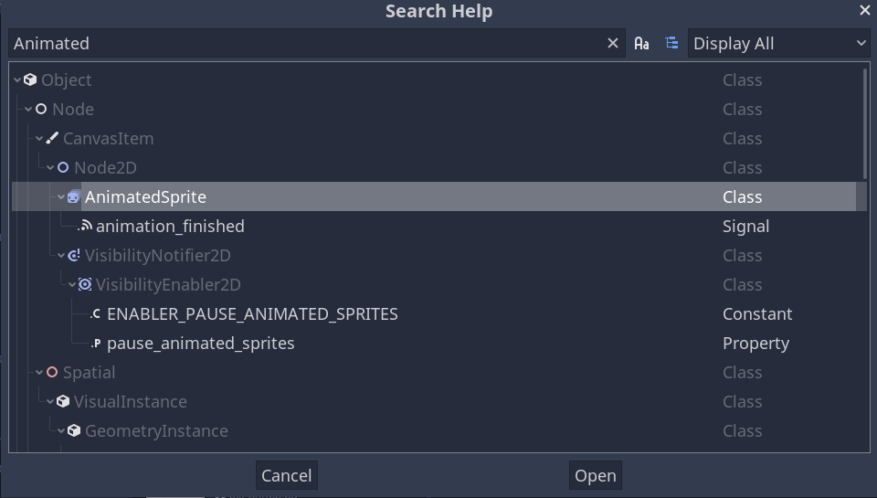
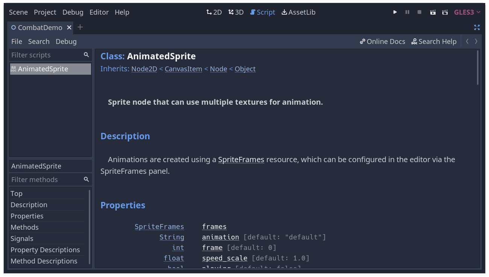

.. This page is only here to introduce the interface to the user broadly. To
   cover individual areas in greater detail, write the corresponding pages in
   the most appropriate section, and link them. E.g. the animation editor goes
   to the animation section. General pages, for instance, about the project
   manager, should go in the editor manual.

First look at Godot's editor
============================

This page will give you a brief overview of Godot's interface. We're going to
look at the different main screens and docks to help you situate yourself.

.. seealso:: For a comprehensive breakdown of the editor's interface and how to
             use it, see the `Editor manual ( toc-learn-editor )`.

The Project manager
-------------------

When you launch Godot, the first window you see is the Project Manager. In the
default tab, "Projects," you can manage existing projects, import or create new
ones, and more.

At the top of the window, there is another tab named "Asset Library Projects".
In the open-source asset library you can search for demo projects, templates,
and completed projects, including many that are developed by the community.

You can also change the editor's language using the drop-down menu to the right
of the engine's version in the window's top-right corner. By default, it is in
English (EN).

First look at Godot's editor
----------------------------

When you open a new or an existing project, the editor's interface appears.
Let's look at its main areas.

By default, it features **menus**, **main screens**, and playtest buttons along
the window's top edge.

In the center is the **viewport** with its **toolbar** at the top, where you'll
find tools to move, scale, or lock the scene's nodes.

On either side of the viewport sit the **docks**. And at the bottom of the
window lies the **bottom panel**.

The toolbar changes based on the context and selected node. Here is the 2D toolbar.

Below is the 3D one.

Let's look at the docks. The **FileSystem** dock lists your project files, be it
scripts, images, audio samples, and more.

The **Scene** dock lists the active scene's nodes.

The **Inspector** allows you to edit the properties of a selected node.

The **bottom panel**, situated below the viewport, is the host for the debug
console, the animation editor, the audio mixer, and more. They can take precious
space, that's why they're folded by default.

When you click on one, it expands vertically. Below, you can see the animation editor opened.

The four main screens
---------------------

There are four main screen buttons centered at the top of the editor:
2D, 3D, Script, and AssetLib.

You'll use the **2D screen** for all types of games. In addition to 2D games,
the 2D screen is where you'll build your interfaces.

In the **3D screen**, you can work with meshes, lights, and design levels for
3D games.

Notice the perspective button under the toolbar. Clicking on it opens a list of
options related to the 3D view.

.. note:: Read `doc_introduction_to_3d` for more detail about the **3D
          main screen**.

The **Script screen** is a complete code editor with a debugger, rich
auto-completion, and built-in code reference.

Finally, the **AssetLib** is a library of free and open-source add-ons, scripts,
and assets to use in your projects.

.. seealso:: You can learn more about the asset library in
             `doc_what_is_assetlib`.

Integrated class reference
--------------------------

Godot comes with a built-in class reference.

You can search for information about a class, method, property, constant, or
signal by any one of the following methods:

* Pressing :kbd:`F1` (or :kbd:`Alt + Space` on macOS) anywhere in the editor.
* Clicking the "Search Help" button in the top-right of the Script main screen.
* Clicking on the Help menu and Search Help.
* Clicking while pressing the :kbd:`Ctrl` key on a class name, function name, 
  or built-in variable in the script editor.

When you do any of these, a window pops up. Type to search for any item. You can
also use it to browse available objects and methods.

Double-click on an item to open the corresponding page in the script main screen.

