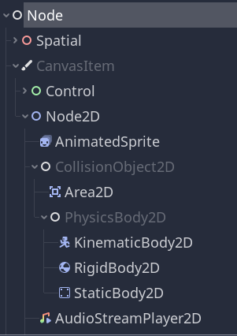
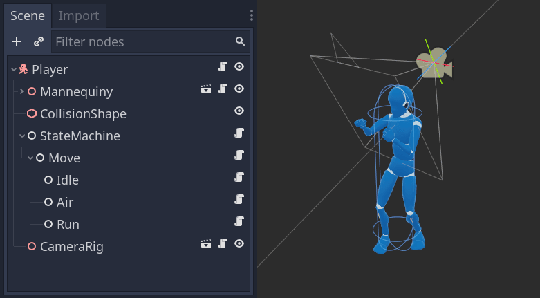
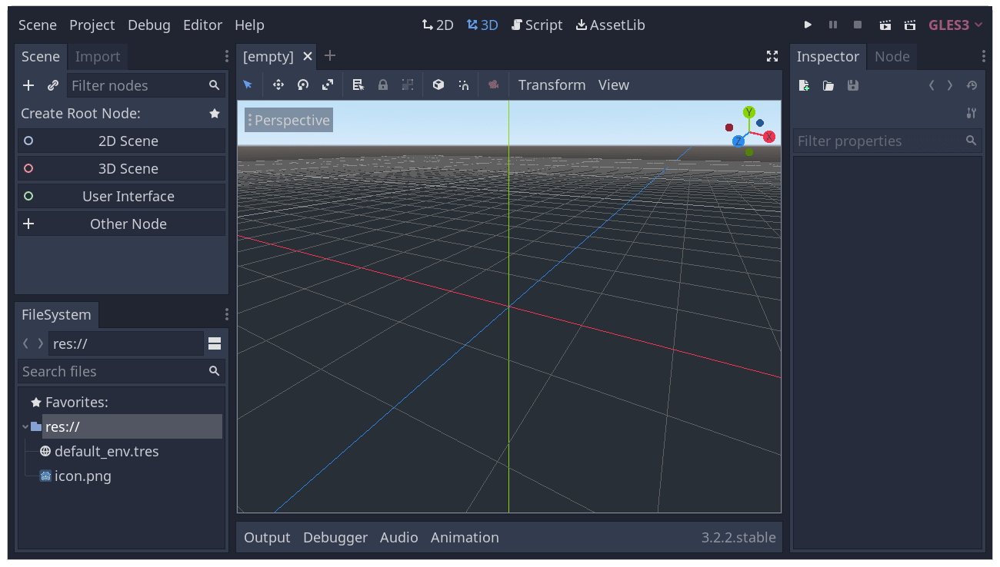
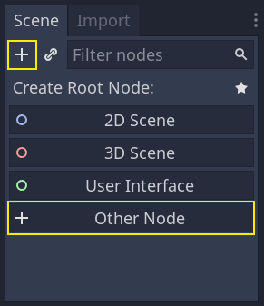
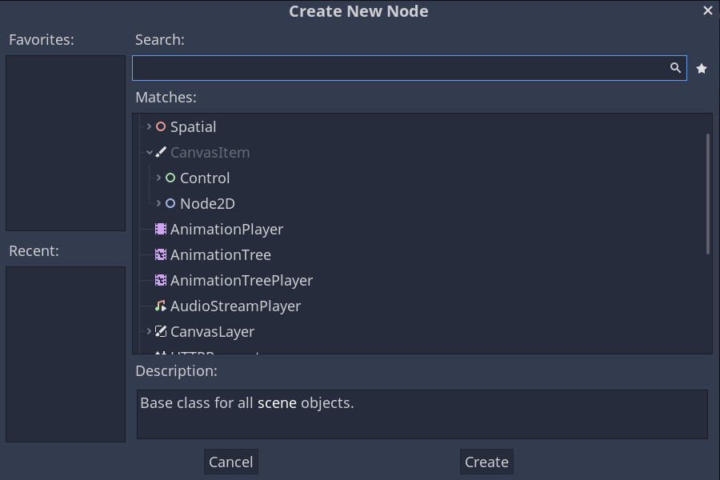
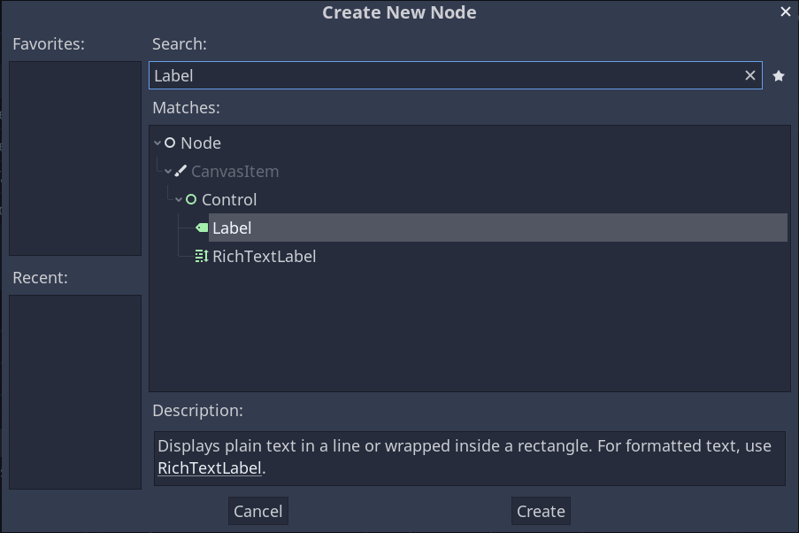
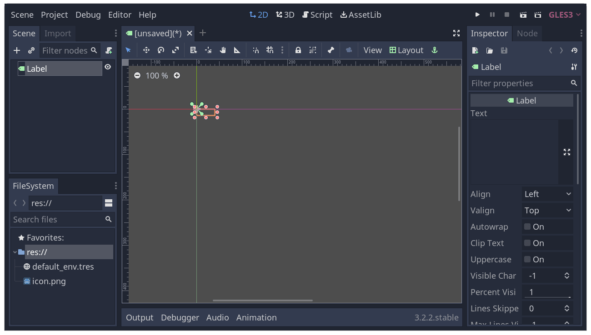
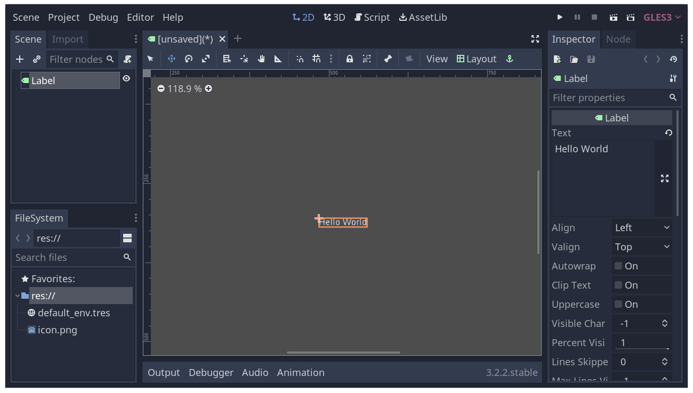
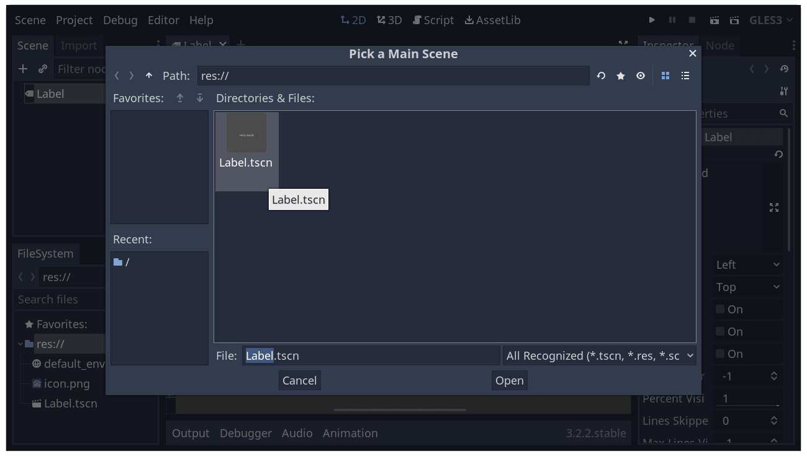

.. The goal of this page is to explain more than doc_key_concepts_overview about nodes and scenes, get the user to create their first concrete scene.

Nodes and Scenes
================

In `doc_key_concepts_overview`, we saw that a Godot game is a tree of
scenes and that each scene is a tree of nodes. In this lesson, we explain a bit
more about them. You will also create your first scene.

Nodes
-----

**Nodes are the fundamental building blocks of your game**. They are like the
ingredients in a recipe. There are dozens of kinds that can display an image,
play a sound, represent a camera, and much more.

All nodes have the following attributes:

- A name.
- Editable properties.
- They receive callbacks to update every frame.
- You can extend them with new properties and functions.
- You can add them to another node as a child.

The last attribute is key. **Together, nodes form a tree**, which is a powerful
feature to organize projects. Since different nodes have different functions,
combining them produces more complex behavior. As we saw before, you can build a
playable character the camera follows using a kinematic body node named
"Character", a sprite node, a camera node, and a collision shape node.

Scenes
------

When you organize nodes in a tree, like our character, we call this construct a
scene. Once saved, scenes work like new node types in the editor, where you can
add them as a child of an existing node. In that case, the instance of the scene
appears as a single node with its internals hidden.

Scenes allow you to structure your game's code however you want. You can
**compose nodes** to create custom and complex node types, like a game character
that runs and jumps, a life bar, a chest with which you can interact, and more.

The Godot editor essentially is a **scene editor**. It has plenty of tools for
editing 2D and 3D scenes, as well as user interfaces. A Godot project can
contain as many of these scenes as you need. The engine only requires one as
your application's **main scene**. This is the scene Godot will first load when
you or a player runs the game.

On top of acting like nodes, scenes have the following attributes:

1. They always have one root node, like the "Character" in our example.
2. You can save them to your hard drive and load them later.
3. You can create as many instances of a scene as you'd like. You could have
   five or ten characters in your game, created from your Character scene.

Creating your first scene
-------------------------

Let's create our first scene with a single node. To do so, you will need to
create a new project first. After opening the project, you should see an empty
editor.

In an empty scene, the Scene dock on the left shows several options to add a
root node quickly. "2D Scene" adds a Node2D node, "3D Scene" adds a Spatial
node, and "User Interface" adds a Control node. These presets
are here for convenience; they are not mandatory. "Other Node" lets you select any
node to be the root node. In an empty scene, "Other Node" is equivalent to pressing
the "Add Child Node" button at the top-left of the Scene dock, which usually adds
a new node as a child of the currently selected node.

We're going to add a single Label node to our scene. Its function is to draw
text on the screen.

Press the "Add Child Node" button or "Other Node" to create a root node.

The Create Node dialog opens, showing the long list of available nodes.

Select the Label node. You can type its name to filter down the list.

Click on the Label node to select it and click the Create button at the bottom
of the window.

A lot happens when you add a scene's first node. The scene changes to the 2D
workspace because Label is a 2D node type. The Label appears, selected, in the
top-left corner of the viewport. The node appears in the Scene dock on the left,
and the node's properties appear in the Inspector dock on the right.

Changing a node's properties
----------------------------

The next step is to change the Label's "Text" property. Let's change it to
"Hello World".

Head to the Inspector dock on the right of the viewport. Click inside the field
below the Text property and type "Hello World".

You will see the text draw in the viewport as you type.

You can move your Label node in the viewport by selecting the move tool in the
toolbar.

With the Label selected, click and drag anywhere in the viewport to
move it to the center of the view delimited by the rectangle.

Running the scene
-----------------

Everything's ready to run the scene! Press the Play Scene button in the
top-right of the screen or press :kbd:`F6` (:kbd:`Cmd + R` on macOS).

A popup invites you to save the scene, which is required to run it.

Click the Yes button, and in the file browser that appears, press the Save
button to save it as "Label.tscn".

Note:
 The Save Scene As dialog, like other file dialogs in the editor, only
          allows you to save files inside the project. The `res://` path at
          the top of the window represents the project's root directory and
          stands for "resource path". For more information about file paths in
          Godot, see `doc_filesystem`.

The application should open in a new window and display the text "Hello World".

Close the window or press :kbd:`F8` to quit the running scene.

Note:

    If this doesn't immediately work and you have a hiDPI display on at least
    one of your monitors, go to Project -> Project Settings -> Display ->
    Window then enable Allow Hidpi under Dpi.

Setting the main scene
----------------------

To run our test scene, we used the Play Scene button. Another button next to it
allows you to set and run the project's main scene. You can press :kbd:`F5`
(:kbd:`Cmd + B` on macOS) to do so.

A popup window appears and invites you to select the main scene.

Click the Select button, and in the file dialog that appears, double click on
Label.tscn.

The demo should run again. Moving forward, every time you run the project, Godot
will use this scene as a starting point.

Note:
 The editor saves the main scene's path in a project.godot file in your
          project's directory. While you can edit this text file directly to
          change project settings, you can also use the "Project -> Project
          Settings" window to do so.

In the next part, we will discuss another key concept in games and in Godot:
creating instances of a scene.
