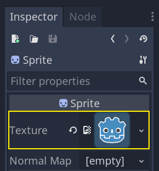
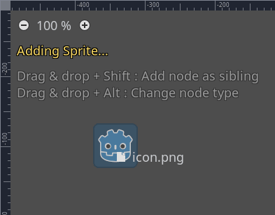
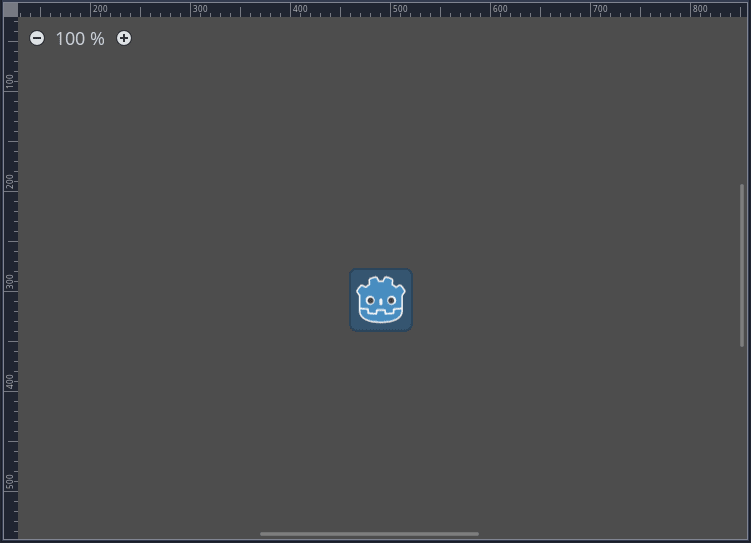
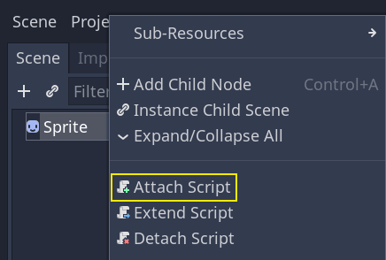

..
    Intention:

    - Giving a *short* and sweet hands-on intro to GDScript. The page should
      focus on working in the code editor.
    - We assume the reader has programming foundations, as explained in
    getting_started/introduction.

    Techniques:

    - Creating a sprite.
    - Creating a script.
    - _init() and _process().
    - Moving an object on screen.


Creating your first script
==========================

In this lesson, you will code your first script to make the Godot icon turn in
circles using GDScript. As we mentioned `in the introduction
<toc-learn-introduction )`, we assume you have programming foundations.
The equivalent C# code has been included in another tab for convenience.


See also:
 To learn more about GDScript, its keywords, and its syntax, head to
             the `GDScript reference( doc_gdscript )`.

See also:
 To learn more about C#, head to the `C# basics ( doc_c_sharp )` page.

Project setup
-------------

Please create a new project to start with a clean slate. Your project should
contain one picture: the Godot icon, which we often use for prototyping in the
community.

.. Godot icon

We need to create a Sprite node to display it in the game. In the Scene dock,
click the Other Node button.


Type "Sprite" in the search bar to filter nodes and double-click on Sprite to
create the node.


Your Scene tab should now only have a Sprite node.


A Sprite node needs a texture to display. In the Inspector on the right, you can
see that the Texture property says "[empty]". To display the Godot icon, click
and drag the file `icon.png)` from the FileSystem dock onto the Texture slot.



Note:


    You can create Sprite nodes automatically by dragging and dropping images on
    the viewport.

    

Then, click and drag the icon in the viewport to center it in the game view.



Creating a new script
---------------------

To create and attach a new script to our node, right-click on Sprite in the
scene dock and select "Attach Script".



The Attach Node Script window appears. It allows you to select the script's
language and file path, among other options.

Change the Template from Default to Empty to start with a clean file. Leave the
other options by default and click the Create button to create the script.


The Script workspace should appear with your new `Sprite.gd` file open and the
following line of code:

gdscript GDScript

```
    extends Sprite
```

Every GDScript file is implicitly a class. The `extends` keyword defines the
class this script inherits or extends. In this case, it's `Sprite`, meaning
our script will get access to all the properties and functions of the Sprite
node, including classes it extends, like `Node2D`, `CanvasItem`, and
`Node`.

Note:
 In GDScript, if you omit the line with the `extends` keyword, your
          class will implicitly extend `Reference`, which
          Godot uses to manage your application's memory.

Inherited properties include the ones you can see in the Inspector dock, like
our node's `texture`.

Note:


    By default, the Inspector displays a node's properties in "Title Case", with
    capitalized words separated by a space. In GDScript code, these properties
    are in "snake_case", which is lowercase with words separated by an underscore.

    You can hover any property's name in the Inspector to see a description and
    its identifier in code.

Hello, world!
-------------

Our script currently doesn't do anything. Let's make it print the text "Hello,
world!" to the Output bottom panel to get started.

Add the following code to your script:

gdscript GDScript

```
    func _init():
        print("Hello, world!")
```


Let's break it down. The `func` keyword defines a new function named
`init`. This is a special name for our class's constructor. The engine calls
`init()` on every object or node upon creating it in memory, if you define
this function.

Note:
 GDScript is an indent-based language. The tab at the start of the line
          that says `print()` is necessary for the code to work. If you omit
          it or don't indent a line correctly, the editor will highlight it in
          red and display the following error message: "Indented block expected".

Save the scene if you haven't already, then press :kbd:`F6` (:kbd:`Cmd + R` on macOS)
to run it. Look at the **Output** bottom panel that expands.
It should display "Hello, world!".


Delete the `init()` function, so you're only left with the line `extends
Sprite`.

Turning around
--------------

It's time to make our node move and rotate. To do so, we're going to add two
member variables to our script: the movement speed in pixels per second and the
angular speed in radians per second.

gdscript GDScript

```
    var speed = 400
    var angular_speed = PI
```

Member variables sit near the top of the script, after any "extends" lines,
but before functions. Every node
instance with this script attached to it will have its own copy of the `speed`
and `angular_speed` properties.

Note:
 Angles in Godot work in radians by default,
          but you have built-in functions and properties available if you prefer
          to calculate angles in degrees instead.

To move our icon, we need to update its position and rotation every frame in the
game loop. We can use the `process()` virtual function of the `Node` class.
If you define it in any class that extends the Node class, like Sprite, Godot
will call the function every frame and pass it an argument named `delta`, the
time elapsed since the last frame.

Note:


    Games work by rendering many images per second, each called a frame, and
    they do so in a loop. We measure the rate at which a game produces images in
    Frames Per Second (FPS). Most games aim for 60 FPS, although you might find
    figures like 30 FPS on slower mobile devices or 90 to 240 for virtual
    reality games.

    The engine and game developers do their best to update the game world and
    render images at a constant time interval, but there are always small
    variations in frame render times. That's why the engine provides us with
    this delta time value, making our motion independent of our framerate.

At the bottom of the script, define the function:

gdscript GDScript

```
    func _process(delta):
        rotation += angular_speed * delta
```

The `func` keyword defines a new function. After it, we have to write the
function's name and arguments it takes in parentheses. A colon ends the
definition, and the indented blocks that follow are the function's content or
instructions.

Note:
 Notice how `process()`, like `init()`, starts with a leading
          underscore. By convention, Godot's virtual functions, that is to say,
          built-in functions you can override to communicate with the engine,
          start with an underscore.

The line inside the function, `rotation += angular_speed * delta`, increments
our sprite's rotation every frame. Here, `rotation` is a property inherited
from the class `Node2D`, which `Sprite` extends. It controls the rotation of
our node and works with radians.

.. tip:: In the code editor, you can ctrl-click on any built-in property or
         function like `position`, `rotation`, or `process` to open the
         corresponding documentation in a new tab.

Run the scene to see the Godot icon turn in-place.


Moving forward
~~~~~~~~~~~~~~

Let's now make the node move. Add the following two lines to the `process()`
function, ensuring the new lines are indented the same way as the one before
them.

gdscript GDScript

```
    var velocity = Vector2.UP.rotated(rotation) * speed

    position += velocity * delta
```

As we already saw, the `var` keyword defines a new variable. If you put it at
the top of the script, it defines a property of the class. Inside a function, it
defines a local variable: it only exists within the function's scope.

We define a local variable named `velocity`, a 2D vector representing both a
direction and a speed. To make the node move forward, we start from the Vector2
class's constant Vector2.UP, a vector pointing up, and rotate it by calling the
`Vector2.rotated()` method. This expression, `Vector2.UP.rotated(rotation)`,
is a vector pointing forward relative to our icon. Multiplied by our `speed`
property, it gives us a velocity we can use to move the node forward.

We add `velocity * delta` to the node's `position` to move it. The position
itself is of type `Vector2`, a built-in type in Godot
representing a 2D vector.

Run the scene to see the Godot head run in circles.


Note:
 Moving a node like that does not take into account colliding with
          walls or the floor. In `doc_your_first_2d_game`, you will learn
          another approach to moving objects while detecting collisions.

Our node currently moves by itself. In the next part
`doc_scripting_player_input`, we'll use player input to control it.

Complete script
---------------

Here is the complete `Sprite.gd` file for reference.

gdscript GDScript

```
    extends Sprite

    var speed = 400
    var angular_speed = PI


    func _process(delta):
        rotation += angular_speed * delta

        var velocity = Vector2.UP.rotated(rotation) * speed

        position += velocity * delta
```
