.. Intention: give the user a first taste of signals. We should write more
   documentation in the scripting/ section.
.. Note: GDScript snippets use one line return instead of two because they're
   really short.

.. meta::
    :keywords: Signal


Using signals
=============

In this lesson, we will look at signals. They are messages that nodes emit when
something specific happens to them, like a button being pressed. Other nodes can
connect to that signal and call a function when the event occurs.

Signals are a delegation mechanism built into Godot that allows one game object to
react to a change in another without them referencing one another. Using signals
limits `coupling
( https://en.wikipedia.org/wiki/Coupling_(computer_programming) )`_ and keeps your
code flexible.

For example, you might have a life bar on the screen that represents the
player’s health. When the player takes damage or uses a healing potion, you want
the bar to reflect the change. To do so, in Godot, you would use signals.

.. note:: As mentioned in the introduction, signals are Godot's version of the
          observer pattern. You can learn more about it here:
          https://gameprogrammingpatterns.com/observer.html

We will now use a signal to make our Godot icon from the previous lesson
(`doc_scripting_player_input`) move and stop by pressing a button.

.. Example

Scene setup
-----------

To add a button to our game, we will create a new "main" scene which will
include both a button and the `Sprite.tscn` scene that we scripted in previous
lessons.

Create a new scene by going to the menu Scene -> New Scene.

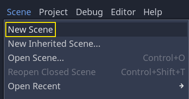

In the Scene dock, click the 2D Scene button. This will add a Node2D as our
root.

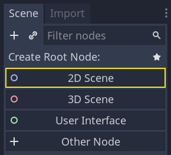

In the FileSystem dock, click and drag the `Sprite.tscn` file you saved
previously onto the Node2D to instantiate it.


We want to add another node as a sibling of the Sprite. To do so, right-click on
Node2D and select Add Child Node.

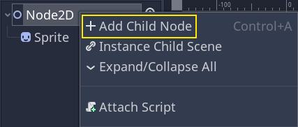

Search for the Button node type and add it.

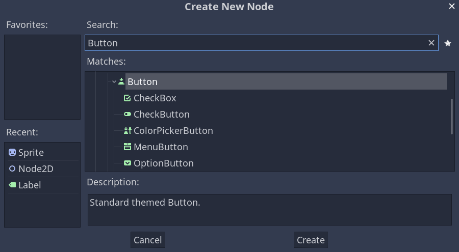

The node is small by default. Click and drag on the bottom-right handle of the
Button in the viewport to resize it.

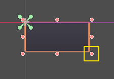

If you don't see the handles, ensure the select tool is active in the toolbar.


Click and drag on the button itself to move it closer to the sprite.

You can also write a label on the Button by editing its Text property in the
Inspector. Enter "Toggle motion".

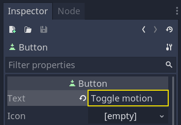

Your scene tree and viewport should look like this.

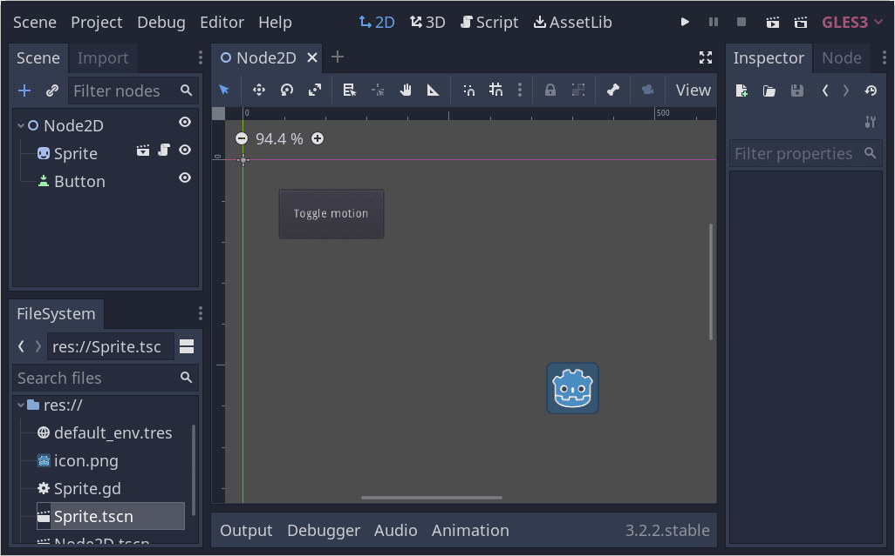

Save your newly created scene. You can then run it with :kbd:`F6`.
At the moment, the button will be visible, but nothing will happen if you
press it.

Connecting a signal in the editor
---------------------------------

Here, we want to connect the Button's "pressed" signal to our Sprite, and we
want to call a new function that will toggle its motion on and off. We need to
have a script attached to the Sprite node, which we do from the previous lesson.

You can connect signals in the Node dock. Select the Button node and, on the
right side of the editor, click on the tab named "Node" next to the Inspector.

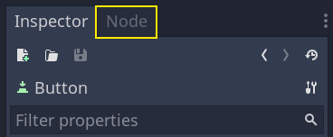

The dock displays a list of signals available on the selected node.

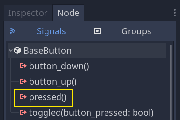

Double-click the "pressed" signal to open the node connection window.

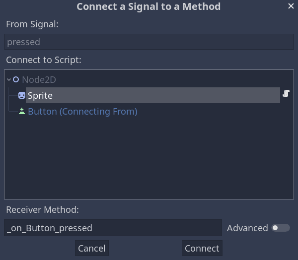

There, you can connect the signal to the Sprite node. The node needs a receiver
method, a function that Godot will call when the Button emits the signal. The
editor generates one for you. By convention, we name these callback methods
"_on_NodeName_signal_name". Here, it'll be "_on_Button_pressed".

.. note::

   When connecting signals via the editor's Node dock, you can use two
   modes. The simple one only allows you to connect to nodes that have a
   script attached to them and creates a new callback function on them.

   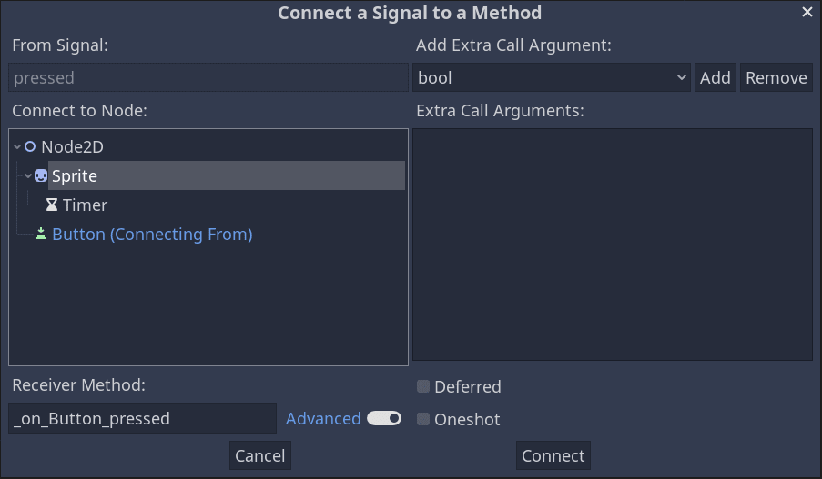

   The advanced view lets you connect to any node and any built-in
   function, add arguments to the callback, and set options. You can
   toggle the mode in the window's bottom-right by clicking the Advanced
   button.

Click the Connect button to complete the signal connection and jump to the
Script workspace. You should see the new method with a connection icon in the
left margin.


If you click the icon, a window pops up and displays information about the
connection. This feature is only available when connecting nodes in the editor.

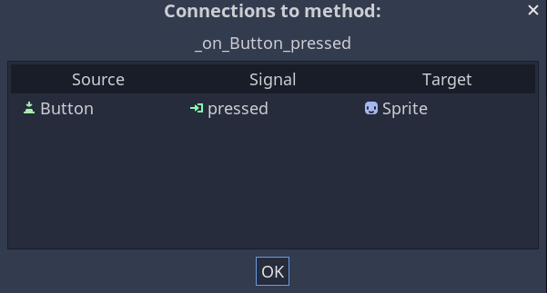

Let's replace the line with the `pass` keyword with code that'll toggle the
node's motion.

Our Sprite moves thanks to code in the `_process()` function. Godot provides a
method to toggle processing on and off: `Node.set_process()
( Node_method_set_process )`. Another method of the Node class,
`is_processing()`, returns `true` if idle processing is active. We can use
the `not` keyword to invert the value.

gdscript GDScript

```
    func _on_Button_pressed():
        set_process(not is_processing())
```

This function will toggle processing and, in turn, the icon's motion on and off
upon pressing the button.

Before trying the game, we need to simplify our `_process()` function to move
the node automatically and not wait for user input. Replace it with the
following code, which we saw two lessons ago:

gdscript GDScript

```
    func _process(delta):
        rotation += angular_speed * delta
        var velocity = Vector2.UP.rotated(rotation) * speed
        position += velocity * delta
```

Your complete `Sprite.gd` code should look like the following.

gdscript GDScript

```
    extends Sprite

    var speed = 400
    var angular_speed = PI


    func _process(delta):
        rotation += angular_speed * delta
        var velocity = Vector2.UP.rotated(rotation) * speed
        position += velocity * delta


    func _on_Button_pressed():
        set_process(not is_processing())
```

Run the scene now and click the button to see the sprite start and stop.

Connecting a signal via code
----------------------------

You can connect signals via code instead of using the editor. This is necessary
when you create nodes or instantiate scenes inside of a script.

Let's use a different node here. Godot has a `Timer` node
that's useful to implement skill cooldown times, weapon reloading, and more.

Head back to the 2D workspace. You can either click the "2D" text at the top of
the window or press :kbd:`Ctrl + F1` (:kbd:`Alt + 1` on macOS).

In the Scene dock, right-click on the Sprite node and add a new child node.
Search for Timer and add the corresponding node. Your scene should now look like
this.

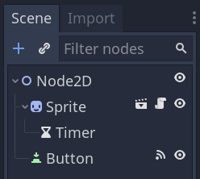

With the Timer node selected, go to the Inspector and check the **Autostart**
property.


Click the script icon next to Sprite to jump back to the scripting workspace.


We need to do two operations to connect the nodes via code:

1. Get a reference to the Timer from the Sprite.
2. Call the Timer's `connect()` method.

.. note:: To connect to a signal via code, you need to call the `connect()`
          method of the node you want to listen to. In this case, we want to
          listen to the Timer's "timeout" signal.

We want to connect the signal when the scene is instantiated, and we can do that
using the `Node._ready()` built-in function,
which is called automatically by the engine when a node is fully instantiated.

To get a reference to a node relative to the current one, we use the method
`Node.get_node()`. We can store the reference
in a variable.

gdscript GDScript

```
    func _ready():
        var timer = get_node("Timer")
```

The function `get_node()` looks at the Sprite's children and gets nodes by
their name. For example, if you renamed the Timer node to "BlinkingTimer" in the
editor, you would have to change the call to `get_node("BlinkingTimer")`.

.. add seealso to a page that explains node features.

We can now connect the Timer to the Sprite in the `_ready()` function.

gdscript GDScript

```
    func _ready():
        var timer = get_node("Timer")
        timer.connect("timeout", self, "_on_Timer_timeout")
```

The line reads like so: we connect the Timer's "timeout" signal to the node to
which the script is attached (`self`). When the Timer emits "timeout", we want
to call the function "_on_Timer_timeout", that we need to define. Let's add it
at the bottom of our script and use it to toggle our sprite's visibility.

gdscript GDScript

```
    func _on_Timer_timeout():
        visible = not visible
```

The `visible` property is a boolean that controls the visibility of our node.
The line `visible = not visible` toggles the value. If `visible` is
`true`, it becomes `false`, and vice-versa.

If you run the scene now, you will see that the sprite blinks on and off, at one
second intervals.

Complete script
---------------

That's it for our little moving and blinking Godot icon demo!
Here is the complete `Sprite.gd` file for reference.

gdscript GDScript

```
    extends Sprite

    var speed = 400
    var angular_speed = PI


    func _ready():
        var timer = get_node("Timer")
        timer.connect("timeout", self, "_on_Timer_timeout")


    func _process(delta):
        rotation += angular_speed * delta
        var velocity = Vector2.UP.rotated(rotation) * speed
        position += velocity * delta


    func _on_Button_pressed():
        set_process(not is_processing())


    func _on_Timer_timeout():
        visible = not visible
```

Custom signals
--------------

.. note:: This section is a reference on how to define and use your own signals,
          and does not build upon the project created in previous lessons.

You can define custom signals in a script. Say, for example, that you want to
show a game over screen when the player's health reaches zero. To do so, you
could define a signal named "died" or "health_depleted" when their health
reaches 0.

gdscript GDScript

```
    extends Node2D

    signal health_depleted

    var health = 10
```

.. note:: As signals represent events that just occurred, we generally use an
          action verb in the past tense in their names.

Your signals work the same way as built-in ones: they appear in the Node tab and
you can connect to them like any other.


To emit a signal in your scripts, call `emit_signal()`.

gdscript GDScript

```
    func take_damage(amount):
        health -= amount
        if health <= 0:
            emit_signal("health_depleted")
```

A signal can optionally declare one or more arguments. Specify the argument
names between parentheses:

gdscript GDScript

```
    extends Node

    signal health_changed(old_value, new_value)
```

.. note::

    The signal arguments show up in the editor's node dock, and Godot can use
    them to generate callback functions for you. However, you can still emit any
    number of arguments when you emit signals. So it's up to you to emit the
    correct values.

To emit values along with the signal, add them as extra arguments to the
`emit_signal()` function:

gdscript GDScript

```
    func take_damage(amount):
        var old_health = health
        health -= amount
        emit_signal("health_changed", old_health, health)
```

Summary
-------

Any node in Godot emits signals when something specific happens to them, like a
button being pressed. Other nodes can connect to individual signals and react to
selected events.

Signals have many uses. With them, you can react to a node entering or exiting
the game world, to a collision, to a character entering or leaving an area, to
an element of the interface changing size, and much more.

For example, an `Area2D` representing a coin emits a
`body_entered` signal whenever the player's physics body enters its collision
shape, allowing you to know when the player collected it.

In the next section, `doc_your_first_2d_game`, you'll create a complete 2D
game and put everything you learned so far into practice.
