# Using LayeredTileSets

## Introduction

A tilemap is a grid of tiles used to create a game's layout. There are several
benefits to using `LayeredTileMap` nodes to design your levels.
First, they let you draw a layout by "painting" tiles onto a grid,
which is much faster than placing individual `Sprite` nodes one by one. 
Second, they allow for larger levels
because they are optimized for drawing large numbers of tiles.
Finally, they allow you to add greater functionality to your tiles with
collision, occlusion, and navigation shapes.

To use tilemaps, you will need to create a LayeredTileSet first. A LayeredTileSet is a
collection of tiles that can be placed in a LayeredTileMap node. After creating a
LayeredTileSet, you will be able to place them using the LayeredTileMap editor.

To follow this guide, you will need an image containing your tiles where every
tile has the same size (large objects can be split into several tiles). This
image is called a *tilesheet*. Tiles do not have to be square: they can be
rectangular, hexagonal, or isometric (pseudo-3D perspective).

## Creating a new LayeredTileSet

### Using a tilesheet

This demonstration will use the following tiles taken from
[Kenney's "Abstract Platformer" pack](https://kenney.nl/assets/abstract-platformer).
We'll use this particular *tilesheet* from the set:

Tilesheet with 64×64 tiles. Credit: [Kenney](https://kenney.nl/assets/abstract-platformer)

Create a new **LayeredTileMap** node, then select it and create a new `LayeredTileSet` resource in the inspector:

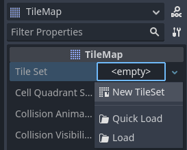

Creating a new LayeredTileSet resource within the LayeredTileMap node

After creating the LayeredTileSet resource, click the value to unfold it in the
inspector. The default tile shape is Square, but you can also choose Isometric,
Half-Offset Square or Hexagon (depending on the shape of your tile images). If
using a tile shape other than Square, you may also need to adjust the **Tile
Layout** and **Tile Offset Axis** properties. Lastly, enabling the
**Rendering > UV Clipping** property may be useful if you wish tiles to be clipped
by their tile coordinates. This ensures tiles cannot draw outside their allocated
area on the tilesheet.

Set the tile size to 64×64 in the inspector to match the example tilesheet:

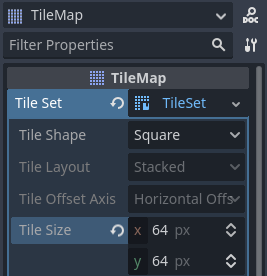

Setting the tile size to 64×64 to match the example tilesheet

If relying on automatic tiles creation (like we're about to do here), you must
set the tile size **before** creating the *atlas*. The atlas will
determine which tiles from the tilesheet can be added to a LayeredTileMap node
(as not every part of the image may be a valid tile).

Open the **LayeredTileSet** panel at the bottom of the editor, then click the "+" icon
in the bottom-left corner to add a new atlas:

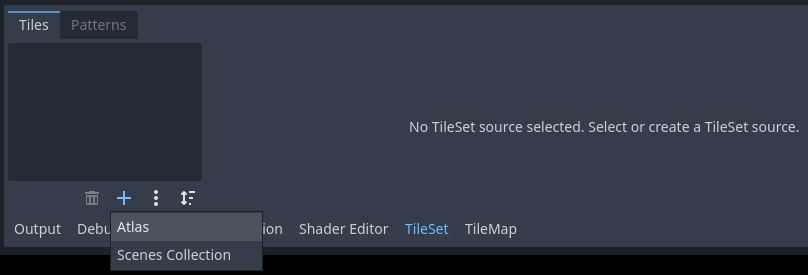

Creating a new atlas in a LayeredTileSet resource using the bottom panel

After creating an atlas, you must assign a tilesheet texture to it.
This can be done by choosing it on the left column of the bottom panel, then
clicking the value of the **Texture** property and choosing **Quick Load** (or **Load**).
Specify the path to the image file using the file dialog that appears.

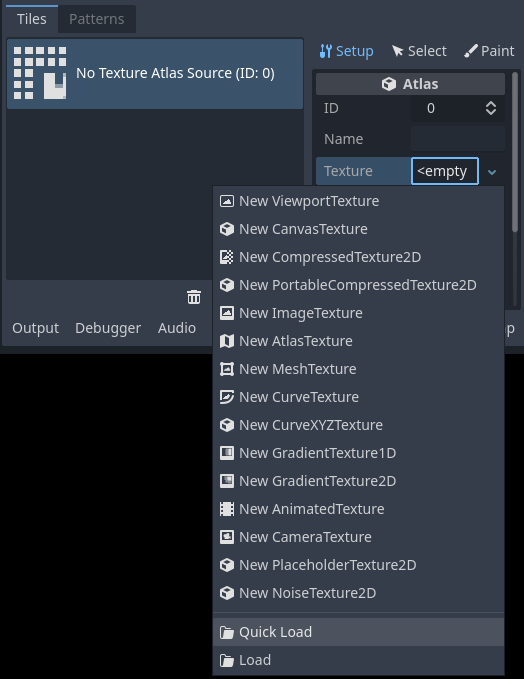

Loading a tilesheet image in the newly created LayeredTileSet atlas

After specifying a valid image, you will be asked whether to create tiles
automatically. Answer **Yes**:

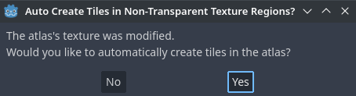

This will automatically create tiles according to the tile size you specified
earlier in the LayeredTileSet resource. This greatly speeds up initial tile setup.

Note:

- When using automatic tile generation based on image contents, parts of the tilesheet that are *fully* transparent will not have tiles generated.

If there are tiles from the tilesheet you do not wish to be present in atlas,
choose the Eraser tool at the top of the tileset preview, then click the tiles
you wish to remove:

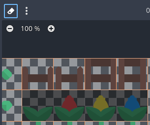

Using the Eraser tool to remove unwanted tiles from the LayeredTileSet atlas

You can also right-click a tile and choose **Delete**, as an alternative to the
Eraser tool.

Tip: Like in the 2D and LayeredTileMap editors, you can pan across the LayeredTileSet panel using the middle or right mouse buttons, and zoom using the mouse wheel or buttons in the top-left corner.

If you wish to source tiles from several tilesheet images for a single LayeredTileSet,
create additional atlases and assign textures to each of them before continuing.
It is also possible to use one image per tile this way (although using
tilesheets is recommended for better usability).

You can adjust properties for the atlas in the middle column:

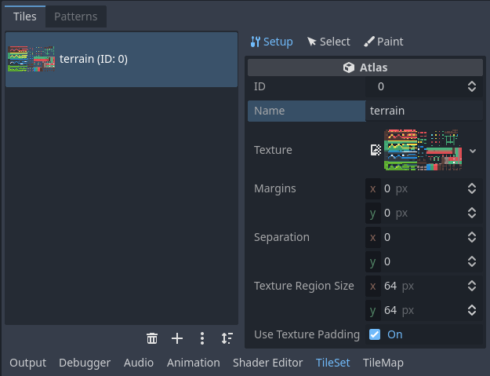

Adjusting LayeredTileSet atlas properties in the dedicated inspector (part of the LayeredTileSet panel)

The following properties can be adjusted on the atlas:

- **ID:** The identifier (unique within this LayeredTileSet), used for sorting.
- **Name:** The human-readable name for the atlas. Use a descriptive name
  here for organizational purposes (such as "terrain", "decoration", etc).
- **Margins:** The margins on the image's edges that should not be selectable as
  tiles (in pixels). Increasing this can be useful if you download a tilesheet
  image that has margins on the edges (e.g. for attribution).
- **Separation:** The separation between each tile on the atlas in pixels.
  Increasing this can be useful if the tilesheet image you're using contains
  guides (such as outlines between every tile).
- **Texture Region Size:** The size of each tile on the atlas in pixels. In most
  cases, this should match the tile size defined in the LayeredTileMap property
  (although this is not strictly necessary).
- **Use Texture Padding:** If checked, adds a 1-pixel transparent edge around
  each tile to prevent texture bleeding when filtering is enabled.
  It's recommended to leave this enabled unless you're running into rendering issues
  due to texture padding.

Note that changing texture margin, separation and region size may cause tiles to
be lost (as some of them would be located outside the atlas image's
coordinates). To regenerate tiles automatically from the tilesheet, use the
three vertical dots menu button at the top of the LayeredTileSet editor and choose
**Create Tiles in Non-Transparent Texture Regions**:

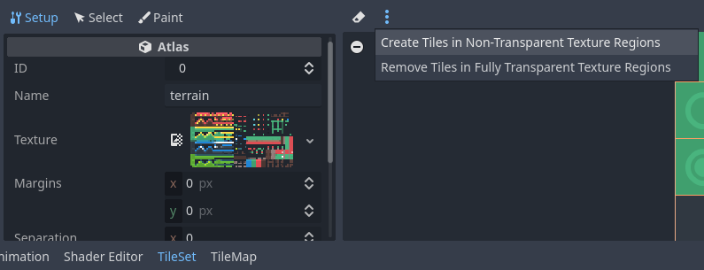

Recreating tiles automatically after changing atlas properties

### Using a collection of scenes

Since Godot 4.0, you can place actual *scenes* as tiles. This allows you to use
any collection of nodes as a tile. For example, you could use scene tiles to
place gameplay elements, such as shops the player may be able to interact with.
You could also use scene tiles to place AudioStreamPlayer2Ds (for ambient
sounds), particle effects, and more.

Warning:

- Scene tiles come with a greater performance overhead compared to atlases, as every scene is instanced individually for every placed tile.
- It's recommended to use only scene tiles when necessary. To draw sprites in a tile without any kind of advanced manipulation, use atlases instead.

For this example, we'll create a scene containing a CPUParticles2D root node.
Save this scene to a scene file (separate from the scene containing the
LayeredTileMap), then switch to the scene containing the LayeredTileMap node. Open the LayeredTileSet
editor, and create a new **Scenes Collection** in the left column:

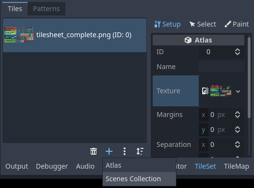

Creating a scenes collection in the LayeredTileSet editor

After creating a scenes collection, you can enter a descriptive name for the
scenes collection in the middle column if you wish. Select this scenes
collection then create a new scene slot:

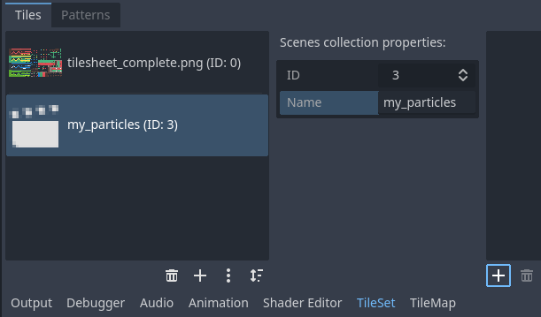

Creating a scene tile after selecting the scenes collection in the LayeredTileSet editor

Select this scene slot in the right column, then use **Quick Load** (or
**Load**) to load the scene file containing the particles:

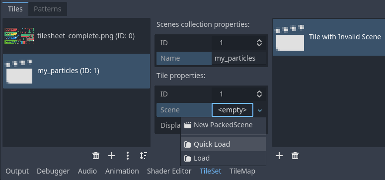

Creating a scene slot, then loading a scene file into it in the LayeredTileSet editor

You now have a scene tile in your LayeredTileSet. Once you switch to the LayeredTileMap
editor, you'll be able to select it from the scenes collection and paint it like
any other tile.

## Merging several atlases into a single atlas

Using multiple atlases within a single LayeredTileSet resource can sometimes be useful,
but it can also be cumbersome in certain situations (especially if you're using
one image per tile). Godot allows you to merge several atlases into a single
atlas for easier organization.

To do so, you must have more than one atlas created in the LayeredTileSet resource.
Use the "three vertical dots" menu button located at the bottom of the list of
atlases, then choose **Open Atlas Merging Tool**:

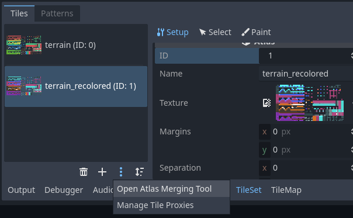

Opening the atlas merging tool after creating multiple atlases

This will open a dialog, in which you can select several atlases by holding
`Shift` or `Ctrl` then clicking on multiple elements:

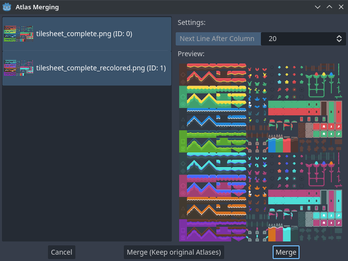

Using the atlas merging tool dialog

Choose **Merge** to merge the selected atlases into a single atlas image (which
translates to a single atlas within the LayeredTileSet). The unmerged atlases will be
removed within the LayeredTileSet, but *the original tilesheet images will be kept on
the filesystem*. If you don't want the unmerged atlases to be removed from the
LayeredTileSet resource, choose **Merge (Keep Original Atlases)** instead.

Tip:

- LayeredTileSet features a system of *tile proxies*. Tile proxies are a mapping table that allows notifying the LayeredTileMap using a given LayeredTileSet that a given set of tile identifiers should be replaced by another one.
- Tile proxies are automatically set up when merging different atlases, but they can also be set manually thanks to the **Manage Tile Proxies** dialog you can access using the "three vertical dots" menu mentioned above.
- Manually creating tile proxies may be useful when you changed an atlas ID or want to replace all tiles from an atlas by the ones from another atlas. Note that when editing a LayeredTileMap, you can replace all cells by their corresponding mapped value.

## Adding collision, navigation and occlusion to the LayeredTileSet

We've now successfully created a basic LayeredTileSet. We could start using in the
LayeredTileMap node now, but it currently lacks any form of collision detection.
This means the player and other objects could walk straight through the floor or
walls.

If you use 2D navigation, you'll also need
to define navigation polygons for tiles to generate a navigation mesh that
agents can use for pathfinding.

Lastly, if you use 2D Lights and Shadows or GPUParticles2D, you may
also want your LayeredTileSet to be able to cast shadows and collide with particles.
This requires defining occluder polygons for "solid" tiles on the LayeredTileSet.

To be able to define collision, navigation and occlusion shapes for each tile,
you will need to create a physics, navigation or occlusion layer for the LayeredTileSet
resource first. To do so, select the LayeredTileMap node, click the LayeredTileSet property
value in the inspector to edit it then unfold **Physics Layers** and choose
**Add Element**:

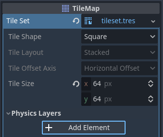

Creating a physics layer in the LayeredTileSet resource inspector (within the LayeredTileMap node)

If you also need navigation support, now is a good time to create a navigation layer:

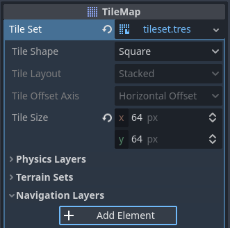

Creating a navigation layer in the LayeredTileSet resource inspector (within the LayeredTileMap node)

If you need support for light polygon occluders, now is a good time to create an occlusion layer:

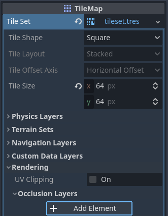

Creating an occlusion layer in the LayeredTileSet resource inspector (within the LayeredTileMap node)

Note:

- Future steps in this tutorial are tailored to creating collision polygons, but the procedure for navigation and occlusion is very similar. Their respective polygon editors behave in the same way, so these steps are not repeated for brevity.
- The only caveat is that the tile's occlusion polygon property is part of a **Rendering** subsection in the atlas inspector. Make sure to unfold this section so you can edit the polygon.

After creating a physics layer, you have access to the **Physics Layer** section
in the LayeredTileSet atlas inspector:

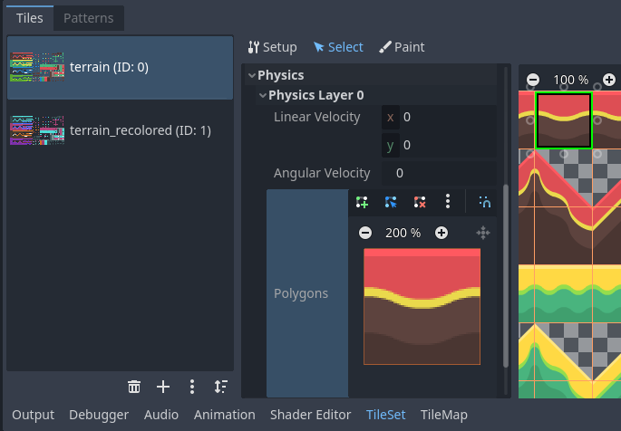

Opening the collision editor while in Select mode

You can quickly create a rectangle collision shape by pressing `F` while
the LayeredTileSet editor is focused. If the keyboard shortcut doesn't work, try
clicking in the empty area around the polygon editor to focus it:

Using default rectangle collision shape by pressing `F`

In this tile collision editor, you have access to all the 2D polygon editing tools:

- Use the toolbar above the polygon to toggle between creating a new polygon,
  editing an existing polygon and removing points on the polygon. The "three vertical dots"
  menu button offers additional options, such as rotating and flipping the polygon.
- Create new points by clicking and dragging a line between two points.
- Remove a point by right-clicking it (or using the Remove tool described above
  and left-clicking).
- Pan in the editor by middle-clicking or right-clicking. (Right-click panning
  can only be used in areas where there is no point nearby.)

You can use the default rectangle shape to quickly create a triangle-shaped
collision shape by removing one of the points:

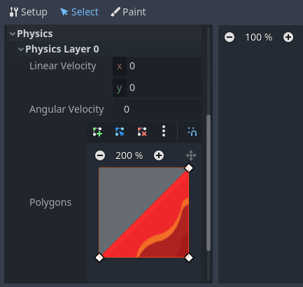

Creating a triangle collision shape by right-clicking one of the corners to remove it

You can also use the rectangle as a base for more complex shapes by adding more points:

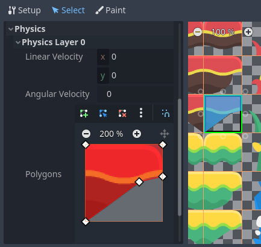

Drawing a custom collision for a complex tile shape

Tip:

If you have a large tileset, specifying the collision for each tile individually could take a lot of time. This is especially true as LayeredTileMaps tend to have many tiles with common collision patterns (such as solid blocks or 45-degree slopes). To apply a similar collision shape to several tiles quickly, use functionality to assign properties to multiple tiles at once.

## Assigning custom metadata to the LayeredTileSet's tiles

You can assign custom data on a per-tile basis using *custom data layers*.
This can be useful to store information specific to your game, such as the damage
that a tile should deal when the player touches it, or whether a tile can be
destroyed using a weapon.

The data is associated with the tile in the LayeredTileSet: all instances of the placed
tile will use the same custom data. If you need to create a variant of a tile
that has different custom data, this can be done by creating an
alternative tile and changing the custom data for the alternative tile only.

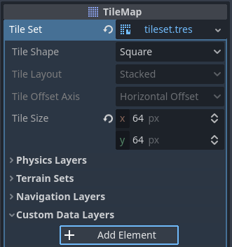

Creating a custom data layer in the LayeredTileSet resource inspector (within the LayeredTileMap node)

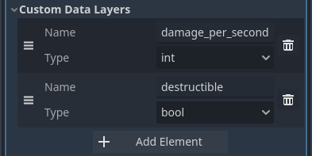

Example of configured custom data layers with game-specific properties

You can reorder custom data without breaking existing metadata: the LayeredTileSet
editor will update automatically after reordering custom data properties.

Note that in the editor, property names do not appear (only their index, which
matches the order in which they are defined). For example, with the custom data
layers example shown above, we're assigning a tile to have the
`damage_per_second` metadata set to `25` and the `destructible` metadata
to `false`:

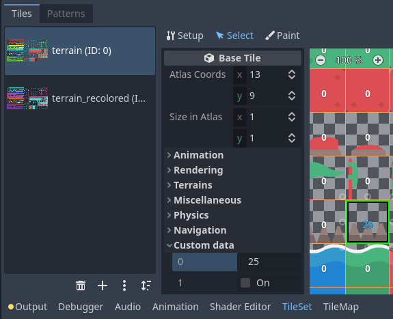

Editing custom data in the LayeredTileSet editor while in Select mode

Tile property painting can also be used for custom data:

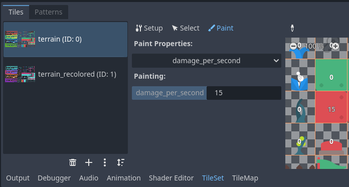

Assigning custom data in the LayeredTileSet editor using tile property painting

## Creating terrain sets (autotiling)

Note:

- This functionality was implemented in a different form as *autotiling* in Godot 3.x. Terrains are essentially a more powerful replacement of autotiles. Unlike autotiles, terrains can support transitions from one terrain to another, as a tile may define several terrains at once.
- Unlike before, where autotiles were a specific kind of tiles, terrains are only a set of properties assigned to atlas tiles. These properties are then used by a dedicated LayeredTileMap painting mode that selects tiles featuring terrain data in a smart way. This means any terrain tile can be either painted as terrain or as a single tile, like any other.

A "polished" tileset generally features variations that you should use on
corners or edges of platforms, floors, etc. While these can be placed manually,
this quickly becomes tedious. Handling this situation with procedurally
generated levels can also be difficult and require a lot of code.

Godot offers *terrains* to perform this kind of tile connections automatically.
This allows you to have the "correct" tile variants automatically used.

Terrains are grouped into terrain sets. Each terrain set is assigned a mode from
**Match Corners and Sides**, **Match Corners** and **Match sides**. They define how
terrains are matched to each other in a terrain set.

Note:

- The above modes correspond to the previous bitmask modes autotiles used in Godot 3.x: 2×2, 3×3 or 3×3 minimal. This is also similar to what the [Tiled](https://www.mapeditor.org/) editor features.

Select the LayeredTileMap node, go to the inspector and create a new terrain set within the LayeredTileSet *resource*:

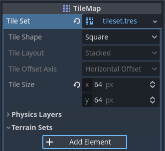

Creating a terrain set in the LayeredTileSet resource inspector (within the LayeredTileMap node)

After creating a terrain set, you **must** create one or more terrains *within* the terrain set:

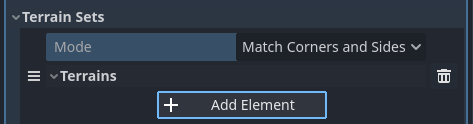

Creating a terrain within the terrain set

In the LayeredTileSet editor, switch to Select mode and click a tile. In the middle
column, unfold the **Terrains** section then assign a terrain set ID and a
terrain ID for the tile. `-1` means "no terrain set" or "no terrain", which
means you must set **Terrain Set** to `0` or greater before you can set
**Terrain** to `0` or greater.

Note:

- Terrain set IDs and terrain IDs are independent from each other. They also start from `0`, not `1`.

Configuring terrain on a single tile in the LayeredTileSet editor's Select mode

After doing so, you can now configure the **Terrain Peering Bits** section which
becomes visible in the middle column. The peering bits determine which tile will
be placed depending on neighboring tiles. `-1` is a special value which refers
to empty space.

For example, if a tile has all its bits set to `0` or greater, it will only
appear if *all* 8 neighboring tiles are using a tile with the same terrain ID.
If a tile has its bits set to `0` or greater,
but the top-left, top and top-right bits are set to `-1`, it will only appear
if there is empty space on top of it (including diagonally).

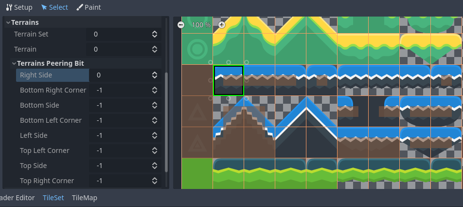

Configuring terrain peering bits on a single tile in the LayeredTileSet editor's Select mode

An example configuration for a full tilesheet may look as follows:

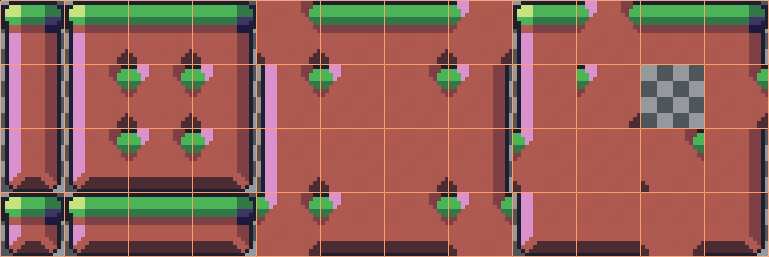

Example full tilesheet for a sidescrolling game

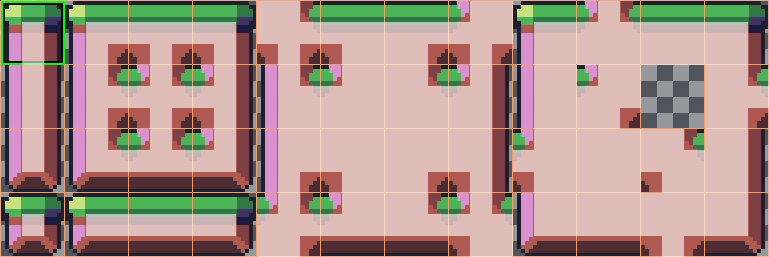

Example full tilesheet for a sidescrolling game with terrain peering bits visible

## Assigning properties to multiple tiles at once

There are two ways to assign properties to multiple tiles at once.
Depending on your use cases, one method may be faster than the other:

### Using multiple tile selection

If you wish to configure various properties on several times at once,
choose the **Select** mode at the top of the LayeredTileSet editor:

After doing this, you can select multiple tiles on the right column by holding
`Shift` then clicking on tiles. You can also perform rectangle selection by
holding down the left mouse button then dragging the mouse. Lastly, you can
deselect tiles that were already selected (without affecting the rest of the
selection) by holding `Shift` then clicking on a selected tile.

You can then assign properties using the inspector in the middle column of the
LayeredTileSet editor. Only properties that you change here will be applied to all
selected tiles. Like in the editor's inspector, properties that differ on
selected tiles will remain different until you edit them.

With numerical and color properties, you will also see a preview of the
property's value on all tiles in the atlas after editing a property:

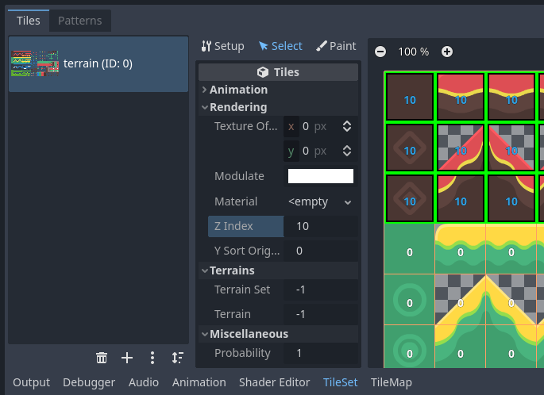

Selecting multiple tiles using the Select mode, then applying properties

### Using tile property painting

If you wish to apply a single property to several tiles at once,
you can use the *property painting* mode for this purpose.

Configure a property to be painted in the middle column, then
click on tiles (or hold down the left mouse button) in the right column
to "paint" properties onto tiles.

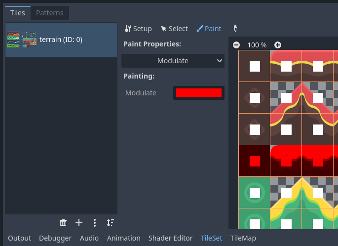

Painting tile properties using the LayeredTileSet editor

Tile property painting is especially useful with properties that are
time-consuming to set manually, such as collision shapes:

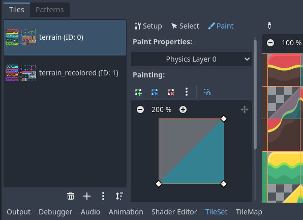

Painting a collision polygon, then left-clicking tiles to apply it

## Creating alternative tiles

Sometimes, you want to use a single tile image (found only once within the
atlas), but configured in different ways. For example, you may want to use the
same tile image, but rotated, flipped, or modulated with a different color. This
can be done using *alternative tiles*.

Tip:

Since Godot 4.2, you don't have to create alternative tiles to rotate or
flip tiles anymore. You can rotate any tile while placing it in the
LayeredTileMap editor by using the rotation/flip buttons in the LayeredTileMap editor
toolbar.

To create an alternative tile, right-click a base tile in the atlas displayed by
the LayeredTileSet editor, then choose **Create an Alternative Tile**:

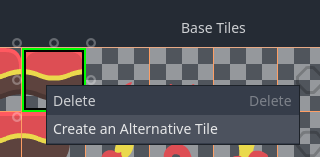

Creating an alternative tile by right-clicking a base tile in the LayeredTileSet editor

If currently in Select mode, the alternative tile will already be selected
for editing. If not currently in Select mode, you can still create alternative
tiles, but you will need to switch to Select mode and select the alternative
tile to edit it.

If you don't see the alternative tile, pan over to the right of the atlas image,
as alternative tiles always appear on the right of base tiles of a given atlas
in the LayeredTileSet editor:

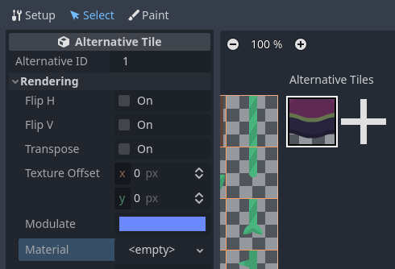

Configuring an alternative tile after clicking it in the LayeredTileSet editor

After selecting an alternative tile, you can change any properties using the
middle column like you would on a base tile. However, the list of exposed
properties is different compared to base tiles:

- **Alternative ID:** The unique numerical identifier for this alternative tile.
  Changing it will break existing LayeredTileMaps, so be careful! This ID also controls
  the sorting in the list of alternative tiles displayed in the editor.
- **Rendering > Flip H:** If `true`, the tile is horizontally flipped.
- **Rendering > Flip V:** If `true`, the tile is vertically flipped.
- **Rendering > Transpose:** If `true`, the tile is rotated 90 degrees
  *counter-clockwise* and then flipped vertically. In practice, this means that
  to rotate a tile by 90 degrees clockwise without flipping it, you should
  enable **Flip H** and **Transpose**. To rotate a tile by 180 degrees
  clockwise, enable **Flip H** and **Flip V**. To rotate a tile by 270 degrees
  clockwise, enable **Flip V** and **Transpose**.
- **Rendering > Texture Origin:** The origin to use for drawing the tile. This
  can be used to visually offset the tile compared to the base tile.
- **Rendering > Modulate:** The color multiplier to use when rendering the tile.
- **Rendering > Material:** The material to use for this tile. This can be used
  to apply a different blend mode or custom shaders to a single tile.
- **Z Index:** The sorting order for this tile. Higher values will make the tile
  render in front of others on the same layer.
- **Y Sort Origin:** The vertical offset to use for tile sorting based on its Y
  coordinate (in pixels). This allows using layers as if they were on different
  height for top-down games. Adjusting this can help alleviate issues with
  sorting certain tiles. Only effective if **Y Sort Enabled** is `true` on
  the LayeredTileMap layer the tile is placed on.

You can create an additional alternative tile variant by clicking the large "+"
icon next to the alternative tile. This is equivalent to selecting the base tile
and right-clicking it to choose **Create an Alternative Tile** again.

Note:

- When creating an alternative tile, none of the properties from the base tile are inherited. You must set properties again on the alternative tile if you wish those to be identical on the base tile and the alternative tile.
