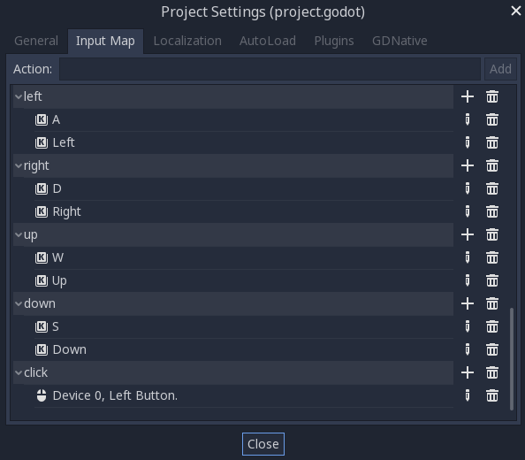

.. _doc_2d_movement:

2D movement overview
====================

Introduction
------------

Every beginner has been there: "How do I move my character?" Depending on the
style of game you're making, you may have special requirements, but in general
the movement in most 2D games is based on a small number of designs.

We'll use `KinematicBody2D` for these examples,
but the principles will apply to other node types (Area2D, RigidBody2D) as well.

.. _doc_2d_movement_setup:

Setup
-----

Each example below uses the same scene setup. Start with a `KinematicBody2D` with two
children: `Sprite` and `CollisionShape2D`. You can use the Godot icon ("icon.png)")
for the Sprite's texture or use any other 2D image you have.

Open `Project -> Project Settings` and select the "Input Map" tab. Add the following
input actions (see `InputEvent <doc_inputevent )` for details):



8-way movement
--------------

In this scenario, you want the user to press the four directional keys (up/left/down/right
or W/A/S/D) and move in the selected direction. The name "8-way movement" comes from the
fact that the player can move diagonally by pressing two keys at the same time.


Add a script to the kinematic body and add the following code:

gdscript GDScript

```
    extends KinematicBody2D

    export (int) var speed = 200

    var velocity = Vector2()

    func get_input():
        velocity = Vector2()
        if Input.is_action_pressed("right"):
            velocity.x += 1
        if Input.is_action_pressed("left"):
            velocity.x -= 1
        if Input.is_action_pressed("down"):
            velocity.y += 1
        if Input.is_action_pressed("up"):
            velocity.y -= 1
        velocity = velocity.normalized() * speed

    func _physics_process(delta):
        get_input()
        velocity = move_and_slide(velocity)
```

In the `get_input()` function, we check for the four key events and sum them
up to get the velocity vector. This has the benefit of making two opposite keys
cancel each other out, but will also result in diagonal movement being faster
due to the two directions being added together.

We can prevent that if we *normalize* the velocity, which means we set
its *length* to `1`, and multiply by the desired speed.

.. tip:: If you've never used vector math before, or need a refresher,
         you can see an explanation of vector usage in Godot at `doc_vector_math`.

.. note::

    If the code above does nothing when you press the keys, double-check that
    you've set up input actions correctly as described in the
    `doc_2d_movement_setup` part of this tutorial.

Rotation + movement
-------------------

This type of movement is sometimes called "Asteroids-style" because it resembles
how that classic arcade game worked. Pressing left/right rotates the character,
while up/down moves it forward or backward in whatever direction it's facing.


gdscript GDScript

```
    extends KinematicBody2D

    export (int) var speed = 200
    export (float) var rotation_speed = 1.5

    var velocity = Vector2()
    var rotation_dir = 0

    func get_input():
        rotation_dir = 0
        velocity = Vector2()
        if Input.is_action_pressed("right"):
            rotation_dir += 1
        if Input.is_action_pressed("left"):
            rotation_dir -= 1
        if Input.is_action_pressed("down"):
            velocity = Vector2(-speed, 0).rotated(rotation)
        if Input.is_action_pressed("up"):
            velocity = Vector2(speed, 0).rotated(rotation)

    func _physics_process(delta):
        get_input()
        rotation += rotation_dir * rotation_speed * delta
        velocity = move_and_slide(velocity)
```

Here we've added two new variables to track our rotation direction and speed.
Again, pressing both keys at once will cancel out and result in no rotation.
The rotation is applied directly to the body's `rotation` property.

To set the velocity, we use the `Vector2.rotated()` method, so that it points
in the same direction as the body. `rotated()` is a useful vector function
that you can use in many circumstances where you would otherwise need to apply
trigonometric functions.

Rotation + movement (mouse)
---------------------------

This style of movement is a variation of the previous one. This time, the direction
is set by the mouse position instead of the keyboard. The character will always
"look at" the mouse pointer. The forward/back inputs remain the same, however.


gdscript GDScript

```
    extends KinematicBody2D

    export (int) var speed = 200

    var velocity = Vector2()

    func get_input():
        look_at(get_global_mouse_position())
        velocity = Vector2()
        if Input.is_action_pressed("down"):
            velocity = Vector2(-speed, 0).rotated(rotation)
        if Input.is_action_pressed("up"):
            velocity = Vector2(speed, 0).rotated(rotation)

    func _physics_process(delta):
        get_input()
        velocity = move_and_slide(velocity)
```

Here we're using the `Node2D` `look_at()` method to
point the player towards a given position. Without this function, you
could get the same effect by setting the angle like this:

gdscript GDScript

```
    rotation = get_global_mouse_position().angle_to_point(position)
```


Click-and-move
--------------

This last example uses only the mouse to control the character. Clicking
on the screen will cause the player to move to the target location.


gdscript GDScript

```
    extends KinematicBody2D

    export (int) var speed = 200

    onready var target = position
    var velocity = Vector2()

    func _input(event):
        if event.is_action_pressed("click"):
            target = get_global_mouse_position()

    func _physics_process(delta):
        velocity = position.direction_to(target) * speed
        # look_at(target)
        if position.distance_to(target) > 5:
            velocity = move_and_slide(velocity)
```


Note the `distance_to()` check we make prior to movement. Without this test,
the body would "jitter" upon reaching the target position, as it moves
slightly past the position and tries to move back, only to move too far and
repeat.

Uncommenting the `look_at()` line will also turn the body to point in its
direction of motion if you prefer.

.. tip:: This technique can also be used as the basis of a "following" character.
         The `target` position can be that of any object you want to move to.

Summary
-------

You may find these code samples useful as starting points for your own projects.
Feel free to use them and experiment with them to see what you can make.

You can download this sample project here:
:download:`2D_movement_demo.zip <files/2D_movement_demo.zip )`
