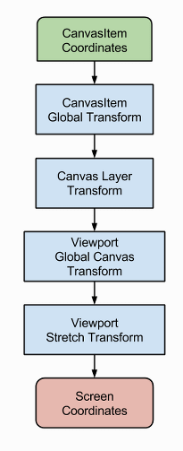

.. _doc_viewport_and_canvas_transforms:

Viewport and canvas transforms
==============================

Introduction
------------

This is an overview of the 2D transforms going on for nodes from the
moment they draw their content locally to the time they are drawn onto
the screen. This overview discusses very low level details of the engine.

Canvas transform
----------------

As mentioned in the previous tutorial, `doc_canvas_layers`, every
CanvasItem node (remember that Node2D and Control based nodes use
CanvasItem as their common root) will reside in a *Canvas Layer*. Every
canvas layer has a transform (translation, rotation, scale, etc.) that
can be accessed as a `Transform2D`.

Also covered in the previous tutorial, nodes are drawn by default in Layer 0,
in the built-in canvas. To put nodes in a different layer, a `CanvasLayer
<class_CanvasLayer>` node can be used.

Global canvas transform
-----------------------

Viewports also have a Global Canvas transform (also a
`Transform2D`). This is the master transform and
affects all individual *Canvas Layer* transforms. Generally, this
transform is not of much use, but is used in the CanvasItem Editor
in Godot's editor.

Stretch transform
-----------------

Finally, viewports have a *Stretch Transform*, which is used when
resizing or stretching the screen. This transform is used internally (as
described in `doc_multiple_resolutions`), but can also be manually set
on each viewport.

Input events received in the `MainLoop._input_event()`
callback are multiplied by this transform but lack the ones above. To
convert InputEvent coordinates to local CanvasItem coordinates, the
`CanvasItem.make_input_local()`
function was added for convenience.

Transform order
---------------

For a coordinate in CanvasItem local properties to become an actual
screen coordinate, the following chain of transforms must be applied:



Transform functions
-------------------

Obtaining each transform can be achieved with the following functions:

+----------------------------------+---------------------------------------------------------------------------------------------+
| Type                             | Transform                                                                                   |
+==================================+=============================================================================================+
| CanvasItem                       | `CanvasItem.get_global_transform()`     |
+----------------------------------+---------------------------------------------------------------------------------------------+
| CanvasLayer                      | `CanvasItem.get_canvas_transform()`     |
+----------------------------------+---------------------------------------------------------------------------------------------+
| CanvasLayer+GlobalCanvas+Stretch | `CanvasItem.get_viewport_transform()` |
+----------------------------------+---------------------------------------------------------------------------------------------+

Finally, then, to convert a CanvasItem local coordinates to screen
coordinates, just multiply in the following order:

gdscript GDScript

```
    var screen_coord = get_viewport_transform() * (get_global_transform() * local_pos)
```

Keep in mind, however, that it is generally not desired to work with
screen coordinates. The recommended approach is to simply work in Canvas
coordinates (`CanvasItem.get_global_transform()`), to allow automatic
screen resolution resizing to work properly.

Feeding custom input events
---------------------------

It is often desired to feed custom input events to the scene tree. With
the above knowledge, to correctly do this, it must be done the following
way:

gdscript GDScript

```
    var local_pos = Vector2(10, 20) # local to Control/Node2D
    var ie = InputEventMouseButton.new()
    ie.button_index = BUTTON_LEFT
    ie.position = get_viewport_transform() * (get_global_transform() * local_pos)
    get_tree().input_event(ie)
```
