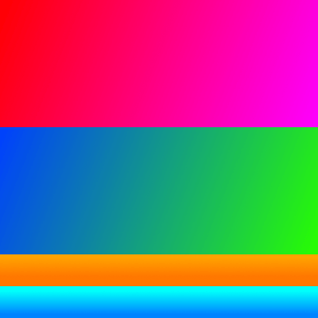

3D text
=======

Introduction
------------

In a project, there may be times when text needs to be created as
part of a 3D scene and not just in the HUD. Godot provides two
methods to do this. The Label3D node and the text mesh for a
MeshInstance node.

This page does **not** cover how to display a GUI scene in a 3D
environment. For information on how to do that see `this ( https://github.com/godotengine/godot-demo-projects/tree/master/viewport/2d_in_3d )`
demo project.

Label3D
-------

Label3D behaves like a label node but in a 3D space. Unlike label
node this can not inherit properties of a GUI theme. However its
look remains customizable and uses the same DynamicFont and BitmapFont
subresources control nodes use.

Label3D has minimal interaction with a 3D environment, it can be lit
up and shaded by light sources if the shaded flag is enabled, but it
will not cast a shadow, even with cast shadow turned on under the nodes
GeometryInstance3D settings. This is because the node is a quad mesh
(one glyph per quad) with transparent textures and has the same limitations
as Sprite3D. See `this page ( doc_3d_rendering_limitations_transparency_sorting )`
for more information.

Text mesh
---------

Text meshes have similarities to Label3D. They display text in a 3D
scene, and will use the same DynamicFont subresource. However text is 3D and
has the properties of a mesh. A text mesh cast shadows onto the environment
and can have a material applied to it. Here is an example of a texture and
how it's applied to the mesh.

There are two limitations to text mesh. It can't use bitmap fonts, or fonts
with self intersection.
