Prototyping levels with CSG
===========================

CSG stands for **Constructive Solid Geometry**, and is a tool to combine basic
shapes or custom meshes to create more complex shapes. In 3D modelling software,
CSG is mostly known as "Boolean Operators".

Level prototyping is one of the main uses of CSG in Godot. This technique allows
users to create simple versions of most common shapes by combining primitives.
Interior environments can be created by using inverted primitives.

.. note:: The CSG nodes in Godot are mainly intended for prototyping. There is
          no built-in support for UV mapping or editing 3D polygons (though
          extruded 2D polygons can be used with the CSGPolygon node).

          If you're looking for an easy to use level design tool for a project,
          you may want to use `Qodot ( https://github.com/Shfty/qodot-plugin )`
          instead. It lets you design levels using
          `TrenchBroom ( https://kristianduske.com/trenchbroom/ )` and import
          them in Godot.

Introduction to CSG nodes
-------------------------

Like other features of Godot, CSG is supported in the form of nodes. These are
the CSG nodes:

- `CSGBox`
- `CSGCylinder` (also supports cone)
- `CSGSphere`
- `CSGTorus`
- `CSGPolygon`
- `CSGMesh`
- `CSGCombiner`

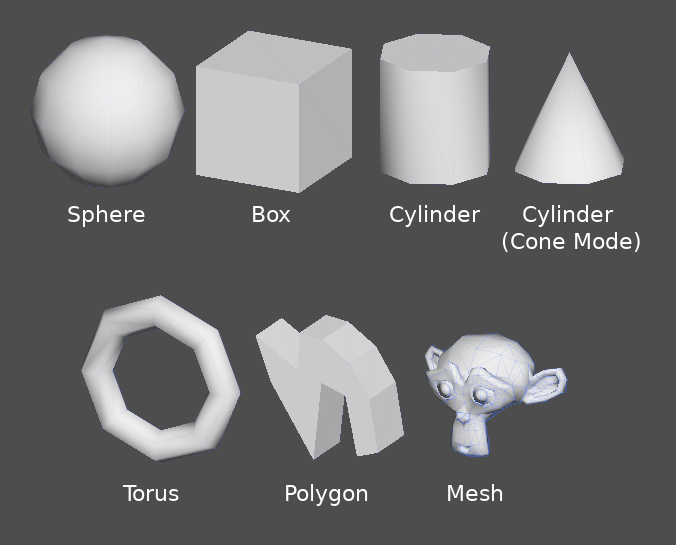

CSG tools features
~~~~~~~~~~~~~~~~~~

Every CSG node supports 3 kinds of boolean operations:

- **Union:** Geometry of both primitives is merged, intersecting geometry
  is removed.
- **Intersection:** Only intersecting geometry remains, the rest is removed.
- **Subtraction:** The second shape is subtracted from the first, leaving a dent
  with its shape.

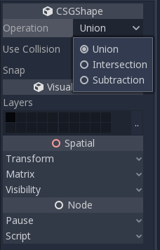

CSGPolygon
~~~~~~~~~~

The `CSGPolygon` node extrude along a Polygon drawn in
2D (in X, Y coordinates) in the following ways:

- **Depth:** Extruded back a given amount.
- **Spin:** Extruded while spinning around its origin.
- **Path:** Extruded along a Path node. This operation is commonly called
  lofting.

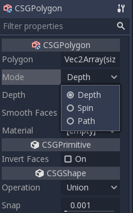

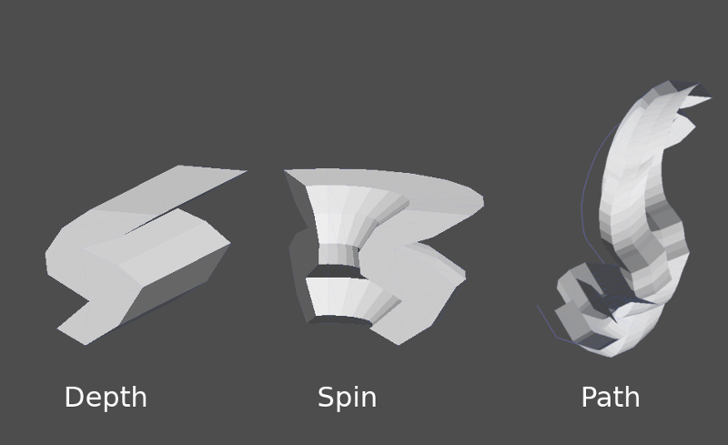

.. note:: The **Path** mode must be provided with a `Path`
          node to work. In the Path node, draw the path and the polygon in
          CSGPolygon will extrude along the given path.

Custom meshes
~~~~~~~~~~~~~

Any mesh can be used for `CSGMesh`; the mesh can be
modelled in other software and imported into Godot. Multiple materials are
supported. There are some restrictions for geometry:

- it must be closed,
- it must not self-intersect,
- it must not contain internal faces,
- every edge must connect to only two other faces.

CSGCombiner
~~~~~~~~~~~

The `CSGCombiner` node is an empty shape used for
organization. It will only combine children nodes.

Processing order
~~~~~~~~~~~~~~~~

Every CSG node will first process its children nodes and their operations:
union, intersection or subtraction, in tree order, and apply them to itself one
after the other.

.. note:: In the interest of performance, make sure CSG geometry remains
          relatively simple, as complex meshes can take a while to process.
          If adding objects together (such as table and room objects), create
          them as separate CSG trees. Forcing too many objects in a single tree
          will eventually start affecting performance.
          Only use binary operations where you actually need them.

Prototyping a level
-------------------

We will prototype a room to practice the use of CSG tools.

.. tip:: Working in **Orthogonal** projection gives a better view when combining
         the CSG shapes.

Our level will contain these objects:

- a room,
- a bed,
- a lamp,
- a desk,
- a bookshelf.

Create a scene with a Spatial node as root node.

.. tip:: The default lighting of the environment doesn't provide clear shading
         at some angles. Change the display mode using **Display Overdraw** in
         the 3D viewport menu, or add a DirectionalLight node to help you see
         clearly.

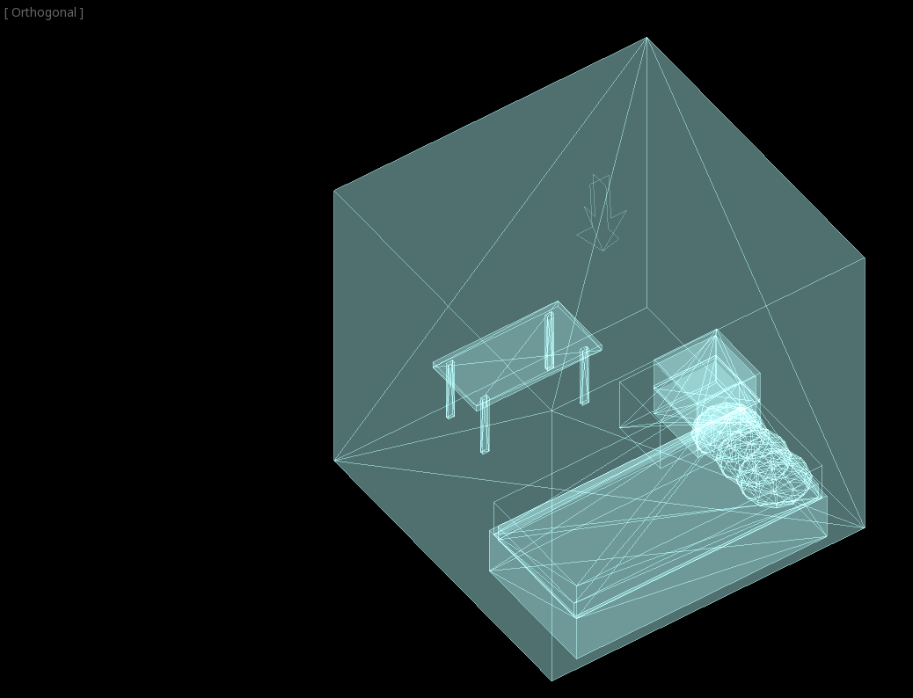

Create a CSGBox and name it `room`, enable **Invert Faces** and change the
dimensions of your room.

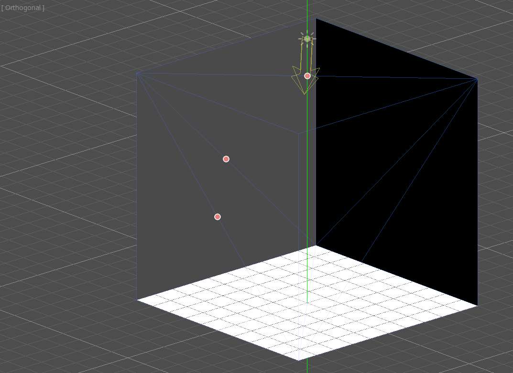

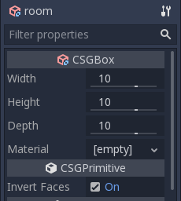

Next, create a CSGCombiner and name it `desk`.

A desk has one surface and 4 legs:

- Create 1 CSGBox children node in **Union** mode for the surface
  and adjust the dimensions.
- Create 4 CSGBox children nodes in **Union** mode for the legs
  and adjust the dimensions.

Adjust their placement to resemble a desk.

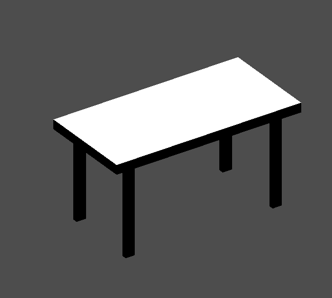

.. note:: CSG nodes inside a CSGCombiner will only process their operation
          within the combiner. Therefore, CSGCombiners are used to organize
          CSG nodes.

Create a CSGCombiner and name it `bed`.

Our bed consists of 3 parts: the bed, the mattress and a pillow. Create a CSGBox
and adjust its dimension for the bed. Create another CSGBox and adjust its
dimension for the mattress.

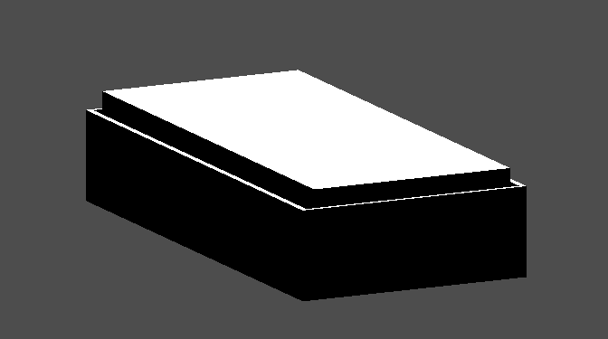

We will create another CSGCombiner named `pillow` as the child of  `bed`.
The scene tree should look like this:

We will combine 3 CSGSphere nodes in **Union** mode to form a pillow. Scale the
Y axis of the spheres and enable **Smooth Faces**.

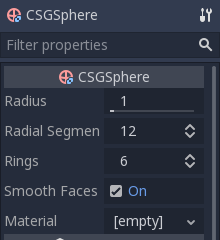

Select the `pillow` node and switch the mode to **Subtraction**; the combined
spheres will cut a hole into the mattress.

Try to re-parent the `pillow` node to the root `Spatial` node; the hole will
disappear.

.. note:: This is to illustrate the effect of CSG processing order.
          Since the root node is not a CSG node, the CSGCombiner nodes are
          the end of the operations; this shows the use of CSGCombiner to
          organize the CSG scene.

Undo the re-parent after observing the effect. The bed you've built should look
like this:

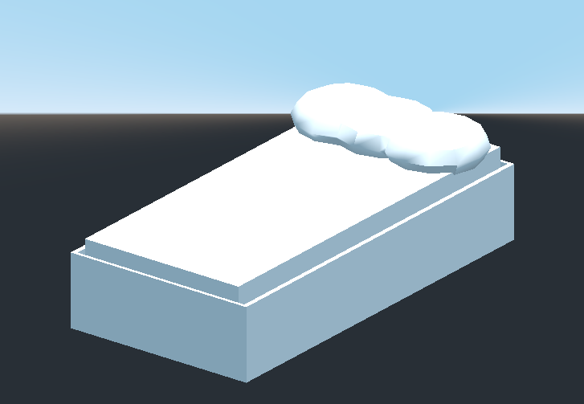

Create a CSGCombiner and name it `lamp`.

A lamp consists of 3 parts: the stand, the pole and the lampshade.
Create a CSGCylinder, enable the **Cone** option and make it the stand. Create
another CSGCylinder and adjust the dimensions to use it as a pole.

We will use a CSGPolygon for the lampshade. Use the **Spin** mode for the
CSGPolygon and draw a `trapezoid ( https://en.wikipedia.org/wiki/Trapezoid )`_
while in **Front View** (numeric keypad 1); this shape will extrude around the
origin and form the lampshade.

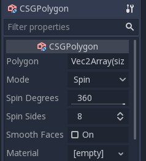

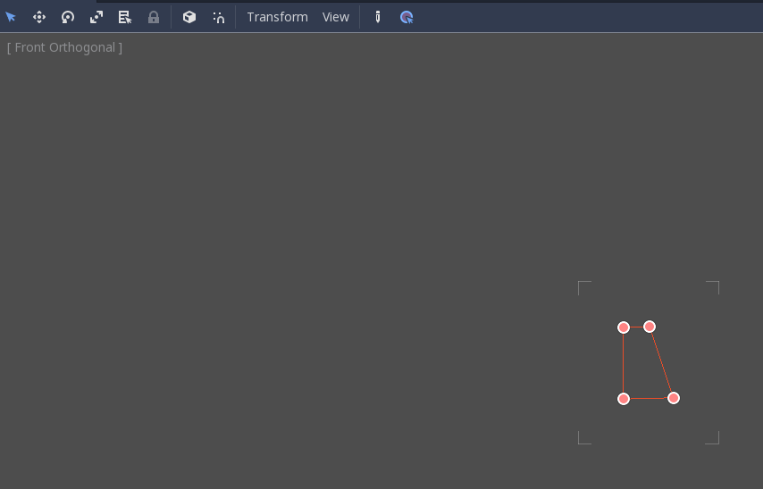

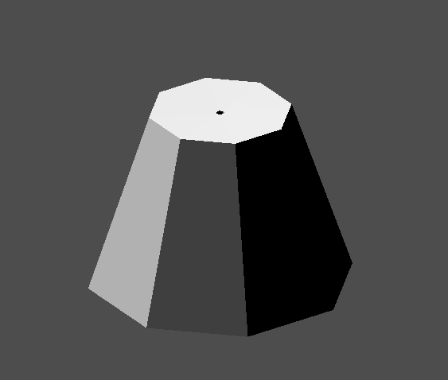

Adjust the placement of the 3 parts to make it look like a lamp.

Create a CSGCombiner and name it `bookshelf`.

We will use 3 CSGBox nodes for the bookshelf. Create a CSGBox and adjust its
dimensions; this will be the size of the bookshelf.

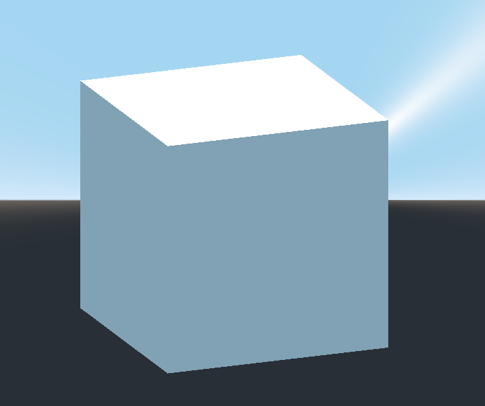

Duplicate the CSGBox and shorten the dimensions of each axis and change the mode
to **Subtraction**.

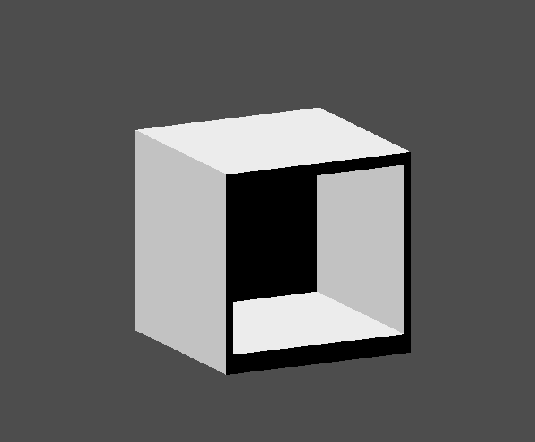

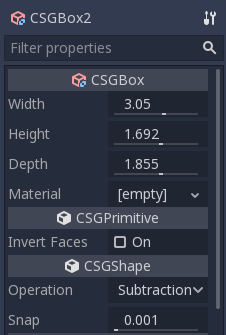

You've almost built a shelf. Create one more CSGBox for dividing the shelf into
two levels.

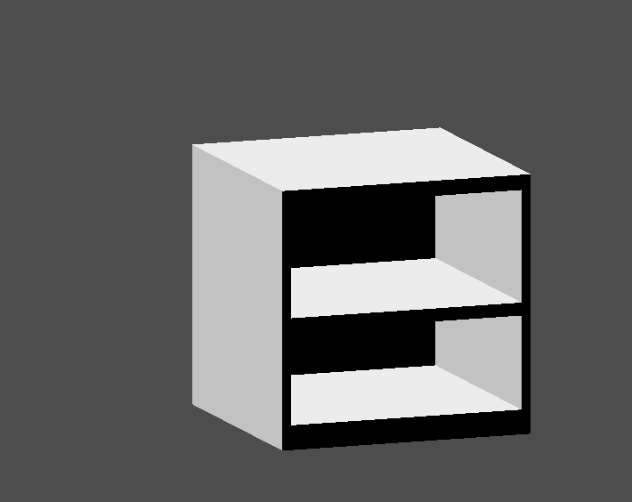

Position your furniture in your room as you like and your scene should look
this:

You've successfully prototyped a room level with the CSG tools in Godot.
CSG tools can be used for designing all kinds of levels, such as a maze
or a city; explore its limitations when designing your game.

Using prototype textures
------------------------

Godot's `doc_spatial_material` supports *triplanar mapping*, which can be
used to automatically apply a texture to arbitrary objects without distortion.
This is handy when using CSG as Godot doesn't support editing UV maps on CSG
nodes yet. Triplanar mapping is relatively slow, which usually restricts its
usage to organic surfaces like terrain. Still, when prototyping, it can be used
to quickly apply textures to CSG-based levels.

.. note:: If you need some textures for prototyping, Kenney made a
          `set of CC0-licensed prototype textures ( https://kenney.nl/assets/prototype-textures )`.

There are two ways to apply a material to a CSG node:

- Applying it to a CSGCombiner node as a material override
  (**Geometry > Material Override** in the Inspector). This will affect its
  children automatically, but will make it impossible to change the material in
  individual children.
- Applying a material to individual nodes (**Material** in the Inspector). This
  way, each CSG node can have its own appearance. Subtractive CSG nodes will
  apply their material to the nodes they're "digging" into.

To apply triplanar mapping to a CSG node, select it, go to the Inspector, click
the **[empty]** text next to **Material Override** (or **Material** for
individual CSG nodes). Choose **New SpatialMaterial**. Click the newly created
material's icon to edit it. Unfold the **Albedo** section and load a texture
into the **Texture** property. Now, unfold the **Uv1** section and check
**Triplanar**. You can change the texture offset and scale on each axis by
playing with the **Scale** and **Offset** properties just above. Higher values
in the **Scale** property will cause the texture to repeat more often.

.. tip:: You can copy a SpatialMaterial to reuse it across CSG nodes. To do so,
         click the dropdown arrow next to a material property in the Inspector
         and choose **Copy**. To paste it, select the node you'd like to apply
         the material onto, click the dropdown arrow next to its material
         property then choose **Paste**.
