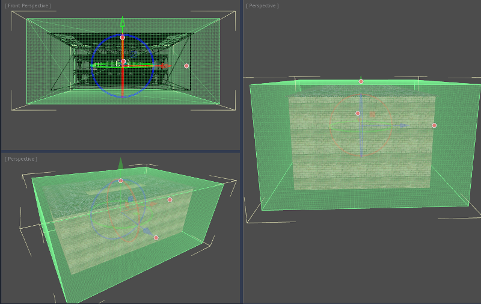
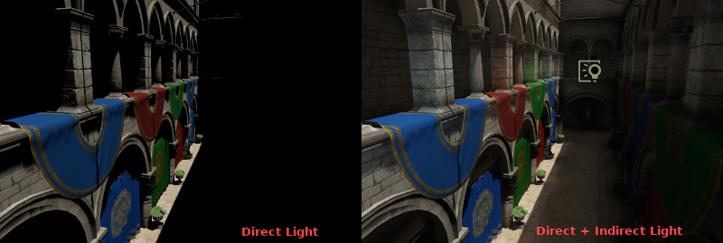
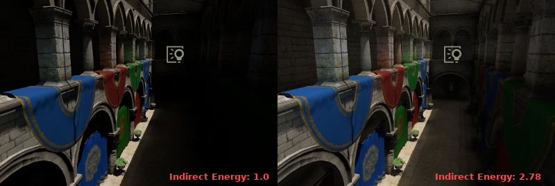
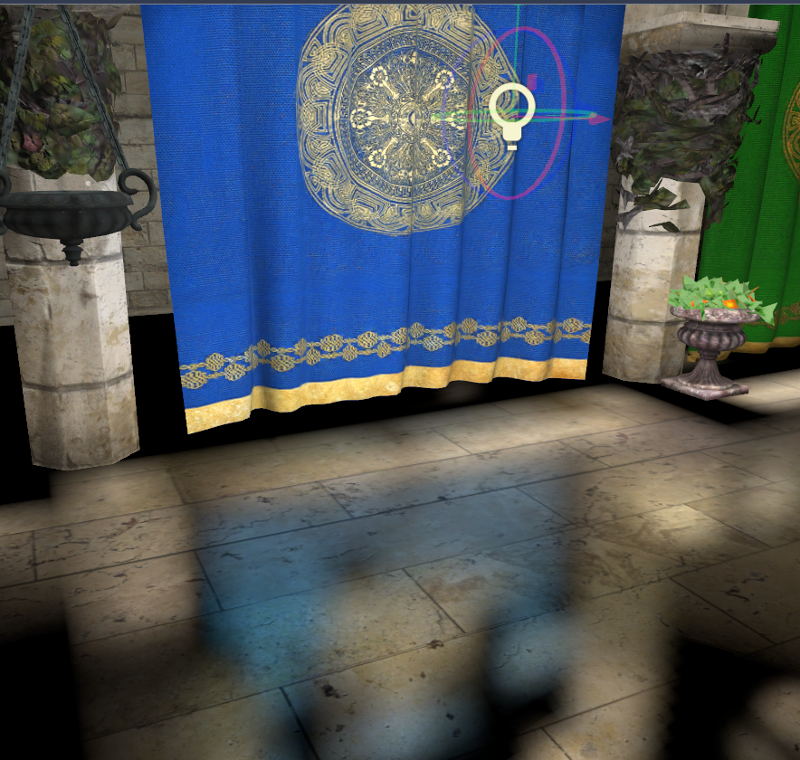
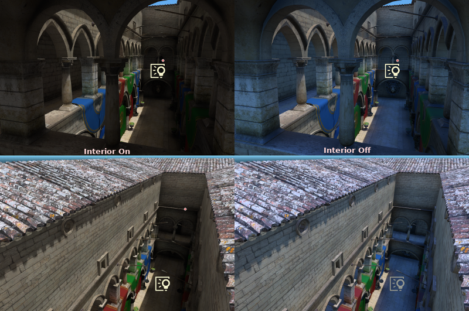
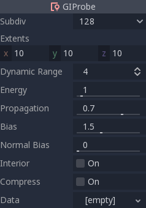

Using GIProbe
=============

Introduction
------------

.. note:: This feature is only available when using the GLES3 backend.
          `doc_baked_lightmaps` can be used as an alternative
          when using the GLES2 renderer.

Just like with `doc_reflection_probes`, and as stated in
the `doc_spatial_material`, objects can show reflected or diffuse light.
GI Probes are similar to Reflection Probes, but they use a different and more
complex technique to produce indirect light and reflections.

The strength of GI Probes is real-time, high quality, indirect light. While the
scene needs a quick pre-bake for the static objects that
will be used, lights can be added, changed or removed, and this will be updated
in real-time. Dynamic objects that move within one of these
probes will also receive indirect lighting from the scene automatically.

Just like with `ReflectionProbe`, `GIProbe` can be blended (in a bit more limited
way), so it is possible to provide full real-time lighting
for a stage without having to resort to lightmaps.

The main downsides of `GIProbe` are:

- A small amount of light leaking can occur if the level is not carefully designed. This must be artist-tweaked.
- Performance requirements are higher than for lightmaps, so it may not run properly in low-end integrated GPUs (may need to reduce resolution).
- Reflections are voxelized, so they don't look as sharp as with `ReflectionProbe`. However, in exchange they are volumetric, so any room size or shape works for them. Mixing them with Screen Space Reflection also works well.
- They consume considerably more video memory than Reflection Probes, so they must be used with care in the right subdivision sizes.

Setting up
----------

Just like a `ReflectionProbe`, simply set up the `GIProbe` by wrapping it around
the geometry that will be affected.

Afterwards, make sure to enable the **Use In Baked Light** property on the geometry instances
in the inspector. This is required for `GIProbe` to recognize objects,
otherwise they will be ignored:

Once the geometry is set up, push the Bake button that appears on the 3D editor
toolbar to begin the pre-baking process:

.. warning::

    Meshes should have sufficiently thick walls to avoid light leaks (avoid
    one-sided walls). For interior levels, enclose your level geometry in a
    sufficiently large box and bridge the loops to close the mesh.

Adding lights
-------------

Unless there are materials with emission, `GIProbe` does nothing by default.
Lights need to be added to the scene to have an effect.

The effect of indirect light can be viewed quickly (it is recommended you turn
off all ambient/sky lighting to tweak this, though, as shown below):

In some situations, though, indirect light may be too weak. Lights have an
indirect multiplier to tweak this:

And, as `GIProbe` lighting updates in real-time, this effect is immediate:

Reflections
-----------

For very metallic materials with low roughness, it's possible to appreciate
voxel reflections. Keep in mind that these have far less detail than Reflection
Probes or Screen Space Reflections, but fully reflect volumetrically.

`GIProbe`\ s can be easily mixed with Reflection Probes and Screen Space Reflections,
as a full 3-stage fallback-chain. This allows to have precise reflections where needed:

Interior vs exterior
--------------------

GI Probes normally allow mixing with lighting from the sky. This can be disabled
when turning on the *Interior* setting.

The difference becomes clear in the image below, where light from the sky goes
from spreading inside to being ignored.

As complex buildings may mix interiors with exteriors, combining GIProbes
for both parts works well.

Tweaking
--------

GI Probes support a few parameters for tweaking:

- **Subdiv** Subdivision used for the probe. The default (128) is generally good for small- to medium-sized areas. Bigger subdivisions use more memory.
- **Extents** Size of the probe. Can be tweaked from the gizmo.
- **Dynamic Range** Maximum light energy the probe can absorb. Higher values allow brighter light, but with less color detail.
- **Energy** Multiplier for all the probe. Can be used to make the indirect light brighter (although it's better to tweak this from the light itself).
- **Propagation** How much light propagates through the probe internally.
- **Bias** Value used to avoid self-occlusion when doing voxel cone tracing, should generally be above 1.0 (1==voxel size).
- **Normal Bias** Alternative type of bias useful for some scenes. Experiment with this one if regular bias does not work.
- **Interior** Allows mixing with lighting from the sky.
- **Compress** Currently broken. Do not use.
- **Data** Contains the light baked data after baking. If you are saving the data it should be saved as a .res file.

Quality
-------

`GIProbe`\ s are quite demanding. It is possible to use lower quality voxel cone
tracing in exchange for more performance.

