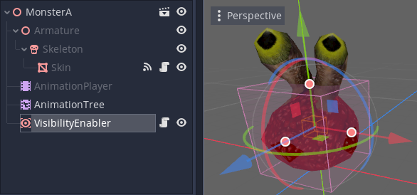
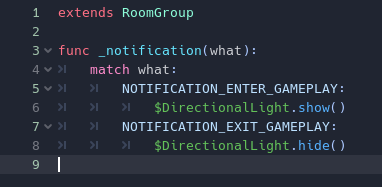
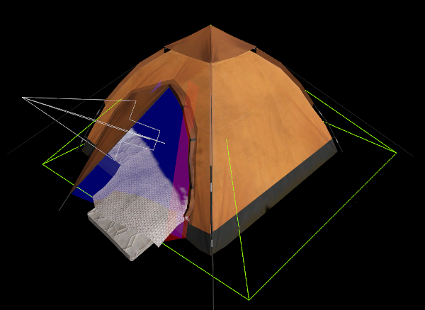
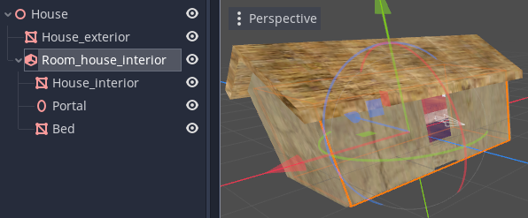
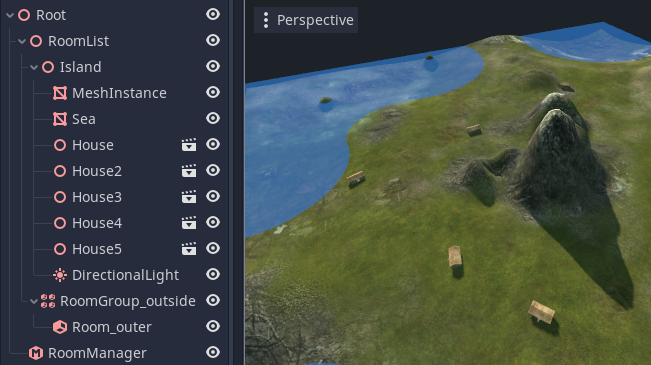

Advanced Room and Portal usage
==============================

Gameplay callbacks
~~~~~~~~~~~~~~~~~~

Although occlusion culling greatly reduces the number of objects that need to be rendered, there are other costs to maintaining objects in a game besides the final rendering. For instance, in Godot, animated objects will still be animated whether they appear on screen or not. This can take up a lot of processing power, especially for objects that use software skinning (where skinning is calculated on the CPU).

Fear not, rooms and portals can solve these problems, and more.

By building our system of rooms for our game level, not only do we have the information needed for occlusion culling, we also have handily created the information required to know which rooms are in the local "gameplay area" of the player (or camera). If you think about it, in a lot of cases, there is no need to do a lot of simulation on objects that have nothing to do with gameplay.

The gameplay area is not confined to just the objects you can see in front of you. AI monsters behind you still need to attack you when your back is turned! In Godot the gameplay area is defined as the *potentially visible set* (PVS) of rooms, from the room you are currently within. That is, if there is any part of a room that can possibly be viewed from any part of the room you are in (even from a corner), it is considered within the PVS, and hence the gameplay area.

This works because if a monster is in an area that is completely out of view for yourself or the monster, you are less likely to care what it is doing.

How does a monster know whether it is within the gameplay area?
^^^^^^^^^^^^^^^^^^^^^^^^^^^^^^^^^^^^^^^^^^^^^^^^^^^^^^^^^^^^^^^

This problem is solved because the portal system contains a subsystem called the **Gameplay Monitor** that can be turned on and off from the `RoomManager( RoomManager )`. When switched on, any roaming objects that move inside or outside the gameplay area (whether by moving themselves, or the camera moving) will receive callbacks to let them know of this change.

You can choose to either receive these callbacks as `signals`, or as `notifications`.

Notifications can be handled in GDScript or other scripting languages:

.. code-block:: none

	func _notification(what):
		match what:
			NOTIFICATION_ENTER_GAMEPLAY:
				print("notification enter gameplay")
			NOTIFICATION_EXIT_GAMEPLAY:
				print("notification exit gameplay")

Signals are sent just as any other signal. They can be attached to functions using the editor inspector. The signals are called `gameplay_entered` and `gameplay_exited`.

In fact, you don't just receive these callbacks for `ROAMING` objects. In addition Rooms and RoomGroups (which can be used to form groups of rooms) can also receive callbacks. For example, you can use this to trigger AI behaviour when the player reaches certain points in a level.

VisbilityNotifiers / VisibilityEnablers
~~~~~~~~~~~~~~~~~~~~~~~~~~~~~~~~~~~~~~~

Gameplay callbacks have one more useful function. By default in Godot, animation and physics are still processed regardless of whether an object is within view. This can sap performance, especially when using software skinning.

The engine's solution to this problem is the `VisibilityNotifier( VisibilityNotifier )` node, and its slightly easier to use variation, the `VisibilityEnabler( VisibilityEnabler )` node. VisibilityEnabler can be used to switch off animation and sleep physics when an object is outside the view frustum. You do this by simply placing a VisibilityEnabler node in your subscene (for e.g. a monster). It will do the rest. Consult the `VisibilityEnabler( VisibilityEnabler )` documentation for full details.

What if the VisibilityEnabler could turn off objects when they were occlusion culled? Well it turns out VisibilityEnabler can. All you have to do is enable the **Gameplay Monitor** in the RoomManager and the rest happens automatically.

.. _doc_rooms_and_portals_roomgroups:

RoomGroups
~~~~~~~~~~

A `RoomGroup( RoomGroup )` is a special node which allows you to deal with a group of rooms at once, instead of having write code for them individually. This is especially useful in conjunction with gameplay callbacks. The most important use for RoomGroups is to delineate between "inside" and "outside" areas.

For instance, when outside you may wish to use a `DirectionalLight( DirectionalLight )` to represent the sun. When the outside RoomGroup receives an `enter gameplay` callback, you can turn the light on, and you can turn it off when the RoomGroup exits gameplay. With the light off, performance will increase as there is no need to render it indoors.

This is an example of a simple RoomGroup script to turn on and off a DirectionalLight. Note that you can also use signals for callbacks (the choice is up to you):

.. tip:: You can apply the same technique for switching on and off weather effects, skyboxes and much more.

.. _doc_rooms_and_portals_internal_rooms:

Internal Rooms
~~~~~~~~~~~~~~

There is one more trick that RoomGroups have up their sleeve. A very common desire is to have a game level with a mixed outdoor and indoor environment. We have already mentioned that rooms can be used to represent both rooms in a building, and areas of landscape, such as a canyon.

What happens if you wish to have a house in a terrain 'room'?
^^^^^^^^^^^^^^^^^^^^^^^^^^^^^^^^^^^^^^^^^^^^^^^^^^^^^^^^^^^^^

With the functionality described so far you *can* do it - you would need to place portals around the exterior of the house though, forming needless rooms above the house. This has been done in many games. But what if there was a simpler way?

It turns out there is a simpler way of handling this scenario. Godot supports *rooms **within** rooms* (we will call them **"internal rooms"**). That is, you can place a house within a terrain room, or even a building, or set of buildings, and even have exit portals in different terrain rooms!

To create internal rooms, you don't need to place a room within another room in the scene tree - in fact you will get a warning if you try this. Instead, create them as regular rooms. The internal rooms should be grouped together with a RoomGroup as parent. If you look in the inspector for the RoomGroup, there is a **Room Group Priority** which defaults to `0`.

If you want a room or set of rooms to be internal, set the priority to a higher value than the outer (enclosing) room, using the RoomGroup.

The system uses the priority setting to give priority to the internal room when deciding which room a camera or object is within. Higher priority *always* wins. Everything else works in a mostly similar way.

The only differences:

- Portals between internal rooms and outer rooms should always *be placed in the inner (internal) room*.
- Portals of internal rooms are not considered as part of the bound of outer rooms.
- `STATIC` and `DYNAMIC` objects from outer rooms will not sprawl into internal rooms. If you want objects to cross these portals, place them in the internal room. This is to prevent large objects like terrain sections sprawling into entire buildings, and rendering when not necessary.

Internal room example
^^^^^^^^^^^^^^^^^^^^^

The tent is a simple room inside a terrain room (which contains the ground, the trees etc).

.. note:: To use internal rooms for buildings, it is usually a good idea to split the *interior* mesh of the building from the *exterior*. The exterior can be placed in the outer room (so it can be seen from outside, but not from the inside), and the interior should be placed in the interior room (so it only visible inside, or through the portal).

This is perfect for improving performance in open world games. Often your buildings can be scenes (including the rooms and portals) that can be reused. When viewed from the outside, interiors will mostly be culled, and when viewing from the inside other buildings and most of the outside will be culled. The same goes for other players and objects that are inside and outside the buildings.

*Scene is 'Diorama Eco scene' by Odo, with slight changes for illustration purposes.* `CC Attribution ( https://creativecommons.org/licenses/by/4.0/ )`_

Internal room scenes
^^^^^^^^^^^^^^^^^^^^

Let us look in detail at another practical example for an open world. We want to place houses (as internal rooms) on an island, but have each house as a self-contained scene containing both the interior *and* the external mesh of the house.

We have created a Room node (which will become the internal room) into which we have placed the interior meshes. We have also created a Portal with no links (so autolinking will be used). The exterior mesh is *not* within the room. It will be autoplaced, and we are intending for it to be placed within the outer room.

However there is a problem. The naive autoplace algorithm will look at the center of the exterior mesh, and attempt to place it *within* the internal room. We want to avoid this somehow, as the idea of the exterior mesh is to have something rendered from the outside, so it must be in the outer room for everything to work.

To get around this problem, there is a special setting to enable you to express a preference for autoplacing in an outer room. Each object has an **Autoplace Priority** setting. When set to `0`, there is no preference (the object will be placed in the highest priority room).

However, if we set this autoplace priority to `-1` for example, the autoplace will always choose a `-1` priority room (if one is present at that location). So if we set the outer room priority to `-1`, it will always place our exterior into our "outside" room.

This gives us a helpful extra bit of control for these kinds of situations, and makes the entire system much more flexible.

.. note:: As the default autoplace priority is `0`, you can't effectively force objects into RoomGroups with priority `0`. However there are plenty of priority values available so this should not be a problem in practice.

The final scene looks something like this, with houses instanced wherever you want them on a giant outer room.

The house exteriors will be placed in the outer room, and therefore can always be seen when looking from the outside. The interiors will only be rendered when a view into the entry portals is visible.
