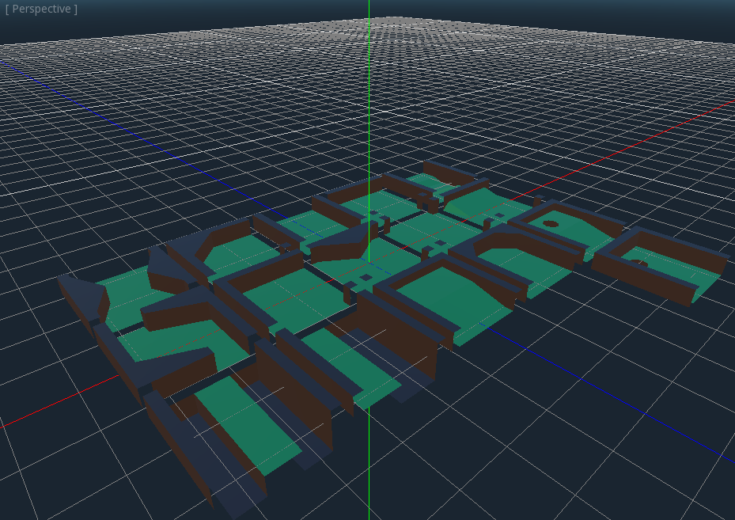
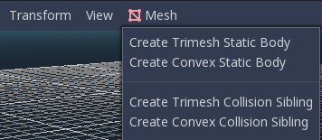
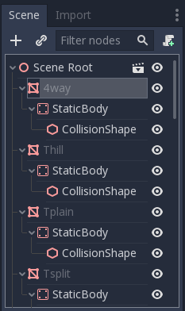
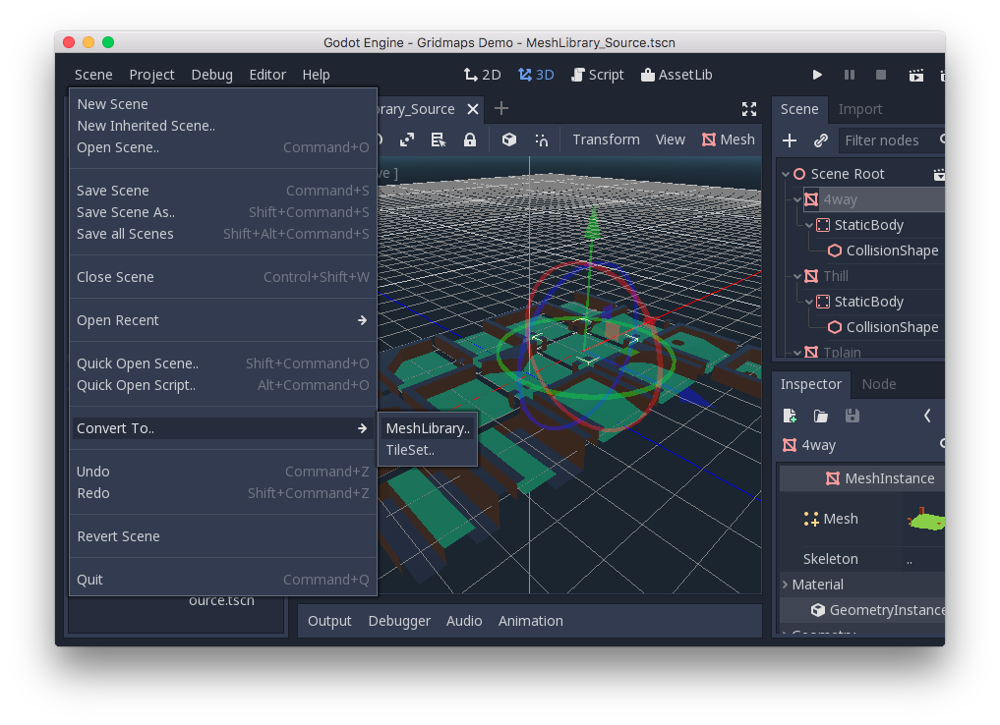
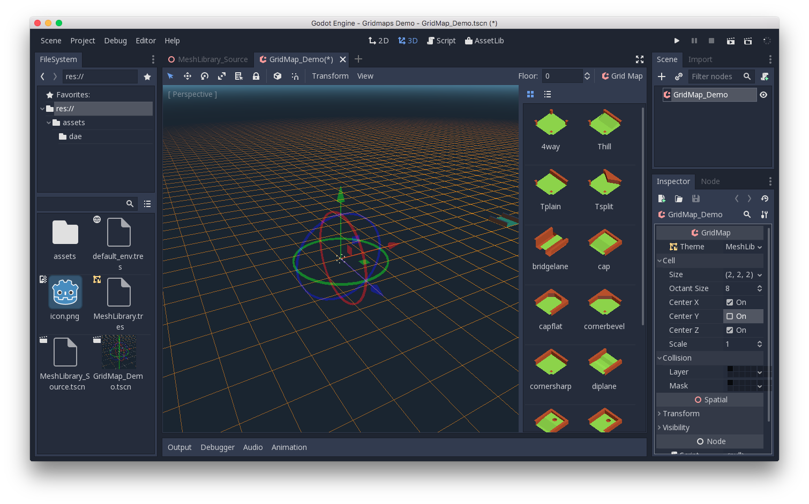
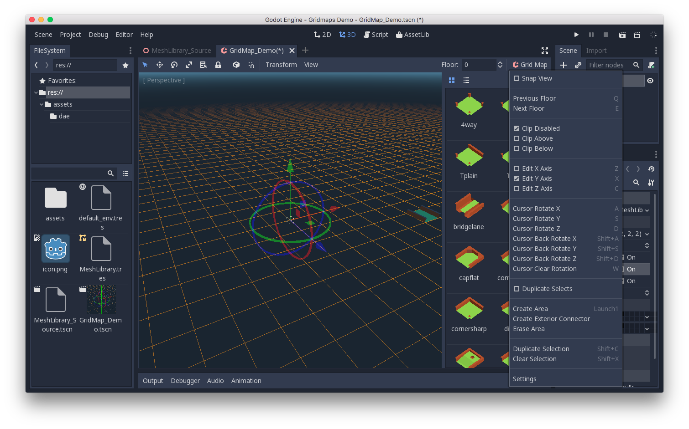
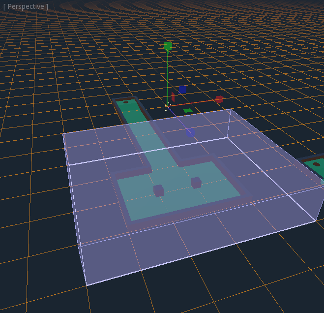
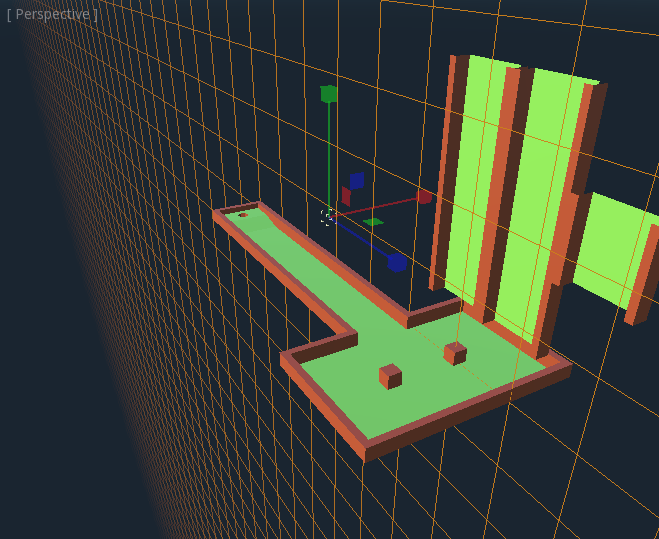

.. _doc_using_gridmaps:

Using GridMaps
~~~~~~~~~~~~~~

Introduction
------------

`Gridmaps` are a tool for creating 3D
game levels, similar to the way `TileMap ( doc_using_tilemaps )`
works in 2D. You start with a predefined collection of 3D meshes (a
`MeshLibrary`) that can be placed on a grid,
as if you were building a level with an unlimited amount of Lego blocks.

Collisions and navigation can also be added to the meshes, just like you
would do with the tiles of a tilemap.

Example project
---------------

To learn how GridMaps work, start by downloading the sample project:
:download:`gridmap_demo.zip ( files/gridmap_demo.zip )`.

Unzip this project and add it to the Project Manager using the "Import"
button.

Creating a MeshLibrary
----------------------

To begin, you need a `MeshLibrary`, which is a collection
of individual meshes that can be used in the gridmap. Open the "MeshLibrary_Source.tscn"
scene to see an example of how to set up the mesh library.

As you can see, this scene has a `Spatial` node as its root, and
a number of `MeshInstance` node children.

If you don't need any physics in your scene, then you're done. However, in most
cases you'll want to assign collision bodies to the meshes.

Collisions
----------

You can manually assign a `StaticBody` and
`CollisionShape` to each mesh. Alternatively, you can use the "Mesh" menu
to automatically create the collision body based on the mesh data.

Note that a "Convex" collision body will work better for simple meshes. For more
complex shapes, select "Create Trimesh Static Body". Once each mesh has
a physics body and collision shape assigned, your mesh library is ready to
be used.

Materials
---------

Only the materials from within the meshes are used when generating the mesh
library. Materials set on the node will be ignored.

NavigationMeshes
----------------

Like all mesh instances, MeshLibrary items can be assigned a `NavigationMesh`
resource, which can be created manually, or baked as described below.

To create the NavigationMesh from a MeshLibrary scene export, place a
`NavigationMeshInstance` child node below the main MeshInstance for the GridMap
item. Add a valid NavigationMesh resource to the NavigationMeshInstance and some source
geometry nodes below and bake the NavigationMesh.

.. note::

    With small grid cells it is often necessary to reduce the NavigationMesh properties
    for agent radius and region minimum size.

Nodes below the NavigationMeshInstance are ignored for the MeshLibrary scene export, so
additional nodes can be added as source geometry just for baking the navmesh.

.. warning::

    The baked cell size of the NavigationMesh must match the NavigationServer map cell
    size to properly merge the navigation meshes of different grid cells.

Exporting the MeshLibrary
-------------------------

To export the library, click on Scene -> Convert To.. -> MeshLibrary.., and save it
as a resource.

You can find an already exported MeshLibrary in the project named "MeshLibrary.tres".

Using GridMap
-------------

Create a new scene and add a GridMap node. Add the mesh library by dragging
the resource file from the FileSystem dock and dropping it in the "Theme" property
in the Inspector.

The "Cell/Size" property should be set to the size of your meshes. You can leave
it at the default value for the demo. Set the "Center Y" property to "Off".

Now you can start designing the level by choosing a tile from the palette and
placing it with Left-Click in the editor window. To remove a tile, hold :kbd:`Shift`
and use Right-click.

Click on the "GridMap" menu to see options and shortcuts. For example, pressing
:kbd:`S` rotates a tile around the y-axis.

Holding :kbd:`Shift` and dragging with the left mouse button will draw a selection
box. You can duplicate or clear the selected area using the respective menu
options.

In the menu, you can also change the axis you're drawing on, as well as shift
the drawing plane higher or lower on its axis.

Using GridMap in code
---------------------

See `GridMap` for details on the node's methods and member variables.
