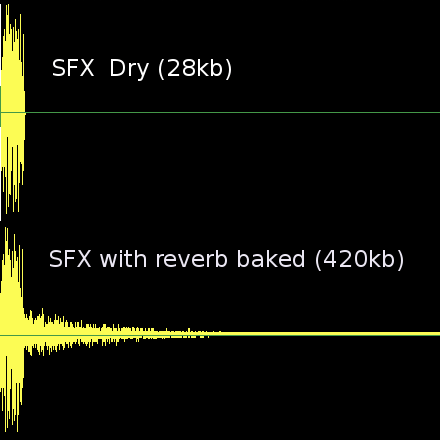

.. _doc_importing_audio_samples:

Importing audio samples
=======================

Supported files
---------------

Godot provides three options to import your audio data: WAV, Ogg Vorbis
and MP3.

Each has different advantages.

* WAV files use raw data or light compression (IMA-ADPCM). They are lightweight
  on the CPU to play back (hundreds of simultaneous voices in this format are
  fine). The downside is that they take up a lot of disk space.
* Ogg Vorbis files use a stronger compression that results in much
  smaller file size, but require significantly more processing power to
  play back.
* MP3 files use better compression than WAV with IMA-ADPCM, but worse than
  Ogg Vorbis. This means that a MP3 file with roughly equal quality to
  Ogg Vorbis will be significantly larger. On the bright side, MP3 requires
  less CPU usage to play back compared to Ogg Vorbis. This makes MP3 useful
  for mobile and HTML5 projects where CPU resources are limited, especially
  when playing multiple compressed sounds at the same time (such as long
  ambient sounds).

Here is a comparative chart.

+-----------------------------+-------------------+
| Format                      | 1 second of audio |
+=============================+===================+
| WAV 24-bit, 96 kHz, stereo  | 576 KB            |
+-----------------------------+-------------------+
| WAV 16-bit, 44 kHz, mono    | 88 KB             |
+-----------------------------+-------------------+
| WAV 16-bit, IMA-ADPCM, mono | 22 KB             |
+-----------------------------+-------------------+
| MP3 192 Kb/s, stereo        | 24 KB             |
+-----------------------------+-------------------+
| Ogg Vorbis 128 Kb/s, stereo | 16 KB             |
+-----------------------------+-------------------+
| Ogg Vorbis 96 Kb/s, stereo  | 12 KB             |
+-----------------------------+-------------------+

Consider using WAV for short and repetitive sound effects, and Ogg Vorbis
for music, speech, and long sound effects.

Best practices
--------------

Godot has an `extensive bus system ( doc_audio_buses )` with built-in effects.
This saves SFX artists the need to add reverb to the sound effects,
reducing their size greatly and ensuring correct trimming. Say no to SFX
with baked reverb!

As you can see above, sound effects become huge with reverb added.

Trimming
~~~~~~~~

One issue that happens often is that the waveform is exported with long
silences at the beginning and at the end. These are inserted by
DAWs when saving to a waveform, increase their size unnecessarily and
add latency to the moment they are played back.

Importing as WAV with the **Trimming** option enabled solves
this.

Looping
~~~~~~~

Godot supports looping in the samples (tools such as Sound Forge or
Audition can add loop points to WAV files). This is useful for sound
effects, such as engines, machine guns etc. Ping-pong looping is also
supported.

As an alternative, the Import dock has a **Loop** option that enables
looping for the entire sample when importing.
