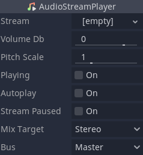
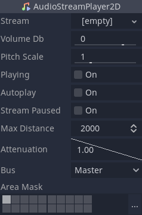
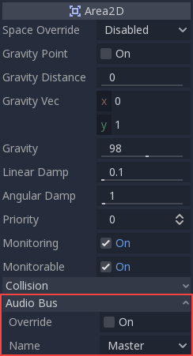
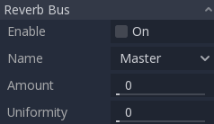
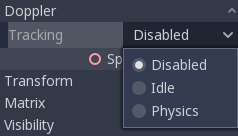

.. _doc_audio_streams:

Audio streams
=============

Introduction
------------

As you might have already read in `doc_audio_buses`, sound is sent to
each bus via an AudioStreamPlayer node. There are different kinds
of AudioStreamPlayers. Each one loads an AudioStream and plays it back.

AudioStream
-----------

An audio stream is an abstract object that emits sound. The sound can come from
many places, but is most commonly loaded from the filesystem. Audio files can be
loaded as AudioStreams and placed inside an AudioStreamPlayer. You can find
information on supported formats and differences in `doc_importing_audio_samples`.

There are other types of AudioStreams, such as AudioStreamRandomPitch.
This one makes a random adjustment to the sound's pitch every time it's
played back. This can be helpful for adding variation to sounds that are
played back often.

AudioStreamPlayer
-----------------

This is the standard, non-positional stream player. It can play to any bus.
In 5.1 sound setups, it can send audio to stereo mix or front speakers.

AudioStreamPlayer2D
-------------------

This is a variant of AudioStreamPlayer, but emits sound in a 2D positional
environment. When close to the left of the screen, the panning will go left.
When close to the right side, it will go right.

.. note::

    Area2Ds can be used to divert sound from any AudioStreamPlayer2Ds they
    contain to specific buses. This makes it possible to create buses with
    different reverb or sound qualities to handle action happening in a
    particular parts of your game world.

AudioStreamPlayer3D
-------------------

This is a variant of AudioStreamPlayer, but emits sound in a 3D positional
environment. Depending on the location of the player relative to the screen,
it can position sound in stereo, 5.1 or 7.1 depending on the chosen audio setup.

Similar to AudioStreamPlayer2D, an Area can divert the sound to an audio bus.

Unlike for 2D, the 3D version of AudioStreamPlayer has a few more advanced options:

.. _doc_audio_streams_reverb_buses:

Reverb buses
~~~~~~~~~~~~

Godot allows for 3D audio streams that enter a specific Area node to send dry
and wet audio to separate buses. This is useful when you have several reverb
configurations for different types of rooms. This is done by enabling this type
of reverb in the **Reverb Bus** section of the Area's properties:

At the same time, a special bus layout is created where each area receives the
reverb info from each area. A Reverb effect needs to be created and configured
in each reverb bus to complete the setup for the desired effect:

The Area's **Reverb Bus** section also has a parameter named **Uniformity**.
Some types of rooms bounce sounds more than others (like a warehouse), so
reverberation can be heard almost uniformly across the room even though the
source may be far away. Playing around with this parameter can simulate
that effect.

Doppler
~~~~~~~

When the relative velocity between an emitter and listener changes, this is
perceived as an increase or decrease in the pitch of the emitted sound.
Godot can track velocity changes in the AudioStreamPlayer3D and Camera nodes.
Both nodes have this property, which must be enabled manually:

Enable it by setting it depending on how objects will be moved:
use **Idle** for objects moved using `_process`, or **Physics**
for objects moved using `_physics_process`. The tracking will
happen automatically.
