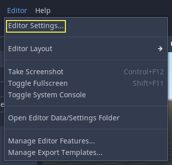
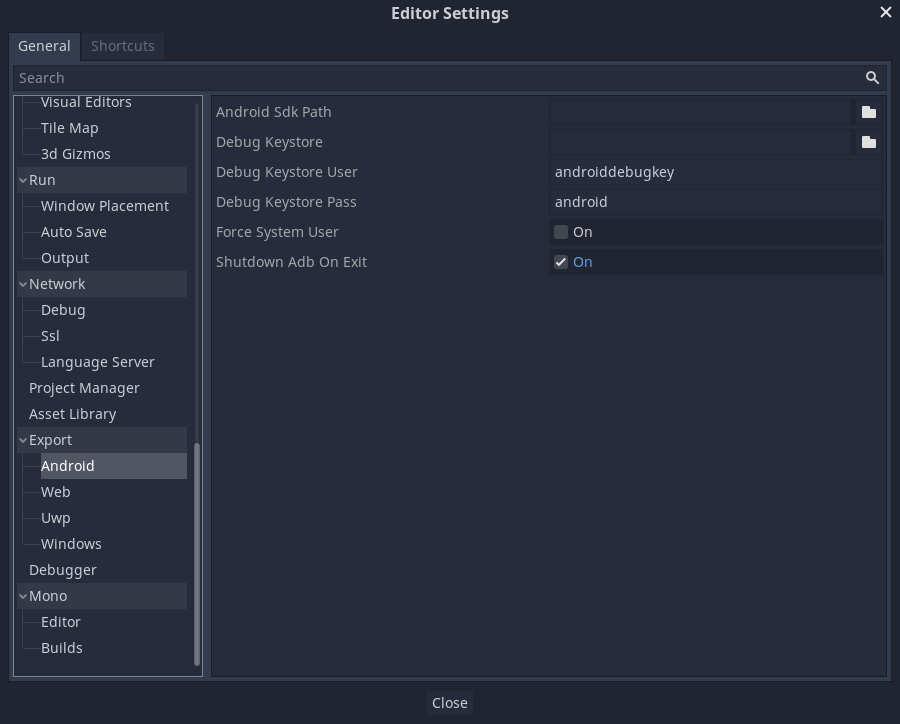
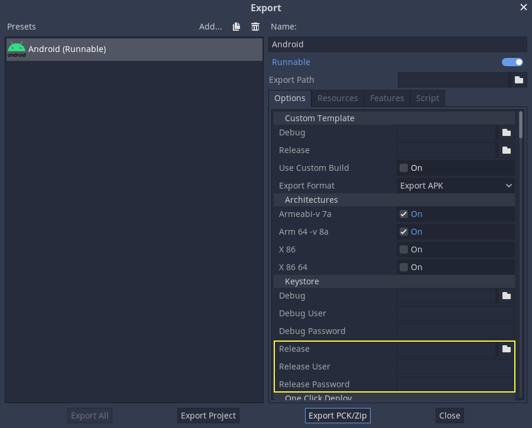

Exporting for Android
=====================

.. seealso::

    This page describes how to export a Godot project to Android.
    If you're looking to compile export template binaries from source instead,
    read `doc_compiling_for_android`.

Exporting for Android has fewer requirements than compiling Godot for Android.
The following steps detail what is needed to set up the Android SDK and the engine.

Install OpenJDK 11
------------------

Download and install  `OpenJDK 11 ( https://adoptium.net/?variant=openjdk11 )`.

Download the Android SDK
------------------------

Download and install the Android SDK.

- You can install it using `Android Studio version 4.1 or later ( https://developer.android.com/studio/ )`.

  - Run it once to complete the SDK setup using these `instructions ( https://developer.android.com/studio/intro/update#sdk-manager )`.
  - Ensure that the `required packages ( https://developer.android.com/studio/intro/update#recommended )` are installed as well.

    - Android SDK Platform-Tools version 30.0.5 or later
    - Android SDK Build-Tools version 30.0.3
    - Android SDK Platform 31
    - Android SDK Command-line Tools (latest)
    - CMake version 3.10.2.4988404
    - NDK version r23c (23.2.8568313)

- You can install it using the `command line tools ( https://developer.android.com/studio/#command-tools )`.

  - Once the command line tools are installed, run the `sdkmanager ( https://developer.android.com/studio/command-line/sdkmanager )` command to complete the setup process:

::

    sdkmanager --sdk_root=<android_sdk_path> "platform-tools" "build-tools;30.0.3" "platforms;android-31" "cmdline-tools;latest" "cmake;3.10.2.4988404" "ndk;21.4.7075529"

.. note::

    If you are using Linux,
    **do not use an Android SDK provided by your distribution's repositories as it will often be outdated**.

Create a debug.keystore
-----------------------

Android needs a debug keystore file to install to devices and distribute
non-release APKs. If you have used the SDK before and have built
projects, ant or eclipse probably generated one for you (in the `~/.android` directory on Linux and
macOS, in the `C:\Users\<user>\.android\` directory on Windows).

If you can't find it or need to generate one, the keytool command from
the JDK can be used for this purpose::

    keytool -keyalg RSA -genkeypair -alias androiddebugkey -keypass android -keystore debug.keystore -storepass android -dname "CN=Android Debug,O=Android,C=US" -validity 9999 -deststoretype pkcs12

This will create a `debug.keystore` file in your current directory. You should move it to a memorable location such as `%USERPROFILE%\.android\`, because you will need its location in a later step. For more information on `keytool` usage, see `this Q&A article ( https://godotengine.org/qa/21349/jdk-android-file-missing )`.

Setting it up in Godot
----------------------

Enter the Editor Settings screen. This screen contains the editor
settings for the user account in the computer (it's independent of the
project).

Scroll down to the section where the Android settings are located:

In that screen, 2 paths need to be set:

- The `Android Sdk Path` should be the location where the Android SDK was installed.
  - For example `%LOCALAPPDATA%\Android\Sdk\` on Windows or `/Users/$USER/Library/Android/sdk/` on macOS.

- The debug `.keystore` file
  - It can be found in the folder where you put the `debug.keystore` file you created above.

Once that is configured, everything is ready to export to Android!

.. note::

    If you get an error saying *"Could not install to device."*, make sure
    you do not have an application with the same Android package name already
    installed on the device (but signed with a different key).

    If you have an application with the same Android package name but a
    different signing key already installed on the device, you **must** remove
    the application in question from the Android device before exporting to
    Android again.

Providing launcher icons
------------------------

Launcher icons are used by Android launcher apps to represent your application to users. Godot only requires high-resolution icons (for `xxxhdpi` density screens) and will automatically generate lower-resolution variants.

There are two types of icons required by Godot:

- **Main Icon:** The "classic" icon. This will be used on all Android versions up to Android 8 (Oreo), exclusive. Must be at least 192×192 px.
- **Adaptive Icons:** Starting from Android 8 (inclusive), `Adaptive Icons ( https://developer.android.com/guide/practices/ui_guidelines/icon_design_adaptive )`_ were introduced. Applications will need to include separate background and foreground icons to have a native look. The user's launcher application will control the icon's animation and masking. Must be at least 432×432 px.

.. seealso:: It's important to adhere to some rules when designing adaptive icons. `Google Design has provided a nice article ( https://medium.com/google-design/designing-adaptive-icons-515af294c783 )`_ that helps to understand those rules and some of the capabilities of adaptive icons.

.. caution:: The most important adaptive icon design rule is to have your icon critical elements inside the safe zone: a centered circle with a diameter of 66dp (264 pixels on `xxxhdpi`) to avoid being clipped by the launcher.

If you don't provide some of the requested icons, Godot will replace them using a fallback chain, trying the next in line when the current one fails:

- **Main Icon:** Provided main icon -> Project icon -> Default Godot main icon.
- **Adaptive Icon Foreground:** Provided foreground icon -> Provided main icon -> Project icon -> Default Godot foreground icon.
- **Adaptive Icon Background:** Provided background icon -> Default Godot background icon.

It's highly recommended to provide all the requested icons with their specified resolutions.
This way, your application will look great on all Android devices and versions.

Exporting for Google Play Store
-------------------------------

Uploading an APK to Google's Play Store requires you to sign using a non-debug
keystore file; such file can be generated like this:

.. code-block:: shell

    keytool -v -genkey -keystore mygame.keystore -alias mygame -keyalg RSA -validity 10000

This keystore and key are used to verify your developer identity, remember the password and keep it in a safe place!
Use Google's Android Developer guides to learn more about `APK signing ( https://developer.android.com/studio/publish/app-signing )`.

Now fill in the following forms in your Android Export Presets:

- **Release:** Enter the path to the keystore file you just generated.
- **Release User:** Replace with the key alias.
- **Release Password:** Key password. Note that the keystore password and the key password currently have to be the same.

**Your export_presets.cfg file now contains sensitive information.** If you use
a version control system, you should remove it from public repositories and add
it to your `.gitignore` file or equivalent.

Don't forget to uncheck the **Export With Debug** checkbox while exporting.

Optimizing the APK size
-----------------------

By default, the APK will contain native libraries for both ARMv7 and ARMv8
architectures. This increases its size significantly. To create a smaller APK,
uncheck either **Armeabi-v 7a** or **Arm 64 -v 8a** in your project's Android
export preset. This will create an APK that only contains a library for
a single architecture. Note that applications targeting ARMv7 can also run on
ARMv8 devices, but the opposite is not true.

Since August 2019, Google Play requires all applications to be available in
64-bit form. This means you cannot upload an APK that contains *just* an ARMv7
library. To solve this, you can upload several APKs to Google Play using its
`Multiple APK support ( https://developer.android.com/google/play/publishing/multiple-apks )`.
Each APK should target a single architecture; creating an APK for ARMv7
and ARMv8 is usually sufficient to cover most devices in use today.

You can optimize the size further by compiling an Android export template with
only the features you need. See `doc_optimizing_for_size` for more
information.

Troubleshooting rendering issues
--------------------------------

To improve out-of-the-box performance on mobile devices, Godot automatically
uses low-end-friendly settings by default on both Android and iOS.

This can cause rendering issues that do not occur when running the project on a
desktop platform. See `doc_mobile_rendering_limitations` for more information.
