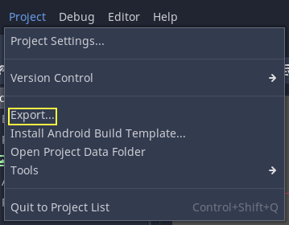
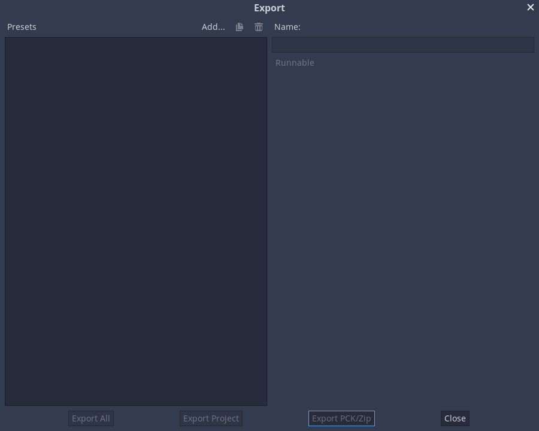
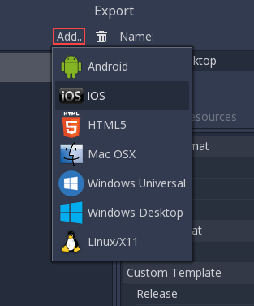
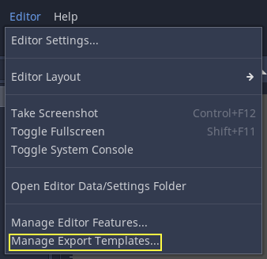
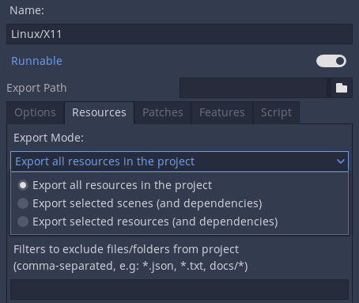
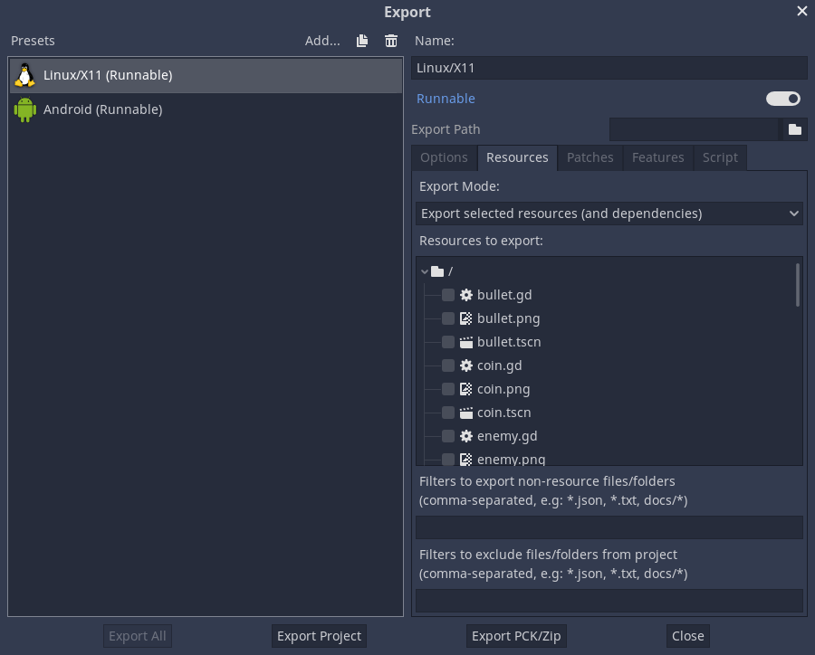

Exporting projects
==================

.. highlight:: none

Why export?
-----------

Originally, Godot did not have any means to export projects. The
developers would compile the proper binaries and build the packages for
each platform manually.

When more developers (and even non-programmers) started using it, and
when our company started taking more projects at the same time, it
became evident that this was a bottleneck.

On PC
~~~~~

Distributing a game project on PC with Godot is rather easy. Drop
the Godot binary in the same directory as the `project.godot` file,
then compress the project directory and you are done.

It sounds simple, but there are probably a few reasons why the developer
may not want to do this. The first one is that it may not be desirable
to distribute loads of files. Some developers may not like curious users
peeking at how the game was made, others may find it inelegant, and so on.
Another reason is that the developer might prefer a specially-compiled
binary, which is smaller in size, more optimized and does not include
tools like the editor and debugger.

Finally, Godot has a simple but efficient system for
`creating DLCs as extra package files ( doc_exporting_pcks )`.

On mobile
~~~~~~~~~

The same scenario on mobile platforms is a little worse.
To distribute a project on those devices, a binary for each of
those platforms is built, then added to a native project together
with the game data.

This can be troublesome because it means that the developer must be
familiarized with the SDK of each platform before even being able to
export. While learning each SDK is always encouraged, it can be
frustrating to be forced to do it at an undesired time.

There is also another problem with this approach: different devices
prefer some data in different formats to run. The main example of this
is texture compression. All PC hardware uses S3TC (BC) compression and
that has been standardized for more than a decade, but mobile devices
use different formats for texture compression, such as PVRTC (iOS) or
ETC (Android).

Export menu
-----------

After many attempts at different export workflows, the current one has
proven to work the best. At the time of this writing, not all platforms are
supported yet, but the supported platforms continue to grow.

To open the export menu, click the **Export** button:

The export menu will open. However, it will be completely empty.
This is because we need to add an export preset.

To create an export preset, click the **Add…** button at the top
of the export menu. This will open a drop-down list of platforms
to choose from for an export preset.

The default options are often enough to export, so tweaking them is
usually not necessary. However, many platforms require additional
tools (SDKs) to be installed to be able to export. Additionally, Godot
needs export templates installed to create packages. The export menu
will complain when something is missing and will not allow the user to
export for that platform until they resolve it:

At that time, the user is expected to come back to the documentation and follow
instructions on how to properly set up that platform.

Export templates
~~~~~~~~~~~~~~~~

Apart from setting up the platform, the export templates must be
installed to be able to export projects. They can be obtained as a
TPZ file (which is a renamed ZIP archive) from the
`download page of the website ( https://www.godotengine.org/download )`.

Once downloaded, they can be installed using the **Install Export Templates**
option in the editor:

Resource options
~~~~~~~~~~~~~~~~

When exporting, Godot makes a list of all the files to export and then
creates the package. There are 3 different modes for exporting:

-  Export all resources in the project
-  Export selected scenes (and dependencies)
-  Export selected resources (and dependencies)

**Export all resources in the project** will export every resource in the
project. **Export selected scenes** and **Export selected resources** gives
you a list of the scenes or resources in the project, and you have to
select every scene or resource you want to export.

Note:

    Files and folders whose name begin with a period will never be included in
    the exported project. This is done to prevent version control folders like
    `.git` from being included in the exported PCK file.

Below the list of resources are two filters that can be setup. The first allows
non resource files such as `.txt`,`.json` and `.csv` to be exported with
the project. The second filter can be used to exclude every file of a certain
type without manually deselecting every one. For example, `.png)` files.

Exporting from the command line
-------------------------------

In production, it is useful to automate builds, and Godot supports this
with the `--export` and `--export-debug` command line parameters.
Exporting from the command line still requires an export preset to define
the export parameters. A basic invocation of the command would be:

.. code-block:: shell

    godot --export "Windows Desktop" some_name.exe

This will export to `some_name.exe`, assuming there is a preset
called "Windows Desktop" and the template can be found. (The export preset name
must be written within quotes if it contains spaces or special characters.)
The output path is *relative to the project path* or *absolute*;
**it does not respect the directory the command was invoked from**.

The output file extension should match the one used by the Godot export process:

- Windows: `.exe`
- macOS: `.zip` (from all platforms) or `.dmg` (only when exporting *from* macOS).
  `.app` is not supported directly, although the generated ZIP archive contains an `.app` bundle.
- Linux: Any extension (including none). `.x86_64` is typically used for 64-bit x86 binaries.
- HTML5: `.zip`
- Android: `.apk`
- iOS: `.zip`

You can also configure it to export *only* the PCK or ZIP file, allowing
a single exported main pack file to be used with multiple Godot executables.
When doing so, the export preset name must still be specified on the command line:

.. code-block:: shell

    godot --export-pack "Windows Desktop" some_name.pck

It is often useful to combine the `--export` flag with the `--path`
flag, so that you do not need to `cd` to the project folder before running
the command:

.. code-block:: shell

    godot --path /path/to/project --export "Windows Desktop" some_name.exe

See also:

    See `doc_command_line_tutorial` for more information about using Godot
    from the command line.

PCK versus ZIP pack file formats
--------------------------------

Each format has its upsides and downsides. PCK is the default and recommended
format for most use cases, but you may want to use a ZIP archive instead
depending on your needs.

**PCK format:**

- Uncompressed format. Larger file size, but faster to read/write.
- Not readable and writable using tools normally present on the user's
  operating system, even though there are
  `third-party tools ( https://github.com/hhyyrylainen/GodotPckTool )`
  to extract and create PCK files.

**ZIP format:**

- Compressed format. Smaller file size, but slower to read/write.
- Readable and writable using tools normally present on the user's operating system.
  This can be useful to make modding easier (see also `doc_exporting_pcks`).

Warning:

    Due to a `known bug ( https://github.com/godotengine/godot/pull/42123 )`,
    when using a ZIP file as a pack file, the exported binary will not try to use
    it automatically. Therefore, you have to create a *launcher script* that
    the player can double-click or run from a terminal to launch the project::

        :: launch.bat (Windows)
        @echo off
        my_project.exe --main-pack my_project.zip

        # launch.sh (Linux)
        ./my_project.x86_64 --main-pack my_project.zip

    Save the launcher script and place it in the same folder as the exported binary.
    On Linux, make sure to give executable permissions to the launcher script using
    the command `chmod +x launch.sh`.
