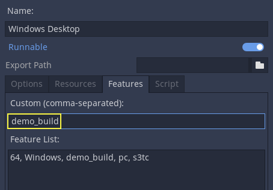
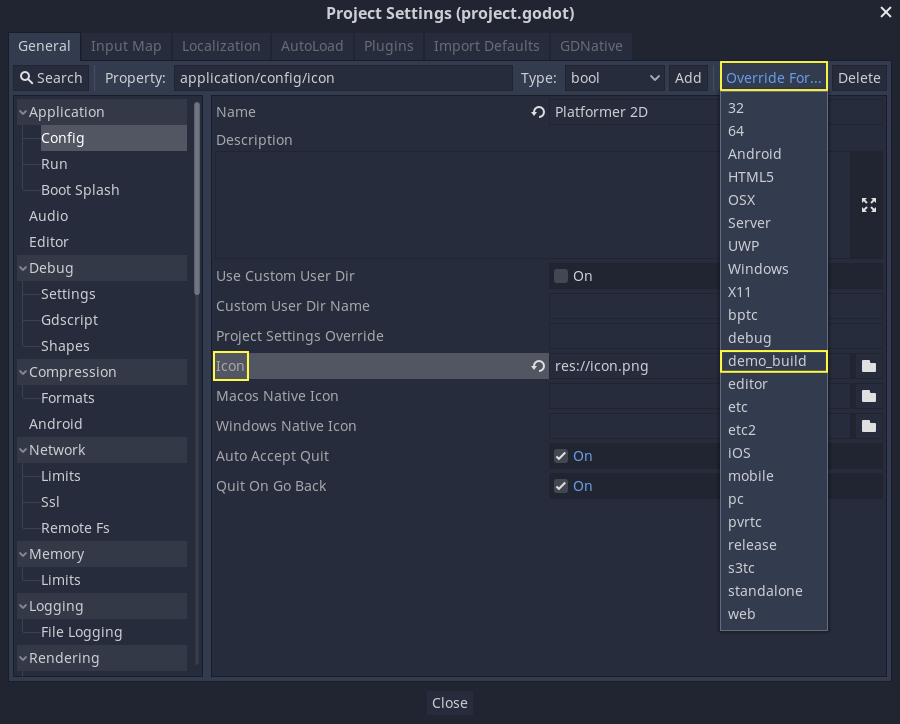
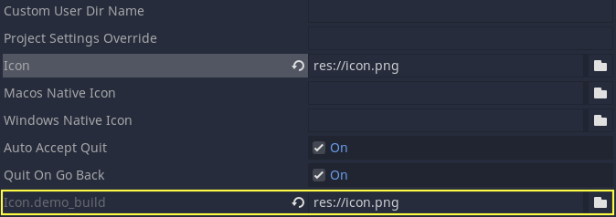
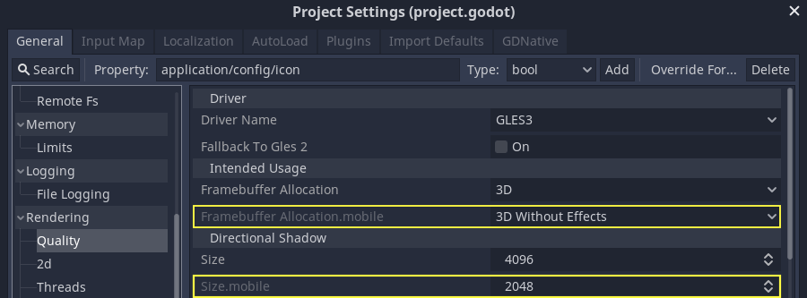

.. _doc_feature_tags:

Feature tags
============

Introduction
------------

Godot has a special system to tag availability of features.
Each *feature* is represented as a string, which can refer to many of the following:

* Platform name.
* Platform architecture (64-bit or 32-bit, x86 or ARM).
* Platform type (desktop, mobile, Web).
* Supported texture compression algorithms on the platform.
* Whether a build is `debug` or `release` (`debug` includes the editor).
* Whether the project is running from the editor or a "standalone" binary.
* Many more things.

Features can be queried at run-time from the singleton API by calling:

::

    OS.has_feature(name)

Default features
----------------

Here is a list of most feature tags in Godot. Keep in mind they are **case-sensitive**:

+-----------------+--------------------------------------------------------+
| **Feature tag** | **Description**                                        |
+=================+========================================================+
| **Android**     | Running on Android                                     |
+-----------------+--------------------------------------------------------+
| **HTML5**       | Running on HTML5                                       |
+-----------------+--------------------------------------------------------+
| **JavaScript**  | `JavaScript singleton ( doc_javascript_eval )` is   |
|                 | available                                              |
+-----------------+--------------------------------------------------------+
| **OSX**         | Running on macOS                                       |
+-----------------+--------------------------------------------------------+
| **iOS**         | Running on iOS                                         |
+-----------------+--------------------------------------------------------+
| **UWP**         | Running on UWP                                         |
+-----------------+--------------------------------------------------------+
| **Windows**     | Running on Windows                                     |
+-----------------+--------------------------------------------------------+
| **X11**         | Running on X11 (Linux/BSD desktop)                     |
+-----------------+--------------------------------------------------------+
| **Server**      | Running on the headless server platform                |
+-----------------+--------------------------------------------------------+
| **debug**       | Running on a debug build (including the editor)        |
+-----------------+--------------------------------------------------------+
| **release**     | Running on a release build                             |
+-----------------+--------------------------------------------------------+
| **editor**      | Running on an editor build                             |
+-----------------+--------------------------------------------------------+
| **standalone**  | Running on a non-editor build                          |
+-----------------+--------------------------------------------------------+
| **64**          | Running on a 64-bit build (any architecture)           |
+-----------------+--------------------------------------------------------+
| **32**          | Running on a 32-bit build (any architecture)           |
+-----------------+--------------------------------------------------------+
| **x86_64**      | Running on a 64-bit x86 build                          |
+-----------------+--------------------------------------------------------+
| **x86**         | Running on a 32-bit x86 build                          |
+-----------------+--------------------------------------------------------+
| **arm64**       | Running on a 64-bit ARM build                          |
+-----------------+--------------------------------------------------------+
| **arm**         | Running on a 32-bit ARM build                          |
+-----------------+--------------------------------------------------------+
| **mobile**      | Host OS is a mobile platform                           |
+-----------------+--------------------------------------------------------+
| **pc**          | Host OS is a PC platform (desktop/laptop)              |
+-----------------+--------------------------------------------------------+
| **web**         | Host OS is a Web browser                               |
+-----------------+--------------------------------------------------------+
| **etc**         | Textures using ETC1 compression are supported          |
+-----------------+--------------------------------------------------------+
| **etc2**        | Textures using ETC2 compression are supported          |
+-----------------+--------------------------------------------------------+
| **s3tc**        | Textures using S3TC (DXT/BC) compression are supported |
+-----------------+--------------------------------------------------------+
| **pvrtc**       | Textures using PVRTC compression are supported         |
+-----------------+--------------------------------------------------------+

.. warning::

    With the exception of texture compression feature tags, default feature tags
    are **immutable**. This means that they will *not* change depending on
    run-time conditions. For example, `OS.has_feature("mobile")` will return
    `false` when running a project exported to HTML5 on a mobile device.

    To check whether a project exported to HTML5 is running on a mobile device,
    `call JavaScript code ( doc_javascript_eval )` that reads the browser's
    user agent.

Custom features
---------------

It is possible to add custom features to a build; use the relevant
field in the *export preset* used to generate it:

.. note::

    Custom feature tags are only used when running the exported project
    (including with `doc_one-click_deploy`). They are **not used** when
    running the project from the editor, even if the export preset marked as
    **Runnable** for your current platform has custom feature tags defined.

Overriding project settings
---------------------------

Features can be used to override specific configuration values in the *Project Settings*.
This allows you to better customize any configuration when doing a build.

In the following example, a different icon is added for the demo build of the game (which was
customized in a special export preset, which, in turn, includes only demo levels).

After overriding, a new field is added for this specific configuration:

.. note::

    When using the
    `project settings "override.cfg" functionality`
    (which is unrelated to feature tags), remember that feature tags still apply.
    Therefore, make sure to *also* override the setting with the desired feature
    tag(s) if you want them to override base project settings on all platforms
    and configurations.

Default overrides
-----------------

There are already a lot of settings that come with overrides by default; they can be found
in many sections of the project settings.

Customizing the build
---------------------

Feature tags can be used to customize a build process too, by writing a custom **ExportPlugin**.
They are also used to specify which shared library is loaded and exported in **GDNative**.
