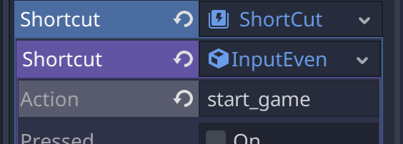

Finishing up
============

We have now completed all the functionality for our game. Below are some
remaining steps to add a bit more "juice" to improve the game experience.

Feel free to expand the gameplay with your own ideas.

Background
~~~~~~~~~~

The default gray background is not very appealing, so let's change its color.
One way to do this is to use a `ColorRect` node. Make it
the first node under `Main` so that it will be drawn behind the other nodes.
`ColorRect` only has one property: `Color`. Choose a color you like and
select "Layout" -> "Full Rect" so that it covers the screen.

You could also add a background image, if you have one, by using a
`TextureRect` node instead.

Sound effects
~~~~~~~~~~~~~

Sound and music can be the single most effective way to add appeal to the game
experience. In your game assets folder, you have two sound files: "House In a
Forest Loop.ogg" for background music, and "gameover.wav" for when the player
loses.

Add two `AudioStreamPlayer` nodes as children of
`Main`. Name one of them `Music` and the other `DeathSound`. On each one,
click on the `Stream` property, select "Load", and choose the corresponding
audio file.

To play the music, add `$Music.play()` in the `new_game()` function and
`$Music.stop()` in the `game_over()` function.

Finally, add `$DeathSound.play()` in the `game_over()` function.

Keyboard shortcut
~~~~~~~~~~~~~~~~~

Since the game is played with keyboard controls, it would be convenient if we
could also start the game by pressing a key on the keyboard. We can do this with
the "Shortcut" property of the `Button` node.

In a previous lesson, we created four input actions to move the character. We
will create a similar input action to map to the start button.

Select "Project" -> "Project Settings" and then click on the "Input Map"
tab. In the same way you created the movement input actions, create a new
input action called `start_game` and add a key mapping for the :kbd:`Enter`
key.

In the `HUD` scene, select the `StartButton` and find its *Shortcut*
property in the Inspector. Select "New Shortcut" and click on the "Shortcut"
item. A second *Shortcut* property will appear. Select "New InputEventAction"
and click the new "InputEventAction". Finally, in the *Action* property, type
the name `start_game`.

Now when the start button appears, you can either click it or press :kbd:`Enter`
to start the game.

And with that, you completed your first 2D game in Pandemonium.

You got to make a player-controlled character, enemies that spawn randomly
around the game board, count the score, implement a game over and replay, user
interface, sounds, and more. Congratulations!

There's still much to learn, but you can take a moment to appreciate what you
achieved.

And when you're ready, you can move on to `doc_your_first_3d_game` to learn
to create a complete 3D game from scratch, in Pandemonium.
