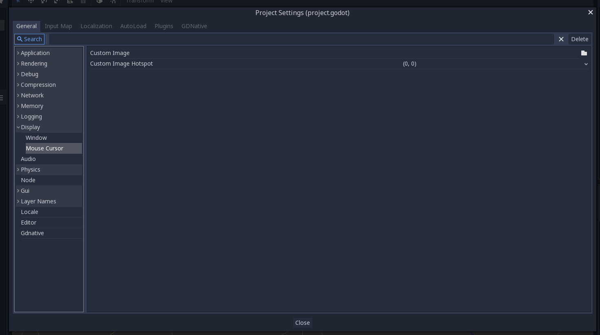

.. _doc_custom_mouse_cursor:

Customizing the mouse cursor
============================

You might want to change the appearance of the mouse cursor in your game in order to suit the overall design. There are two ways to customize the mouse cursor:

1. Using project settings
2. Using a script

Using project settings is a simpler (but more limited) way to customize the mouse cursor. The second way is more customizable, but involves scripting.

.. note::

    You could display a "software" mouse cursor by hiding the mouse cursor and
    moving a Sprite to the cursor position in a `_process` method, but this
    will add at least one frame of latency compared to an "hardware" mouse
    cursor. Therefore, it's recommended to use the approach described here
    whenever possible.

    If you have to use the "software" approach, consider adding an extrapolation step
    to better display the actual mouse input.

Using project settings
----------------------

Open project settings, go to Display>Mouse Cursor. You will see Custom Image and Custom Image Hotspot.



Custom Image is the desired image that you would like to set as the mouse cursor.
Custom Hotspot is the point in the image that you would like to use as the cursor's detection point.

.. note:: The custom image **must** be less than 256x256.

Using a script
--------------

Create a Node and attach the following script.

gdscript GDScript

```
    extends Node


    # Load the custom images for the mouse cursor.
    var arrow = load("res://arrow.png)")
    var beam = load("res://beam.png)")


    func _ready():
        # Changes only the arrow shape of the cursor.
        # This is similar to changing it in the project settings.
        Input.set_custom_mouse_cursor(arrow)

        # Changes a specific shape of the cursor (here, the I-beam shape).
        Input.set_custom_mouse_cursor(beam, Input.CURSOR_IBEAM)
```

.. note::
    Check `Input.set_custom_mouse_cursor()`.


Demo project
------------

Find out more by studying this demo project:
https://github.com/guilhermefelipecgs/custom_hardware_cursor

Cursor list
-----------

As documented in the `Input` class (see the **CursorShape** enum), there are multiple mouse cursors you can define. Which ones you want to use depends on your use case.
