.. _doc_matrices_and_transforms:

Matrices and transforms
=======================

Introduction
------------

Before reading this tutorial, we recommend that you thoroughly read
and understand the `doc_vector_math` tutorial, as this tutorial
requires a knowledge of vectors.

This tutorial is about *transformations* and how we represent them
in Godot using matrices. It is not a full in-depth guide to matrices.
Transformations are most of the time applied as translation, rotation,
and scale, so we will focus on how to represent those with matrices.

Most of this guide focuses on 2D, using `Transform2D` and
`Vector2`, but the way things work in 3D is very similar.

.. note:: As mentioned in the previous tutorial, it is important to
          remember that in Godot, the Y axis points *down* in 2D.
          This is the opposite of how most schools teach linear
          algebra, with the Y axis pointing up.

.. note:: The convention is that the X axis is red, the Y axis is
          green, and the Z axis is blue. This tutorial is color-coded
          to match these conventions, but we will also represent
          the origin vector with a blue color.

Matrix components and the Identity matrix
~~~~~~~~~~~~~~~~~~~~~~~~~~~~~~~~~~~~~~~~~

The identity matrix represents a transform with no translation,
no rotation, and no scale. Let's start by looking at the identity
matrix and how its components relate to how it visually appears.

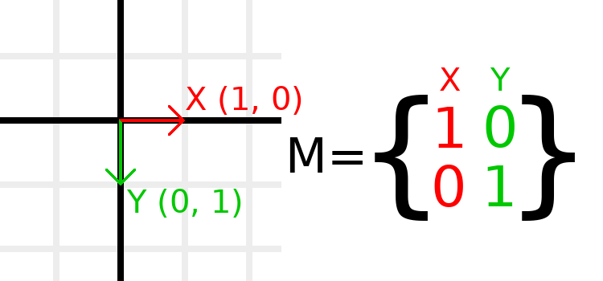

Matrices have rows and columns, and a transformation matrix has
specific conventions on what each does.

In the image above, we can see that the red X vector is represented
by the first column of the matrix, and the green Y vector is
likewise represented by the second column. A change to the columns
will change these vectors. We will see how they can be manipulated
in the next few examples.

You should not worry about manipulating rows directly, as we usually
work with columns. However, you can think of the rows of the matrix
as showing which vectors contribute to moving in a given direction.

When we refer to a value such as `t.x.y`, that's the Y component of
the X column vector. In other words, the bottom-left of the matrix.
Similarly, `t.x.x` is top-left, `t.y.x` is top-right, and `t.y.y`
is bottom-right, where `t` is the Transform2D.

Scaling the transformation matrix
~~~~~~~~~~~~~~~~~~~~~~~~~~~~~~~~~

Applying a scale is one of the easiest operations to understand.
Let's start by placing the Godot logo underneath our vectors
so that we can visually see the effects on an object:


Now, to scale the matrix, all we need to do is multiply each
component by the scale we want. Let's scale it up by 2. 1 times 2
becomes 2, and 0 times 2 becomes 0, so we end up with this:

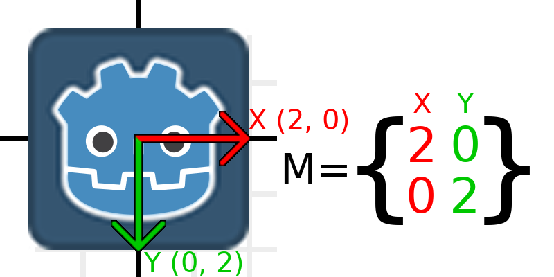

To do this in code, we can simply multiply each of the vectors:

gdscript GDScript

```
    var t = Transform2D()
    # Scale
    t.x *= 2
    t.y *= 2
    transform = t # Change the node's transform to what we just calculated.
```

If we wanted to return it to its original scale, we can multiply
each component by 0.5. That's pretty much all there is to scaling
a transformation matrix.

To calculate the object's scale from an existing transformation
matrix, you can use `length()` on each of the column vectors.

.. note:: In actual projects, you can use the `scaled()`
          method to perform scaling.

Rotating the transformation matrix
~~~~~~~~~~~~~~~~~~~~~~~~~~~~~~~~~~

We'll start the same way as earlier, with the Godot logo underneath
the identity matrix:


As an example, let's say we want to rotate our Godot logo clockwise
by 90 degrees. Right now the X axis points right and the Y axis
points down. If we rotate these in our head, we would logically
see that the new X axis should point down and the new Y axis
should point left.

You can imagine that you grab both the Godot logo and its vectors,
and then spin it around the center. Wherever you finish spinning,
the orientation of the vectors determines what the matrix is.

We need to represent "down" and "left" in normal coordinates,
so means we'll set X to (0, 1) and Y to (-1, 0). These are
also the values of `Vector2.DOWN` and `Vector2.LEFT`.
When we do this, we get the desired result of rotating the object:

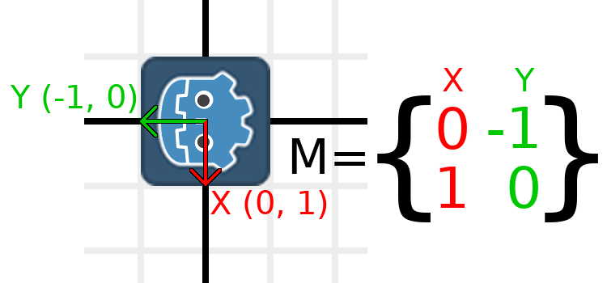

If you have trouble understanding the above, try this exercise:
Cut a square of paper, draw X and Y vectors on top of it, place
it on graph paper, then rotate it and note the endpoints.

To perform rotation in code, we need to be able to calculate
the values programmatically. This image shows the formulas needed
to calculate the transformation matrix from a rotation angle.
Don't worry if this part seems complicated, I promise it's the
hardest thing you need to know.


.. note:: Godot represents all rotations with radians, not degrees.
          A full turn is `TAU` or `PI*2` radians, and a quarter
          turn of 90 degrees is `TAU/4` or `PI/2` radians. Working
          with `TAU` usually results in more readable code.

.. note:: Fun fact: In addition to Y being *down* in Godot, rotation
          is represented clockwise. This means that all the math and
          trig functions behave the same as a Y-is-up CCW system,
          since these differences "cancel out". You can think of
          rotations in both systems being "from X to Y".

In order to perform a rotation of 0.5 radians (about 28.65 degrees),
we simply plug in a value of 0.5 to the formula above and evaluate
to find what the actual values should be:

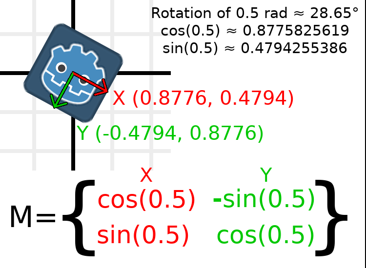

Here's how that would be done in code (place the script on a Node2D):

gdscript GDScript

```
    var rot = 0.5 # The rotation to apply.
    var t = Transform2D()
    t.x.x = cos(rot)
    t.y.y = cos(rot)
    t.x.y = sin(rot)
    t.y.x = -sin(rot)
    transform = t # Change the node's transform to what we just calculated.
```

To calculate the object's rotation from an existing transformation
matrix, you can use `atan2(t.x.y, t.x.x)`, where t is the Transform2D.

.. note:: In actual projects, you can use the `rotated()`
          method to perform rotations.

Basis of the transformation matrix
~~~~~~~~~~~~~~~~~~~~~~~~~~~~~~~~~~

So far we have only been working with the `x` and `y`, vectors, which
are in charge of representing rotation, scale, and/or shearing
(advanced, covered at the end). The X and Y vectors are together
called the *basis* of the transformation matrix. The terms "basis"
and "basis vectors" are important to know.

You might have noticed that `Transform2D` actually
has three `Vector2` values: `x`, `y`, and `origin`.
The `origin` value is not part of the basis, but it is part of the
transform, and we need it to represent position. From now on we'll
keep track of the origin vector in all examples. You can think of
origin as another column, but it's often better to think of it as
completely separate.

Note that in 3D, Godot has a separate `Basis` structure
for holding the three `Vector3` values of the basis,
since the code can get complex and it makes sense to separate
it from `Transform` (which is composed of one
`Basis` and one extra `Vector3` for the origin).

Translating the transformation matrix
~~~~~~~~~~~~~~~~~~~~~~~~~~~~~~~~~~~~~

Changing the `origin` vector is called a *translating* the transformation
matrix. Translating is basically a technical term for "moving" the
object, but it explicitly does not involve any rotation.

Let's work through an example to help understand this. We will start
with the identity transform like last time, except we will keep track
of the origin vector this time.

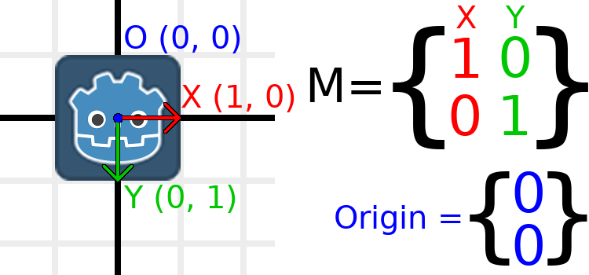

If we want the object to move to a position of (1, 2), we simply need
to set its `origin` vector to (1, 2):

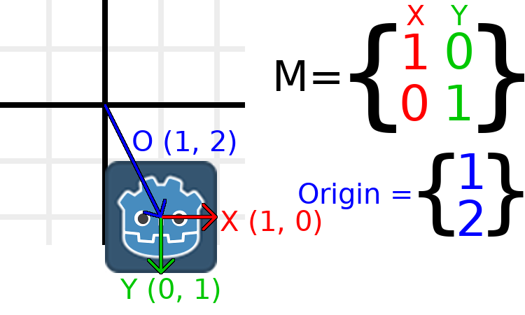

There is also a `translated()` method, which performs a different
operation to adding or changing `origin` directly. The `translated()`
method will translate the object *relative to its own rotation*.
For example, an object rotated 90 degrees clockwise will move to
the right when `translated()` with `Vector2.UP`.

.. note:: Godot's 2D uses coordinates based on pixels, so in actual
          projects you will want to translate by hundreds of units.

Putting it all together
~~~~~~~~~~~~~~~~~~~~~~~

We're going to apply everything we mentioned so far onto one transform.
To follow along, create a simple project with a Sprite node and use the
Godot logo for the texture resource.

Let's set the translation to (350, 150), rotate by -0.5 rad, and scale by 3.
I've posted a screenshot, and the code to reproduce it, but I encourage
you to try and reproduce the screenshot without looking at the code!

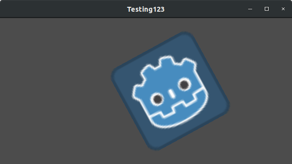

gdscript GDScript

```
    var t = Transform2D()
    # Translation
    t.origin = Vector2(350, 150)
    # Rotation
    var rot = -0.5 # The rotation to apply.
    t.x.x = cos(rot)
    t.y.y = cos(rot)
    t.x.y = sin(rot)
    t.y.x = -sin(rot)
    # Scale
    t.x *= 3
    t.y *= 3
    transform = t # Change the node's transform to what we just calculated.
```

Shearing the transformation matrix (advanced)
~~~~~~~~~~~~~~~~~~~~~~~~~~~~~~~~~~~~~~~~~~~~~

.. note:: If you are only looking for how to *use* transformation matrices,
          feel free to skip this section of the tutorial. This section
          explores an uncommonly used aspect of transformation matrices
          for the purpose of building an understanding of them.

You may have noticed that a transform has more degrees of freedom than
the combination of the above actions. The basis of a 2D transformation
matrix has four total numbers in two `Vector2` values, while
a rotation value and a Vector2 for scale only has 3 numbers. The high-level
concept for the missing degree of freedom is called *shearing*.

Normally, you will always have the basis vectors perpendicular to each
other. However, shearing can be useful in some situations, and
understanding shearing helps you understand how transforms work.

To show you visually how it will look, let's overlay a grid onto the Godot
logo:

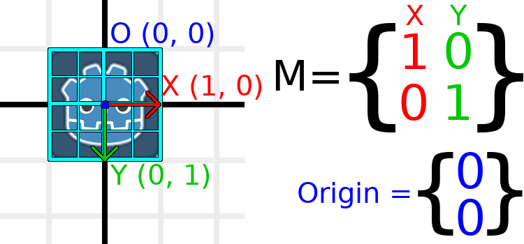

Each point on this grid is obtained by adding the basis vectors together.
The bottom-right corner is X + Y, while the top-right corner is X - Y.
If we change the basis vectors, the entire grid moves with it, as the
grid is composed of the basis vectors. All lines on the grid that are
currently parallel will remain parallel no matter what changes we make to
the basis vectors.

As an example, let's set Y to (1, 1):

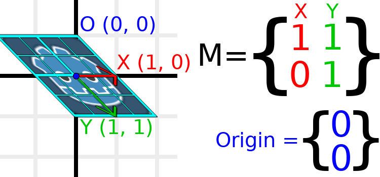

gdscript GDScript

```
    var t = Transform2D()
    # Shear by setting Y to (1, 1)
    t.y = Vector2.ONE
    transform = t # Change the node's transform to what we just calculated.
```

.. note:: You can't set the raw values of a Transform2D in the editor,
          so you *must* use code if you want to shear the object.

Due to the vectors no longer being perpendicular, the object has been
sheared. The bottom-center of the grid, which is (0, 1) relative
to itself, is now located at a world position of (1, 1).

The intra-object coordinates are called UV coordinates in textures,
so let's borrow that terminology for here. To find the world position
from a relative position, the formula is U * X + V * Y, where U and V
are numbers and X and Y are the basis vectors.

The bottom-right corner of the grid, which is always at the UV position
of (1, 1), is at the world position of (2, 1), which is calculated from
X*1 + Y*1, which is (1, 0) + (1, 1), or (1 + 1, 0 + 1), or (2, 1).
This matches up with our observation of where the bottom-right corner
of the image is.

Similarly, the top-right corner of the grid, which is always at the UV
position of (1, -1), is at the world position of (0, -1), which is calculated
from X*1 + Y*-1, which is (1, 0) - (1, 1), or (1 - 1, 0 - 1), or (0, -1).
This matches up with our observation of where the top-right corner
of the image is.

Hopefully you now fully understand the how a transformation matrix affects
the object, and the relationship between the basis vectors and how the
object's "UV" or "intra-coordinates" have their world position changed.

.. note:: In Godot, all transform math is done relative to the parent node.
          When we refer to "world position", that would be relative to the
          node's parent instead, if the node had a parent.

If you would like additional explanation, you should check out
3Blue1Brown's excellent video about linear transformations:
https://www.youtube.com/watch?v=kYB8IZa5AuE

Practical applications of transforms
------------------------------------

In actual projects, you will usually be working with transforms inside
transforms by having multiple `Node2D` or `Spatial`
nodes parented to each other.

However, sometimes it's very useful to manually calculate the values we
need. We will go over how you could use `Transform2D` or
`Transform` to manually calculate transforms of nodes.

Converting positions between transforms
~~~~~~~~~~~~~~~~~~~~~~~~~~~~~~~~~~~~~~~

There are many cases where you'd want to convert a position in and out of
a transform. For example, if you have a position relative to the player
and would like to find the world (parent-relative) position, or if you
have a world position and want to know where it is relative to the player.

We can find what a vector relative to the player would be defined in
world space as using the "xform" method:

gdscript GDScript

```
    # World space vector 100 units below the player.
    print(transform.xform(Vector2(0, 100)))
```

And we can use the "xform_inv" method to find a what world space position
would be if it was instead defined relative to the player:

gdscript GDScript

```
    # Where is (0, 100) relative to the player?
    print(transform.xform_inv(Vector2(0, 100)))
```

.. note:: If you know in advance that the transform is positioned at
          (0, 0), you can use the "basis_xform" or "basis_xform_inv"
          methods instead, which skip dealing with translation.

Moving an object relative to itself
~~~~~~~~~~~~~~~~~~~~~~~~~~~~~~~~~~~

A common operation, especially in 3D games, is to move an object relative
to itself. For example, in first-person shooter games, you would want the
character to move forward (-Z axis) when you press :kbd:`W`.

Since the basis vectors are the orientation relative to the parent,
and the origin vector is the position relative to the parent, we can simply
add multiples of the basis vectors to move an object relative to itself.

This code moves an object 100 units to its own right:

gdscript GDScript

```
    transform.origin += transform.x * 100
```

For moving in 3D, you would need to replace "x" with "basis.x".

.. note:: In actual projects, you can use `translate_object_local` in 3D
          or `move_local_x` and `move_local_y` in 2D to do this.

Applying transforms onto transforms
~~~~~~~~~~~~~~~~~~~~~~~~~~~~~~~~~~~

One of the most important things to know about transforms is how you
can use several of them together. A parent node's transform affects
all of its children. Let's dissect an example.

In this image, the child node has a "2" after the component names
to distinguish them from the parent node. It might look a bit
overwhelming with so many numbers, but remember that each number
is displayed twice (next to the arrows and also in the matrices),
and that almost half of the numbers are zero.

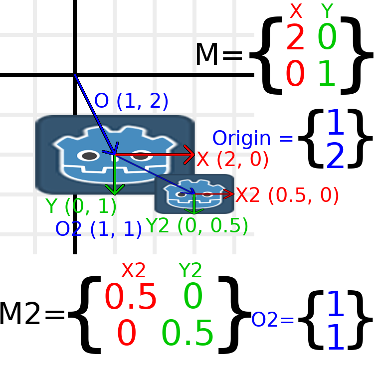

The only transformations going on here are that the parent node has
been given a scale of (2, 1), the child has been given a scale of
(0.5, 0.5), and both nodes have been given positions.

All child transformations are affected by the parent transformations.
The child has a scale of (0.5, 0.5), so you would expect it to be
a 1:1 ratio square, and it is, but only relative to the parent.
The child's X vector ends up being (1, 0) in world space, because
it is scaled by the parent's basis vectors.
Similarly, the child node's `origin` vector is set to (1, 1), but this
actually moves it (2, 1) in world space, due to the parent node's
basis vectors.

To calculate a child transform's world space transform manually, this is
the code we would use:

gdscript GDScript

```
    # Set up transforms just like in the image, except make positions be 100 times bigger.
    var parent = Transform2D(Vector2(2, 0), Vector2(0, 1), Vector2(100, 200))
    var child = Transform2D(Vector2(0.5, 0), Vector2(0, 0.5), Vector2(100, 100))

    # Calculate the child's world space transform
    # origin = (2, 0) * 100 + (0, 1) * 100 + (100, 200)
    var origin = parent.x * child.origin.x + parent.y * child.origin.y + parent.origin
    # basis_x = (2, 0) * 0.5 + (0, 1) * 0
    var basis_x = parent.x * child.x.x + parent.y * child.x.y
    # basis_y = (2, 0) * 0 + (0, 1) * 0.5
    var basis_y = parent.x * child.y.x + parent.y * child.y.y

    # Change the node's transform to what we just calculated.
    transform = Transform2D(basis_x, basis_y, origin)
```

In actual projects, we can find the world transform of the child by
applying one transform onto another using the `*` operator:

gdscript GDScript

```
    # Set up transforms just like in the image, except make positions be 100 times bigger.
    var parent = Transform2D(Vector2(2, 0), Vector2(0, 1), Vector2(100, 200))
    var child = Transform2D(Vector2(0.5, 0), Vector2(0, 0.5), Vector2(100, 100))

    # Change the node's transform to what would be the child's world transform.
    transform = parent * child
```

.. note:: When multiplying matrices, order matters! Don't mix them up.

Lastly, applying the identity transform will always do nothing.

If you would like additional explanation, you should check out
3Blue1Brown's excellent video about matrix composition:
https://www.youtube.com/watch?v=XkY2DOUCWMU

Inverting a transformation matrix
~~~~~~~~~~~~~~~~~~~~~~~~~~~~~~~~~

The "affine_inverse" function returns a transform that "undoes" the
previous transform. This can be useful in some situations, but it's
easier to just provide a few examples.

Multiplying an inverse transform by the normal transform undoes all
transformations:

gdscript GDScript

```
    var ti = transform.affine_inverse()
    var t = ti * transform
    # The transform is the identity transform.
```

Transforming a position by a transform and its inverse results in the
same position (same for "xform_inv"):

gdscript GDScript

```
    var ti = transform.affine_inverse()
    position = transform.xform(position)
    position = ti.xform(position)
    # The position is the same as before.
```

How does it all work in 3D?
---------------------------

One of the great things about transformation matrices is that they
work very similarly between 2D and 3D transformations.
All the code and formulas used above for 2D work the same in 3D,
with 3 exceptions: the addition of a third axis, that each
axis is of type `Vector3`, and also that Godot stores
the `Basis` separately from the `Transform`,
since the math can get complex and it makes sense to separate it.

All of the concepts for how translation, rotation, scale, and shearing
work in 3D are all the same compared to 2D. To scale, we take each
component and multiply it; to rotate, we change where each basis vector
is pointing; to translate, we manipulate the origin; and to shear, we
change the basis vectors to be non-perpendicular.

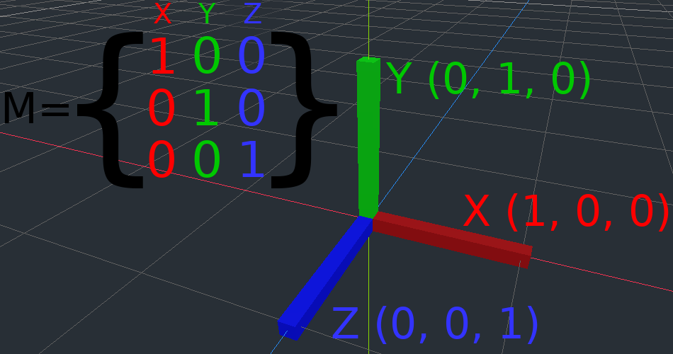

If you would like, it's a good idea to play around with transforms
to get an understanding of how they work. Godot allows you to edit
3D transform matrices directly from the inspector. You can download
this project which has colored lines and cubes to help visualize the
`Basis` vectors and the origin in both 2D and 3D:
https://github.com/godotengine/godot-demo-projects/tree/master/misc/matrix_transform

.. note:: Spatial's "Matrix" section in Godot 3.2's inspector
          displays the matrix as transposed, with the columns
          horizontal and the rows vertical. This may be changed
          to be less confusing in a future release of Godot.

.. note:: You cannot edit Node2D's transform matrix directly in Godot 3.2's
          inspector. This may be changed in a future release of Godot.

If you would like additional explanation, you should check out
3Blue1Brown's excellent video about 3D linear transformations:
https://www.youtube.com/watch?v=rHLEWRxRGiM

Representing rotation in 3D (advanced)
~~~~~~~~~~~~~~~~~~~~~~~~~~~~~~~~~~~~~~

The biggest difference between 2D and 3D transformation matrices is
how you represent rotation by itself without the basis vectors.

With 2D, we have an easy way (atan2) to switch between a transformation
matrix and an angle. In 3D, we can't simply represent rotation as one
number. There is something called Euler angles, which can represent
rotations as a set of 3 numbers, however, they are limited and not very
useful, except for trivial cases.

In 3D we do not typically use angles, we either use a transformation basis
(used pretty much everywhere in Godot), or we use quaternions. Godot can
represent quaternions using the `Quat` struct. My suggestion
to you is to completely ignore how they work under-the-hood, because
they are very complicated and unintuitive.

However, if you really must know how it works, here are some great
resources, which you can follow in order:

https://www.youtube.com/watch?v=mvmuCPvRoWQ

https://www.youtube.com/watch?v=d4EgbgTm0Bg

https://eater.net/quaternions
