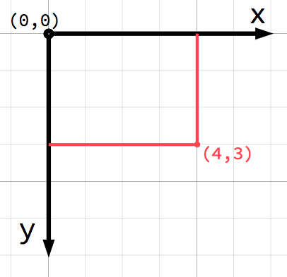
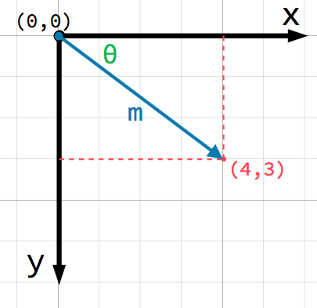
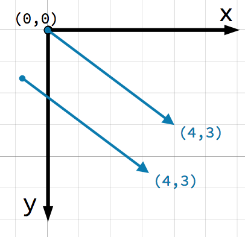
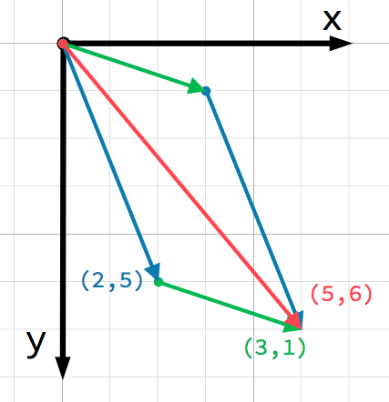
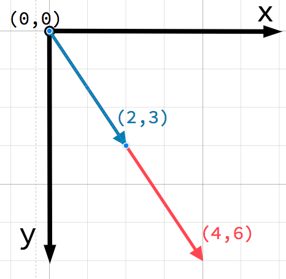
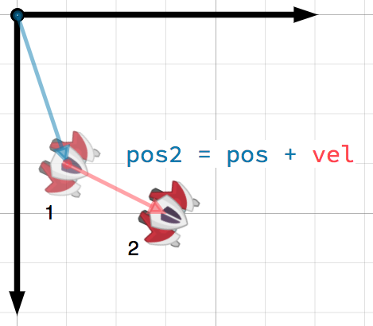
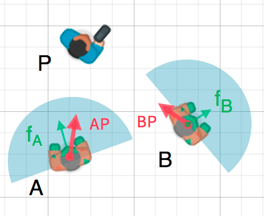
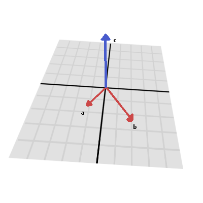

Vector math
===========

Introduction
~~~~~~~~~~~~

This tutorial is a short and practical introduction to linear algebra as
it applies to game development. Linear algebra is the study of vectors and
their uses. Vectors have many applications in both 2D and 3D development
and Godot uses them extensively. Developing a good understanding of vector
math is essential to becoming a strong game developer.

.. note:: This tutorial is **not** a formal textbook on linear algebra. We
          will only be looking at how it is applied to game development.
          For a broader look at the mathematics,
          see https://www.khanacademy.org/math/linear-algebra

Coordinate systems (2D)
~~~~~~~~~~~~~~~~~~~~~~~

In 2D space, coordinates are defined using a horizontal axis (`x`) and
a vertical axis (`y`). A particular position in 2D space is written
as a pair of values such as `(4, 3)`.



.. note:: If you're new to computer graphics, it might seem odd that the
          positive `y` axis points **downwards** instead of upwards,
          as you probably learned in math class. However, this is common
          in most computer graphics applications.

Any position in the 2D plane can be identified by a pair of numbers in this
way. However, we can also think of the position `(4, 3)` as an **offset**
from the `(0, 0)` point, or **origin**. Draw an arrow pointing from
the origin to the point:



This is a **vector**. A vector represents a lot of useful information. As
well as telling us that the point is at `(4, 3)`, we can also think of
it as an angle `θ` and a length (or magnitude) `m`. In this case, the
arrow is a **position vector** - it denotes a position in space, relative
to the origin.

A very important point to consider about vectors is that they only
represent **relative** direction and magnitude. There is no concept of
a vector's position. The following two vectors are identical:



Both vectors represent a point 4 units to the right and 3 units below some
starting point. It does not matter where on the plane you draw the vector,
it always represents a relative direction and magnitude.

Vector operations
~~~~~~~~~~~~~~~~~

You can use either method (x and y coordinates or angle and magnitude) to
refer to a vector, but for convenience, programmers typically use the
coordinate notation. For example, in Godot, the origin is the top-left
corner of the screen, so to place a 2D node named `Node2D` 400 pixels to the right and
300 pixels down, use the following code:

gdscript GDScript

```
    $Node2D.position = Vector2(400, 300)
```

Godot supports both `Vector2` and
`Vector3` for 2D and 3D usage, respectively. The same
mathematical rules discussed in this article apply to both types.

Member access
-------------

The individual components of the vector can be accessed directly by name.

gdscript GDScript

```
    # create a vector with coordinates (2, 5)
    var a = Vector2(2, 5)
    # create a vector and assign x and y manually
    var b = Vector2()
    b.x = 3
    b.y = 1
```

Adding vectors
--------------

When adding or subtracting two vectors, the corresponding components are added:

gdscript GDScript

```
    var c = a + b  # (2, 5) + (3, 1) = (5, 6)
```

We can also see this visually by adding the second vector at the end of
the first:



Note that adding `a + b` gives the same result as `b + a`.

Scalar multiplication
---------------------

.. note:: Vectors represent both direction and magnitude. A value
          representing only magnitude is called a **scalar**.

A vector can be multiplied by a **scalar**:

gdscript GDScript

```
    var c = a * 2  # (2, 5) * 2 = (4, 10)
    var d = b / 3  # (3, 6) / 3 = (1, 2)
```



.. note:: Multiplying a vector by a scalar does not change its direction,
          only its magnitude. This is how you **scale** a vector.

Practical applications
~~~~~~~~~~~~~~~~~~~~~~

Let's look at two common uses for vector addition and subtraction.

Movement
--------

A vector can represent **any** quantity with a magnitude and direction. Typical examples are: position, velocity, acceleration, and force. In
this image, the spaceship at step 1 has a position vector of `(1,3)` and
a velocity vector of `(2,1)`. The velocity vector represents how far the
ship moves each step. We can find the position for step 2 by adding
the velocity to the current position.



.. tip:: Velocity measures the **change** in position per unit of time. The
         new position is found by adding velocity to the previous position.

Pointing toward a target
------------------------

In this scenario, you have a tank that wishes to point its turret at a
robot. Subtracting the tank's position from the robot's position gives the
vector pointing from the tank to the robot.


.. tip:: To find a vector pointing from `A` to `B` use `B - A`.

Unit vectors
~~~~~~~~~~~~

A vector with **magnitude** of `1` is called a **unit vector**. They are
also sometimes referred to as **direction vectors** or **normals**. Unit
vectors are helpful when you need to keep track of a direction.

Normalization
-------------

**Normalizing** a vector means reducing its length to `1` while
preserving its direction. This is done by dividing each of its components
by its magnitude. Because this is such a common operation,
`Vector2` and `Vector3` provide a method for normalizing:

gdscript GDScript

```
    a = a.normalized()
```


.. warning:: Because normalization involves dividing by the vector's length,
             you cannot normalize a vector of length `0`. Attempting to
             do so will result in an error.

Reflection
----------

A common use of unit vectors is to indicate **normals**. Normal
vectors are unit vectors aligned perpendicularly to a surface, defining
its direction. They are commonly used for lighting, collisions, and other
operations involving surfaces.

For example, imagine we have a moving ball that we want to bounce off a
wall or other object:


The surface normal has a value of `(0, -1)` because this is a horizontal
surface. When the ball collides, we take its remaining motion (the amount
left over when it hits the surface) and reflect it using the normal. In
Godot, the `Vector2` class has a `bounce()` method
to handle this. Here is a GDScript example of the diagram above using a
`KinematicBody2D`:


gdscript GDScript

```
    # object "collision" contains information about the collision
    var collision = move_and_collide(velocity * delta)
    if collision:
        var reflect = collision.remainder.bounce(collision.normal)
        velocity = velocity.bounce(collision.normal)
        move_and_collide(reflect)
```

Dot product
~~~~~~~~~~~

The **dot product** is one of the most important concepts in vector math,
but is often misunderstood. Dot product is an operation on two vectors that
returns a **scalar**. Unlike a vector, which contains both magnitude and
direction, a scalar value has only magnitude.

The formula for dot product takes two common forms:


and


However, in most cases it is easiest to use the built-in method. Note that
the order of the two vectors does not matter:

gdscript GDScript

```
    var c = a.dot(b)
    var d = b.dot(a) # These are equivalent.
```

The dot product is most useful when used with unit vectors, making the
first formula reduce to just `cosθ`. This means we can use the dot
product to tell us something about the angle between two vectors:


When using unit vectors, the result will always be between `-1` (180°)
and `1` (0°).

Facing
------

We can use this fact to detect whether an object is facing toward another
object. In the diagram below, the player `P` is trying to avoid the
zombies `A` and `B`. Assuming a zombie's field of view is **180°**, can they see the player?



The green arrows `fA` and `fB` are **unit vectors** representing the
zombies' facing directions and the blue semicircle represents its field of
view. For zombie `A`, we find the direction vector `AP` pointing to
the player using `P - A` and normalize it, however, Godot has a helper
method to do this called `direction_to`. If the angle between this
vector and the facing vector is less than 90°, then the zombie can see
the player.

In code it would look like this:

gdscript GDScript

```
    var AP = A.direction_to(P)
    if AP.dot(fA) > 0:
        print("A sees P!")
```

Cross product
~~~~~~~~~~~~~

Like the dot product, the **cross product** is an operation on two vectors.
However, the result of the cross product is a vector with a direction
that is perpendicular to both. Its magnitude depends on their relative angle.
If two vectors are parallel, the result of their cross product will be a null vector.




The cross product is calculated like this:

gdscript GDScript

```
    var c = Vector3()
    c.x = (a.y * b.z) - (a.z * b.y)
    c.y = (a.z * b.x) - (a.x * b.z)
    c.z = (a.x * b.y) - (a.y * b.x)
```

With Godot, you can use the built-in method:

gdscript GDScript

```
    var c = a.cross(b)
```

.. note:: In the cross product, order matters. `a.cross(b)` does not
          give the same result as `b.cross(a)`. The resulting vectors
          point in **opposite** directions.

Calculating normals
-------------------

One common use of cross products is to find the surface normal of a plane
or surface in 3D space. If we have the triangle `ABC` we can use vector
subtraction to find two edges `AB` and `AC`. Using the cross product,
`AB x AC` produces a vector perpendicular to both: the surface normal.

Here is a function to calculate a triangle's normal:

gdscript GDScript

```
    func get_triangle_normal(a, b, c):
        # find the surface normal given 3 vertices
        var side1 = b - a
        var side2 = c - a
        var normal = side1.cross(side2)
        return normal
```

Pointing to a target
--------------------

In the dot product section above, we saw how it could be used to find the
angle between two vectors. However, in 3D, this is not enough information.
We also need to know what axis to rotate around. We can find that by
calculating the cross product of the current facing direction and the
target direction. The resulting perpendicular vector is the axis of
rotation.

More information
~~~~~~~~~~~~~~~~

For more information on using vector math in Godot, see the following articles:

- `doc_vectors_advanced`
- `doc_matrices_and_transforms`
