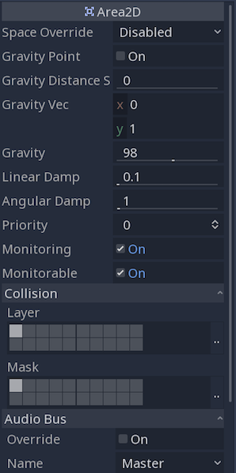
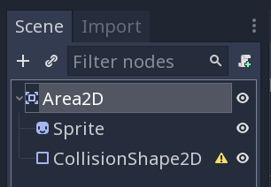
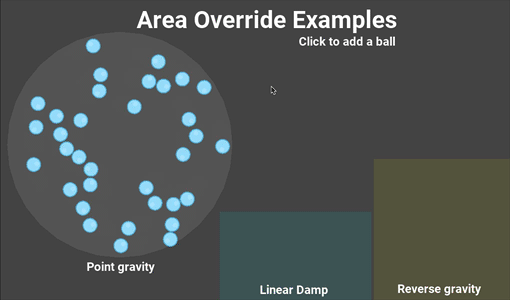

.. _doc_using_area_2d:

Using Area2D
============

Introduction
------------

Godot offers a number of collision objects to provide both collision detection
and response. Trying to decide which one to use for your project can be confusing.
You can avoid problems and simplify development if you understand how each of them
works and what their pros and cons are. In this tutorial, we'll look at the
`Area2D` node and show some examples of how it can be used.

.. note:: This document assumes you're familiar with Godot's various physics
          bodies. Please read `doc_physics_introduction` first.

What is an area?
----------------

An Area2D defines a region of 2D space. In this space you can detect other
`CollisionObject2D` nodes overlapping, entering,
and exiting. Areas also allow for overriding local physics properties. We'll
explore each of these functions below.

Area properties
---------------

Areas have many properties you can use to customize their behavior.



The first eight properties are used to configure the area's physics override
behavior. We'll look at how to use those in the section below.

*Monitoring* and *Monitorable* are used to enable and disable the area.

The "Collision" section is where you configure the area's collision layer(s)
and mask(s).

The "Audio Bus" section allows you to override audio in the area, for example to
apply an audio effect when the player moves through.

Note that Area2D extends `CollisionObject2D`, so it
also provides properties inherited from that class, such as `input_pickable`.

Overlap detection
-----------------

Perhaps the most common use of Area2D nodes is for contact and overlap detection.
When you need to know that two objects have touched, but don't need physical
collision, you can use an area to notify you of the contact.

For example, let's say we're making a coin for the player to pick up. The coin is
not a solid object - the player can't stand on it or push it - we just want it
to disappear when the player touches it.

Here's the node setup for the coin:



To detect the overlap, we'll connect the appropriate signal on the Area2d. Which
signal to use depends on the player's node type. If the player is another area,
use `area_entered`. However, let's assume our player is a `KinematicBody2D`
(and therefore a `CollisionObject2D` type), so we'll connect the
`body_entered` signal.

.. note:: If you're not familiar with using signals, see `doc_signals` for
          an introduction.

gdscript GDScript

```
    extends Area2D

    func _on_Coin_body_entered(body):
        queue_free()
```

Now our player can collect the coins!

Some other usage examples:

- Areas are great for bullets and other projectiles that hit and deal damage, but don't need any other physics such as bouncing.
- Use a large circular area around an enemy to define its "detect" radius. When the player is outside the area, the enemy can't "see" it.
- "Security cameras" - In a large level with multiple cameras, attach areas to each camera and activate them when the player enters.

See the `doc_your_first_2d_game` for an example of using Area2D in a game.

Area influence
--------------

The second major use for area nodes is to alter physics. By default, the area
won't do this, but you can enable this with the *Space Override* property. When
areas overlap, they are processed in *Priority* order (higher priority areas are
processed first). There are four options for override:

- *Combine* - The area adds its values to what has been calculated so far.
- *Replace* - The area replaces physics properties, and lower priority areas are ignored.
- *Combine-Replace* - The area adds its gravity/damping values to whatever has been calculated so far (in priority order), ignoring any lower priority areas.
- *Replace-Combine* - The area replaces any gravity/damping calculated so far, but keeps calculating the rest of the areas.

Using these properties, you can create very complex behavior with multiple
overlapping areas.

The physics properties that can be overridden are:

- *Gravity* - Gravity's strength inside the area.
- *Gravity Vec* - Gravity's direction. This vector does not need to be normalized.
- *Linear Damp* - How quickly objects stop moving - linear velocity lost per second.
- *Angular Damp* - How quickly objects stop spinning - angular velocity lost per second.

Point gravity
~~~~~~~~~~~~~

The *Gravity Point* property allows you to create an "attractor". Gravity in the
area will be calculated towards a point, given by the *Gravity Vec* property.
Values are relative to the Area2D, so for example using `(0, 0)` will attract
objects to the center of the area.

Examples
~~~~~~~~

The example project attached below has three areas demonstrating physics
override.



You can download this project here:
:download:`using_area_2d.zip <files/using_area_2d.zip )`
