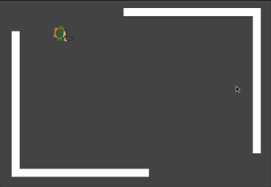

Using KinematicBody2D
=====================

Introduction
------------

Godot offers several collision objects to provide both collision detection
and response. Trying to decide which one to use for your project can be confusing.
You can avoid problems and simplify development if you understand how each of them
works and what their pros and cons are. In this tutorial, we'll look at the
`KinematicBody2D` node and show some examples
of how to use it.

Note:
 This document assumes you're familiar with Godot's various physics
          bodies. Please read `doc_physics_introduction` first.

What is a kinematic body?
-------------------------

`KinematicBody2D` is for implementing bodies that are controlled via code.
Kinematic bodies detect collisions with other bodies when moving, but are not affected by
engine physics properties, like gravity or friction. While this means that you
have to write some code to create their behavior, it also means you have more
precise control over how they move and react.

.. tip:: A `KinematicBody2D` can be affected by gravity and other forces,
        but you must calculate the movement in code. The physics engine will
        not move a `KinematicBody2D`.

Movement and collision
----------------------

When moving a `KinematicBody2D`, you should not set its `position` property
directly. Instead, you use the `move_and_collide()` or `move_and_slide()` methods.
These methods move the body along a given vector and instantly stop if
a collision is detected with another body. After a KinematicBody2D has collided,
any *collision response* must be coded manually.

Warning:
 You should only do Kinematic body movement in the `physics_process()` callback.

The two movement methods serve different purposes, and later in this tutorial, you'll
see examples of how they work.

`move_and_collide`
~~~~~~~~~~~~~~~~~~~~

This method takes one parameter: a `Vector2` indicating the body's
relative movement. Typically, this is your velocity vector multiplied by the
frame timestep (`delta`). If the engine detects a collision anywhere along
this vector, the body will immediately stop moving. If this happens, the
method will return a `KinematicCollision2D` object.

`KinematicCollision2D` is an object containing data about the collision
and the colliding object. Using this data, you can calculate your collision
response.

`move_and_slide`
~~~~~~~~~~~~~~~~~~

The `move_and_slide()` method is intended to simplify the collision
response in the common case where you want one body to slide along the other.
It is especially useful in platformers or top-down games, for example.

.. tip:: `move_and_slide()` automatically calculates frame-based movement
         using `delta`. Do *not* multiply your velocity vector by `delta`
         before passing it to `move_and_slide()`.

In addition to the velocity vector, `move_and_slide()` takes a number of
other parameters allowing you to customize the slide behavior:

- `up_direction` - *default value:* `Vector2( 0, 0 )`

    This parameter allows you to define what surfaces the engine should consider
    being the floor. Setting this lets you use the `is_on_floor()`, `is_on_wall()`,
    and `is_on_ceiling()` methods to detect what type of surface the body is
    in contact with. The default value means that all surfaces are considered walls.

- `stop_on_slope` - *default value:* `false`

    This parameter prevents a body from sliding down slopes when standing still.

- `max_slides` - *default value:* `4`

    This parameter is the maximum number of collisions before the body stops moving. Setting
    it too low may prevent movement entirely.

- `floor_max_angle` - *default value:* `0.785398` (in radians, equivalent to `45` degrees)

    This parameter is the maximum angle before a surface is no longer considered a "floor."

- `infinite_inertia` - *default value:* `true`

When this parameter is `true`, the body can push `RigidBody2D`
nodes, ignoring their mass, but won't detect collisions with them. If it's `false`
the body will collide with rigid bodies and stop.

`move_and_slide_with_snap`
~~~~~~~~~~~~~~~~~~~~~~~~~~~~

This method adds some additional functionality to `move_and_slide()` by adding
the `snap` parameter. As long as this vector is in contact with the ground, the
body will remain attached to the surface. Note that this means you must disable
snapping when jumping, for example. You can do this either by setting `snap`
to `Vector2.ZERO` or by using `move_and_slide()` instead.


Detecting collisions
--------------------

When using `move_and_collide()` the function returns a `KinematicCollision2D`
directly, and you can use this in your code.

When using `move_and_slide()` it's possible to have multiple collisions occur,
as the slide response is calculated. To process these collisions, use `get_slide_count()`
and `get_slide_collision()`:

gdscript GDScript

```
    # Using move_and_collide.
    var collision = move_and_collide(velocity * delta)
    if collision:
        print("I collided with ", collision.collider.name)

    # Using move_and_slide.
    velocity = move_and_slide(velocity)
    for i in get_slide_count():
        var collision = get_slide_collision(i)
        print("I collided with ", collision.collider.name)
```

Note:
 `get_slide_count()` only counts times the body has collided and changed direction.      

See `KinematicCollision2D` for details on what
collision data is returned.

Which movement method to use?
-----------------------------

A common question from new Godot users is: "How do you decide which movement
function to use?" Often, the response is to use `move_and_slide()` because
it's "simpler," but this is not necessarily the case. One way to think of it
is that `move_and_slide()` is a special case, and `move_and_collide()`
is more general. For example, the following two code snippets result in
the same collision response:


gdscript GDScript

```
    # using move_and_collide
    var collision = move_and_collide(velocity * delta)
    if collision:
        velocity = velocity.slide(collision.normal)

    # using move_and_slide
    velocity = move_and_slide(velocity)
```

Anything you do with `move_and_slide()` can also be done with `move_and_collide()`,
but it might take a little more code. However, as we'll see in the examples below,
there are cases where `move_and_slide()` doesn't provide the response you want.

In the example above, we assign the velocity that `move_and_slide()` returns
back into the `velocity` variable. This is because when the character collides
with the environment, the function recalculates the speed internally to reflect
the slowdown.

For example, if your character fell on the floor, you don't want it to
accumulate vertical speed due to the effect of gravity. Instead, you want its
vertical speed to reset to zero.

`move_and_slide()` may also recalculate the kinematic body's velocity several
times in a loop as, to produce a smooth motion, it moves the character and
collides up to five times by default. At the end of the process, the function
returns the character's new velocity that we can store in our `velocity`
variable, and use on the next frame.

Examples
--------

To see these examples in action, download the sample project:
:download:`using_kinematic2d.zip <files/using_kinematic2d.zip )`.

Movement and walls
~~~~~~~~~~~~~~~~~~

If you've downloaded the sample project, this example is in "BasicMovement.tscn".

For this example, add a `KinematicBody2D` with two children: a `Sprite` and a
`CollisionShape2D`. Use the Godot "icon.png)" as the Sprite's texture (drag it
from the Filesystem dock to the *Texture* property of the `Sprite`). In the
`CollisionShape2D`'s *Shape* property, select "New RectangleShape2D" and
size the rectangle to fit over the sprite image.

Note:
 See `doc_2d_movement` for examples of implementing 2D movement schemes.

Attach a script to the KinematicBody2D and add the following code:

gdscript GDScript

```
    extends KinematicBody2D

    var speed = 250
    var velocity = Vector2()

    func get_input():
        # Detect up/down/left/right keystate and only move when pressed.
        velocity = Vector2()
        if Input.is_action_pressed('ui_right'):
            velocity.x += 1
        if Input.is_action_pressed('ui_left'):
            velocity.x -= 1
        if Input.is_action_pressed('ui_down'):
            velocity.y += 1
        if Input.is_action_pressed('ui_up'):
            velocity.y -= 1
        velocity = velocity.normalized() * speed

    func _physics_process(delta):
        get_input()
        move_and_collide(velocity * delta)
```


Run this scene and you'll see that `move_and_collide()` works as expected, moving
the body along the velocity vector. Now let's see what happens when you add
some obstacles. Add a `StaticBody2D` with a
rectangular collision shape. For visibility, you can use a sprite, a
Polygon2D, or turn on "Visible Collision Shapes" from the "Debug" menu.

Run the scene again and try moving into the obstacle. You'll see that the `KinematicBody2D`
can't penetrate the obstacle. However, try moving into the obstacle at an angle and
you'll find that the obstacle acts like glue - it feels like the body gets stuck.

This happens because there is no *collision response*. `move_and_collide()` stops
the body's movement when a collision occurs. We need to code whatever response we
want from the collision.

Try changing the function to `move_and_slide(velocity)` and running again.
Note that we removed `delta` from the velocity calculation.

`move_and_slide()` provides a default collision response of sliding the body along the
collision object. This is useful for a great many game types, and may be all you need
to get the behavior you want.

Bouncing/reflecting
~~~~~~~~~~~~~~~~~~~

What if you don't want a sliding collision response? For this example ("BounceandCollide.tscn"
in the sample project), we have a character shooting bullets and we want the bullets to
bounce off the walls.

This example uses three scenes. The main scene contains the Player and Walls.
The Bullet and Wall are separate scenes so that they can be instanced.

The Player is controlled by the `w` and `s` keys for forward and back. Aiming
uses the mouse pointer. Here is the code for the Player, using `move_and_slide()`:

gdscript GDScript

```
    extends KinematicBody2D

    var Bullet = preload("res://Bullet.tscn")
    var speed = 200
    var velocity = Vector2()

    func get_input():
        # Add these actions in Project Settings -> Input Map.
        velocity = Vector2()
        if Input.is_action_pressed('backward'):
            velocity = Vector2(-speed/3, 0).rotated(rotation)
        if Input.is_action_pressed('forward'):
            velocity = Vector2(speed, 0).rotated(rotation)
        if Input.is_action_just_pressed('mouse_click'):
            shoot()

    func shoot():
        # "Muzzle" is a Position2D placed at the barrel of the gun.
        var b = Bullet.instance()
        b.start($Muzzle.global_position, rotation)
        get_parent().add_child(b)

    func _physics_process(delta):
        get_input()
        var dir = get_global_mouse_position() - global_position
        # Don't move if too close to the mouse pointer.
        if dir.length() > 5:
            rotation = dir.angle()
            velocity = move_and_slide(velocity)
```


And the code for the Bullet:

gdscript GDScript

```
    extends KinematicBody2D

    var speed = 750
    var velocity = Vector2()

    func start(pos, dir):
        rotation = dir
        position = pos
        velocity = Vector2(speed, 0).rotated(rotation)

    func _physics_process(delta):
        var collision = move_and_collide(velocity * delta)
        if collision:
            velocity = velocity.bounce(collision.normal)
            if collision.collider.has_method("hit"):
                collision.collider.hit()

    func _on_VisibilityNotifier2D_screen_exited():
        queue_free()
```

The action happens in `physics_process()`. After using `move_and_collide()`, if a
collision occurs, a `KinematicCollision2D` object is returned (otherwise, the return
is `Nil`).

If there is a returned collision, we use the `normal` of the collision to reflect
the bullet's `velocity` with the `Vector2.bounce()` method.

If the colliding object (`collider`) has a `hit` method,
we also call it. In the example project, we've added a flashing color effect to
the Wall to demonstrate this.



Platformer movement
~~~~~~~~~~~~~~~~~~~

Let's try one more popular example: the 2D platformer. `move_and_slide()`
is ideal for quickly getting a functional character controller up and running.
If you've downloaded the sample project, you can find this in "Platformer.tscn".

For this example, we'll assume you have a level made of `StaticBody2D` objects.
They can be any shape and size. In the sample project, we're using
`Polygon2D` to create the platform shapes.

Here's the code for the player body:


gdscript GDScript

```
    extends KinematicBody2D

    export (int) var run_speed = 100
    export (int) var jump_speed = -400
    export (int) var gravity = 1200

    var velocity = Vector2()
    var jumping = false

    func get_input():
        velocity.x = 0
        var right = Input.is_action_pressed('ui_right')
        var left = Input.is_action_pressed('ui_left')
        var jump = Input.is_action_just_pressed('ui_select')

        if jump and is_on_floor():
            jumping = true
            velocity.y = jump_speed
        if right:
            velocity.x += run_speed
        if left:
            velocity.x -= run_speed

    func _physics_process(delta):
        get_input()
        velocity.y += gravity * delta
        if jumping and is_on_floor():
            jumping = false
        velocity = move_and_slide(velocity, Vector2(0, -1))
```


When using `move_and_slide()`, the function returns a vector representing the
movement that remained after the slide collision occurred. Setting that value back
to the character's `velocity` allows us to move up and down slopes smoothly. Try
removing `velocity =` and see what happens if you don't do this.

Also note that we've added `Vector2(0, -1)` as the floor normal. This vector points
straight upward. As a result, if the character collides with an object
that has this normal, it will be considered a floor.

Using the floor normal allows us to make jumping work, using `is_on_floor()`.
This function will only return `true` after a `move_and_slide()` collision
where the colliding body's normal is within 45 degrees of the given floor
vector. You can control the maximum angle by setting `floor_max_angle`.

This angle also allows you to implement other features like wall jumps using
`is_on_wall()`, for example.
