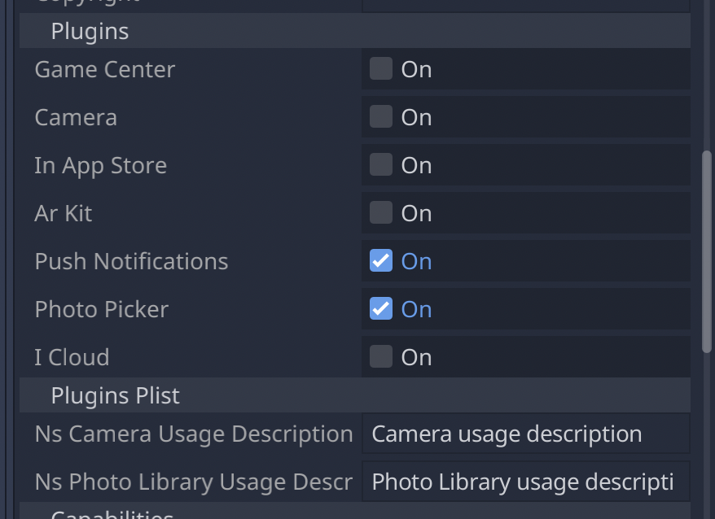

Creating iOS plugins
====================

This page explains what iOS plugins can do for you, how to use an existing plugin, and the steps to code a new one.

iOS plugins allow you to use third-party libraries and support iOS-specific features like In-App Purchases, GameCenter integration, ARKit support, and more.

Loading and using an existing plugin
------------------------------------

An iOS plugin requires a `.gdip` configuration file, a binary file which can be either `.a` static library or `.xcframework` containing `.a` static libraries, and possibly other dependencies. To use it, you need to:

1. Copy the plugin's files to your Godot project's `res://ios/plugins` directory. You can also group files in a sub-directory, like `res://ios/plugins/my_plugin`.

2. The Godot editor automatically detects and imports `.gdip` files inside `res://ios/plugins` and its subdirectories.

3. You can find and activate detected plugins by going to Project -> Export... -> iOS and in the Options tab, scrolling to the Plugins section.

When a plugin is active, you can access it in your using `Engine.get_singleton()`::

    if Engine.has_singleton("MyPlugin"):
        var singleton = Engine.get_singleton("MyPlugin")
        print(singleton.foo())

Creating an iOS plugin
----------------------

At its core, a Godot iOS plugin is an iOS library (*.a* archive file or *.xcframework* containing static libraries) with the following requirements:

- The library must have a dependency on the Godot engine headers.

- The library must come with a `.gdip` configuration file.

An iOS plugin can have the same functionality as a Godot module but provides more flexibility and doesn't require to rebuild the engine.

Here are the steps to get a plugin's development started. We recommend using `Xcode ( https://developer.apple.com/develop/ )`_ as your development environment.

See also:
 The `Godot iOS Plugins ( https://github.com/godotengine/godot-ios-plugins )`_ Godot iOS plugins.

    The `Godot iOS plugin template ( https://github.com/naithar/godot_ios_plugin )`_ gives you all the boilerplate you need to get your iOS plugin started.

To build an iOS plugin:

1. Create an Objective-C static library for your plugin inside Xcode.

2. Add the Godot engine header files as a dependency for your plugin library in `HEADER_SEARCH_PATHS`. You can find the setting inside the `Build Settings` tab:

    - Download the Godot engine source from the `Godot GitHub page ( https://github.com/godotengine/godot )`_.

    - Run SCons to generate headers. You can learn the process by reading `doc_compiling_for_ios`. You don't have to wait for compilation to complete to move forward as headers are generated before the engine starts to compile.

    - You should use the same header files for iOS plugins and for the iOS export template.

3. In the `Build Settings` tab, specify the compilation flags for your static library in `OTHER_CFLAGS`. The most important ones are `-fcxx-modules`, `-fmodules`, and `-DDEBUG` if you need debug support. Other flags should be the same you use to compile Godot. For instance:

::

    -DPTRCALL_ENABLED -DDEBUG_ENABLED -DDEBUG_MEMORY_ALLOC -DDISABLE_FORCED_INLINE -DTYPED_METHOD_BIND

4. Add the required logic for your plugin and build your library to generate a `.a` file. You will probably need to build both `debug` and `release` target `.a` files. Depending on your needs, pick either or both. If you need both debug and release `.a` files, their name should match following pattern: `[PluginName].[TargetType].a`. You can also build the static library with your SCons configuration.

5. The iOS plugin system also supports `.xcframework` files. To generate one, you can use a command such as:

::

    xcodebuild -create-xcframework -library [DeviceLibrary].a -library [SimulatorLibrary].a -output [PluginName].xcframework

6. Create a Godot iOS Plugin configuration file to help the system detect and load your plugin:

    -   The configuration file extension must be `gdip` (e.g.: `MyPlugin.gdip`).

    -   The configuration file format is as follow::

            [config]
            name="MyPlugin"
            binary="MyPlugin.a"

            initialization="init_my_plugin"
            deinitialization="deinit_my_plugin"

            [dependencies]
            linked=[]
            embedded=[]
            system=["Foundation.framework"]

            capabilities=["arkit", "metal"]

            files=["data.json"]

            linker_flags=["-ObjC"]

            [plist]
            PlistKeyWithDefaultType="Some Info.plist key you might need"
            StringPlistKey:string="String value"
            IntegerPlistKey:integer=42
            BooleanPlistKey:boolean=true
            RawPlistKey:raw="
            <array>
                <string>UIInterfaceOrientationPortrait</string>
            </array>
            "
            StringPlistKeyToInput:string_input="Type something"

        The `config` section and fields are required and defined as follow:

            -   **name**: name of the plugin

            -   **binary**: this should be the filepath of the plugin library (`a` or `xcframework`) file.

                -   The filepath can be relative (e.g.: `MyPlugin.a`, `MyPlugin.xcframework`) in which case it's relative to the directory where the `gdip` file is located.
                -   The filepath can be absolute: `res://some_path/MyPlugin.a` or `res://some_path/MyPlugin.xcframework`.
                -   In case you need multitarget library usage, the filename should be `MyPlugin.a` and `.a` files should be named as `MyPlugin.release.a` and `MyPlugin.debug.a`.
                -   In case you use multitarget `xcframework` libraries, their filename in the configuration should be `MyPlugin.xcframework`. The `.xcframework` files should be named as `MyPlugin.release.xcframework` and `MyPlugin.debug.xcframework`.

        The `dependencies` and `plist` sections are optional and defined as follow:

            -   **dependencies**:

                -   **linked**: contains a list of iOS frameworks that the iOS application should be linked with.

                -   **embedded**: contains a list of iOS frameworks or libraries that should be both linked and embedded into the resulting iOS application.

                -   **system**: contains a list of iOS system frameworks that are required for plugin.

                -   **capabilities**: contains a list of iOS capabilities that is required for plugin. A list of available capabilities can be found at `Apple UIRequiredDeviceCapabilities documentation page ( https://developer.apple.com/documentation/bundleresources/information_property_list/uirequireddevicecapabilities )`_.

                -   **files**: contains a list of files that should be copied on export. This is useful for data files or images.

                -   **linker_flags**: contains a list of linker flags to add to the Xcode project when exporting the plugin.

            -   **plist**: should have keys and values that should be present in `Info.plist` file.

                -   Each line should follow pattern: `KeyName:KeyType=KeyValue`
                -   Supported values for `KeyType` are `string`, `integer`, `boolean`, `raw`, `string_input`
                -   If no type is used (e.g.: `KeyName="KeyValue"`) `string` type will be used.
                -   If `raw` type is used value for coresponding key will be stored in `Info.plist` as is.
                -   If `string_input` type is used you will be able to modify value in Export window.
