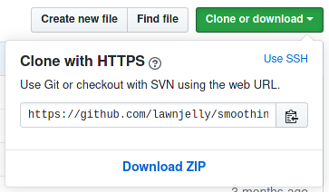

Installing plugins
==================

Godot features an editor plugin system with numerous plugins developed by the
community. Plugins can extend the editor's functionality with new nodes,
additional docks, convenience features, and more.

Finding plugins
~~~~~~~~~~~~~~~

The preferred way to find Godot plugins is to use the
`Asset Library ( https://godotengine.org/asset-library/ )`_. While it can be
browsed online, it's more convenient to use it directly from the editor.
To do so, click the **AssetLib** tab at the top of the editor:

You can also find assets on code hosting websites such as GitHub.

Note:

    Some repositories describe themselves as "plugins" but may not actually be
    *editor* plugins. This is especially the case for scripts that are intended
    to be used in a running project. You don't need to enable such plugins to
    use them. Download them and extract the files in your project folder.

    One way to distinguish editor plugins from non-editor plugins is to look for
    a `plugin.cfg` file in the repository that hosts the plugin. If the
    repository contains a `plugin.cfg` file in a folder placed in the
    `addons/` folder, then it is an editor plugin.

Installing a plugin
~~~~~~~~~~~~~~~~~~~

To install a plugin, download it as a ZIP archive. On the Asset Library, this
can be done using the **Download** button, either from the editor or using the
Web interface.

On GitHub, if a plugin has *tags* (versions) declared, go to the **Releases**
tab to download a stable release. This ensures you download a version that was
declared to be stable by its author.

On GitHub, if the plugin doesn't have any *tags* declared, use the **Download ZIP**
button to download a ZIP of the latest revision:

Extract the ZIP archive and move the `addons/` folder it contains into your
project folder. If your project already contains an `addons/` folder, move the
plugin's `addons/` folder into your project folder to merge the new folder
contents with the existing one. Your file manager may ask you whether to write
into the folder; answer **Yes**. No files will be overwritten in the process.

Enabling a plugin
~~~~~~~~~~~~~~~~~

To enable the freshly installed plugin, open **Project > Project Settings** at
the top of the editor then go the **Plugins** tab. If the plugin was packaged
correctly, you should see it in the list of plugins. Click on the gray
**Inactive** text and choose **Active** to enable the plugin. The word
**Active** will display in green to confirm the plugin was enabled.

You can use the plugin immediately after enabling it; there's no need to restart
the editor. Likewise, disabling a plugin can be done without having to restart
the editor.
