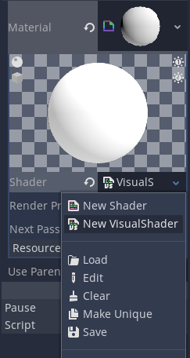
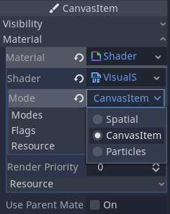
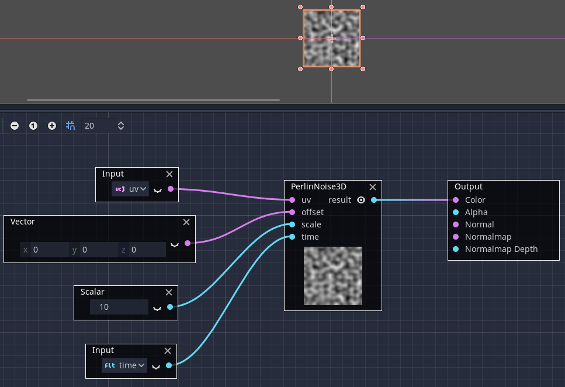

Visual Shader plugins
=====================

Visual Shader plugins are used to create custom `VisualShader` nodes
in GDScript.

The creation process is different from usual editor plugins. You do not need to
create a `plugin.cfg` file to register it; instead, create and save a script
file and it will be ready to use, provided the custom node is registered with
`name`.

This short tutorial will explain how to make a Perlin-3D noise node (original
code from this `GPU noise shaders plugin
( https://github.com/curly-brace/Godot-3.0-Noise-Shaders/blob/master/assets/gpu_noise_shaders/classic_perlin3d.tres )`.

Create a Sprite and assign a `ShaderMaterial` to its material slot:


Assign `VisualShader` to the shader slot of the material:



Don't forget to change its mode to "CanvasItem" (if you are using a Sprite):



Create a script which derives from `VisualShaderNodeCustom`. This is
all you need to initialize your plugin.

```
    # PerlinNoise3D.gd
    tool
    extends VisualShaderNodeCustom
    class_name VisualShaderNodePerlinNoise3D


    func _get_name():
        return "PerlinNoise3D"


    func _get_category():
        return "MyShaderNodes"


    func _get_description():
        return "Classic Perlin-Noise-3D function (by Curly-Brace)"


    func _get_return_icon_type():
        return VisualShaderNode.PORT_TYPE_SCALAR


    func _get_input_port_count():
        return 4


    func _get_input_port_name(port):
        match port:
            0:
                return "uv"
            1:
                return "offset"
            2:
                return "scale"
            3:
                return "time"


    func _get_input_port_type(port):
        match port:
            0:
                return VisualShaderNode.PORT_TYPE_VECTOR
            1:
                return VisualShaderNode.PORT_TYPE_VECTOR
            2:
                return VisualShaderNode.PORT_TYPE_SCALAR
            3:
                return VisualShaderNode.PORT_TYPE_SCALAR


    func _get_output_port_count():
        return 1


    func _get_output_port_name(port):
        return "result"


    func _get_output_port_type(port):
        return VisualShaderNode.PORT_TYPE_SCALAR


    func _get_global_code(mode):
        return """
            vec3 mod289_3(vec3 x) {
                return x - floor(x * (1.0 / 289.0)) * 289.0;
            }

            vec4 mod289_4(vec4 x) {
                return x - floor(x * (1.0 / 289.0)) * 289.0;
            }

            vec4 permute(vec4 x) {
                return mod289_4(((x * 34.0) + 1.0) * x);
            }

            vec4 taylorInvSqrt(vec4 r) {
                return 1.79284291400159 - 0.85373472095314 * r;
            }

            vec3 fade(vec3 t) {
                return t * t * t * (t * (t * 6.0 - 15.0) + 10.0);
            }

            // Classic Perlin noise.
            float cnoise(vec3 P) {
                vec3 Pi0 = floor(P); // Integer part for indexing.
                vec3 Pi1 = Pi0 + vec3(1.0); // Integer part + 1.
                Pi0 = mod289_3(Pi0);
                Pi1 = mod289_3(Pi1);
                vec3 Pf0 = fract(P); // Fractional part for interpolation.
                vec3 Pf1 = Pf0 - vec3(1.0); // Fractional part - 1.0.
                vec4 ix = vec4(Pi0.x, Pi1.x, Pi0.x, Pi1.x);
                vec4 iy = vec4(Pi0.yy, Pi1.yy);
                vec4 iz0 = vec4(Pi0.z);
                vec4 iz1 = vec4(Pi1.z);

                vec4 ixy = permute(permute(ix) + iy);
                vec4 ixy0 = permute(ixy + iz0);
                vec4 ixy1 = permute(ixy + iz1);

                vec4 gx0 = ixy0 * (1.0 / 7.0);
                vec4 gy0 = fract(floor(gx0) * (1.0 / 7.0)) - 0.5;
                gx0 = fract(gx0);
                vec4 gz0 = vec4(0.5) - abs(gx0) - abs(gy0);
                vec4 sz0 = step(gz0, vec4(0.0));
                gx0 -= sz0 * (step(0.0, gx0) - 0.5);
                gy0 -= sz0 * (step(0.0, gy0) - 0.5);

                vec4 gx1 = ixy1 * (1.0 / 7.0);
                vec4 gy1 = fract(floor(gx1) * (1.0 / 7.0)) - 0.5;
                gx1 = fract(gx1);
                vec4 gz1 = vec4(0.5) - abs(gx1) - abs(gy1);
                vec4 sz1 = step(gz1, vec4(0.0));
                gx1 -= sz1 * (step(0.0, gx1) - 0.5);
                gy1 -= sz1 * (step(0.0, gy1) - 0.5);

                vec3 g000 = vec3(gx0.x, gy0.x, gz0.x);
                vec3 g100 = vec3(gx0.y, gy0.y, gz0.y);
                vec3 g010 = vec3(gx0.z, gy0.z, gz0.z);
                vec3 g110 = vec3(gx0.w, gy0.w, gz0.w);
                vec3 g001 = vec3(gx1.x, gy1.x, gz1.x);
                vec3 g101 = vec3(gx1.y, gy1.y, gz1.y);
                vec3 g011 = vec3(gx1.z, gy1.z, gz1.z);
                vec3 g111 = vec3(gx1.w, gy1.w, gz1.w);

                vec4 norm0 = taylorInvSqrt(vec4(dot(g000, g000), dot(g010, g010), dot(g100, g100), dot(g110, g110)));
                g000 *= norm0.x;
                g010 *= norm0.y;
                g100 *= norm0.z;
                g110 *= norm0.w;
                vec4 norm1 = taylorInvSqrt(vec4(dot(g001, g001), dot(g011, g011), dot(g101, g101), dot(g111, g111)));
                g001 *= norm1.x;
                g011 *= norm1.y;
                g101 *= norm1.z;
                g111 *= norm1.w;

                float n000 = dot(g000, Pf0);
                float n100 = dot(g100, vec3(Pf1.x, Pf0.yz));
                float n010 = dot(g010, vec3(Pf0.x, Pf1.y, Pf0.z));
                float n110 = dot(g110, vec3(Pf1.xy, Pf0.z));
                float n001 = dot(g001, vec3(Pf0.xy, Pf1.z));
                float n101 = dot(g101, vec3(Pf1.x, Pf0.y, Pf1.z));
                float n011 = dot(g011, vec3(Pf0.x, Pf1.yz));
                float n111 = dot(g111, Pf1);

                vec3 fade_xyz = fade(Pf0);
                vec4 n_z = mix(vec4(n000, n100, n010, n110), vec4(n001, n101, n011, n111), fade_xyz.z);
                vec2 n_yz = mix(n_z.xy, n_z.zw, fade_xyz.y);
                float n_xyz = mix(n_yz.x, n_yz.y, fade_xyz.x);
                return 2.2 * n_xyz;
            }
        """


    func _get_code(input_vars, output_vars, mode, type):
        return output_vars[0] + " = cnoise(vec3((%s.xy + %s.xy) * %s, %s)) * 0.5 + 0.5;" % [input_vars[0], input_vars[1], input_vars[2], input_vars[3]]
```

Save it and open the Visual Shader. You should see your new node type within the member's dialog (if you can't see your new node, try restarting the editor):


Place it on a graph and connect the required ports:



That is everything you need to do, as you can see it is easy to create your own custom VisualShader nodes!
