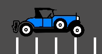
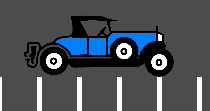

.. _doc_jitter_stutter:

Fixing jitter and stutter
=========================

What are jitter and stutter?
----------------------------

*Jitter* and *stutter* are two different alterations to visible motion of objects on screen that may affect a game,
even when running at full speed. These effects are mostly visible in games where the world moves at a constant speed
in a fixed direction, like runners or platformers.

Distinguishing between them
---------------------------

A game running at a normal framerate without exhibiting any effect will appear smooth:

A game exhibiting *jitter* will shake constantly in a very subtle way:

Finally, a game exhibiting *stutter* will appear smooth, but appear to *stop* or *roll back a frame* every few seconds:

Jitter
------

There can be many causes of jitter, the most typical one happens when the game *physics frequency* (usually 60 Hz) runs
at a different resolution than the monitor refresh rate. Check whether your monitor refresh rate is different from 60 Hz.

This is generally not a problem, given that most monitors are 60 Hz, and
starting with Godot 3.1, a frame timer was introduced that tries to synchronize with refresh as well as possible.

Sometimes only some objects appear to jitter (character or background). This happens when they are processed in different
time sources (one is processed in the physics step while another is processed in the idle step). Godot 3.1 does some
improvements to this, from allowing kinematic bodies to be animated in the regular _process loop, to further fixes in the
frame timer.

.. note::

    You can use physics interpolation to mitigate physics-related jittering.
    See `lawnjelly's smoothing-addon ( https://github.com/lawnjelly/smoothing-addon )`
    for an add-on that can be dropped into any project to enable physics interpolation.

Stutter
-------

Stutter may happen due to two different reasons. The first, and most obvious one, is the game not being able to keep full
framerate performance. Solving this is game specific and will require optimization.

The second is more complicated, because it is often not associated to the engine or game but the underlying operating system.
Here is some information regarding stutter on different OSs.

Windows
^^^^^^^

Windows is known to cause stutter in windowed games. This mostly depends on the hardware installed, drivers version and
processes running in parallel (e.g. having many browser tabs open may cause stutter in a running game). To avoid this,
starting with 3.1, Godot raises the game priority to "Above Normal". This helps considerably but may not completely eliminate
stutter.

Eliminating this completely requires giving your game full privileges to become "time critical", which is not advised.
Some games may do it, but it is advised to learn to live with this problem, as it is common for Windows games and most users
won't play games windowed (games that are played in a window, e.g. puzzle games, will usually not exhibit this problem anyway).

For fullscreen, Windows gives special priority to the game so stutter is no longer visible and very rare.
This is how most games are played.

Linux (X11)
^^^^^^^^^^^

Stutter may be visible on Desktop Linux, but this is usually associated with different video drivers and compositors.
Nouveau drivers often exhibit this, while AMD or NVidia proprietary don't. Some compositors may also trigger this problem
(e.g. KWin), so it is advised to try using a different one to rule it out as the cause.

There is no workaround for driver or compositor stuttering other than reporting it as an issue to the driver or compositor
developers.

macOS
^^^^^

Generally, macOS is stutter-free, although recently some bugs were reported when running on fullscreen (this is a macOS bug).
If you have a machine exhibiting this behavior, please let us know.

Android
^^^^^^^

Generally, Android is stutter and jitter-free because the running activity gets all the priority. That said, there may be
problematic devices (older Kindle Fire is known to be one). If you see this problem on Android, please let us know.

iOS
^^^

iOS devices are generally stutter-free, but older devices running newer versions of the operating system may exhibit problems.
This is generally unavoidable.

Reporting stutter or jitter problems
------------------------------------

If you are reporting a stutter or jitter problem (opening an issue) not caused by any of the above reasons, please specify very
clearly all the information possible about device, operating system, driver versions, etc. This may help to better troubleshoot it.

Also make sure to use the correct term (jitter or stutter) based on the exhibited behavior. This will help understand your issue much faster.
Provide a project that can be used to reproduce the issue, and if possible a screen capture demonstrating the bug.
