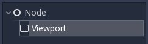
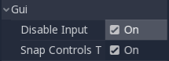
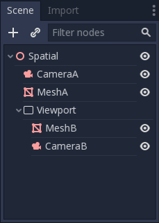
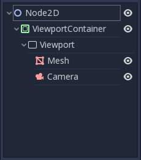
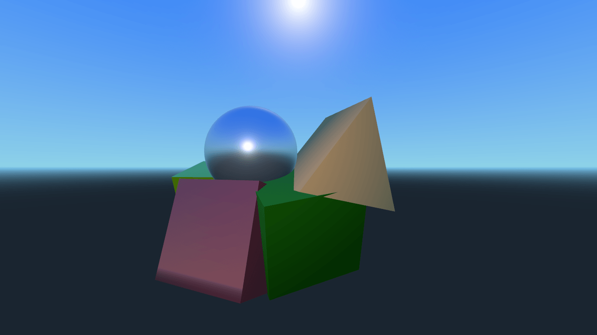
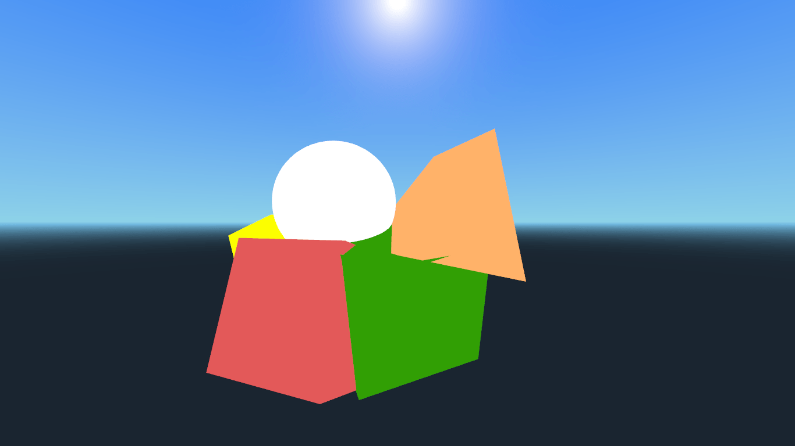
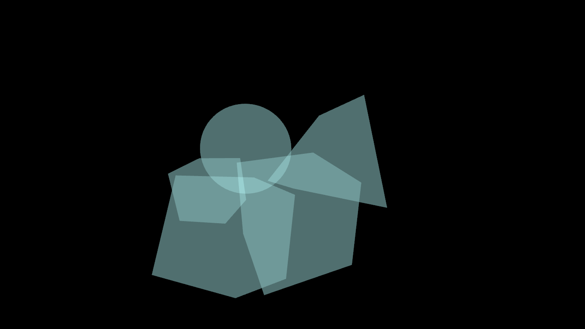
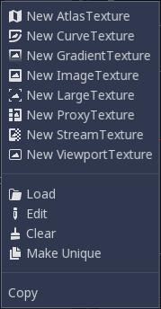
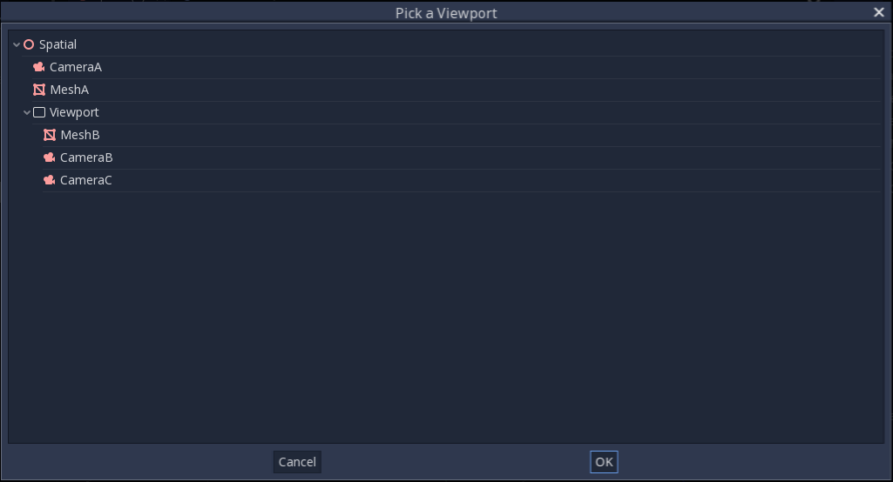

.. _doc_viewports:

Using Viewports
===============

Introduction
------------

Think of a `Viewport` as a screen onto which the game is projected. In order
to see the game, we need to have a surface on which to draw it; that surface is
the Root `Viewport`.

`Viewports` can also be added to the scene so that there
are multiple surfaces to draw on. When we are drawing to a `Viewport`
that is not the Root, we call it a render target. We can access the contents
of a render target by accessing its corresponding `texture`.
By using a `Viewport` as a render target,
we can either render multiple scenes simultaneously or we can render to
a `texture` which is applied to an object in the scene, for example a dynamic
skybox.

`Viewports` have a variety of use cases, including:

- Rendering 3D objects within a 2D game
- Rendering 2D elements in a 3D game
- Rendering dynamic textures
- Generating procedural textures at runtime
- Rendering multiple cameras in the same scene

What all these use cases have in common is that you are given the ability to
draw objects to a texture as if it were another screen and can then choose
what to do with the resulting texture.

Input
-----

`Viewports` are also responsible for delivering properly adjusted and
scaled input events to all their children nodes. Typically, input is received by the
nearest `Viewport` not to receive input by checking
'Disable Input' to 'on'; this will allow the next nearest `Viewport` in the tree to capture
the input.

For more information on how Godot handles input, please read the `Input Event Tutorial<doc_inputevent>`.

Listener
--------

Godot supports 3D sound (in both 2D and 3D nodes); more on this can be
found in the `Audio Streams Tutorial<doc_audio_streams>`. For this type of sound to be
audible, the `Viewport` needs to be enabled as a listener (for 2D or 3D).
If you are using a custom `Viewport`, don't forget
to enable this!

Cameras (2D & 3D)
-----------------

When using a `Camera` /
`Camera2D`, cameras will always display on the
closest parent `Viewport` (going towards the root). For example, in the
following hierarchy:

CameraA will display on the Root `Viewport` and it will draw MeshA. CameraB
will be captured by the `Viewport` Node along with MeshB. Even though MeshB is in the scene
hierarchy, it will still not be drawn to the Root `Viewport`. Similarly MeshA will not
be visible from the `Viewport` nodes only
capture nodes below them in the hierarchy.

There can only be one active camera per `Viewport`, so if there is more
than one, make sure that the desired one has the "current" property set,
or make it the current camera by calling:

::

    camera.make_current()

By default, cameras will render all objects in their world. In 3D, cameras can use their
`cull_mask` property combined with the
`VisualInstance's`
property to restrict which objects are rendered.

Scale & stretching
------------------

`Viewports`
in pixels. For `Viewports`,
these values are overridden, but for all others, this sets their resolution.

It is also possible to scale the 2D content and make the `Viewport` resolution
different from the one specified in size, by calling:

::

    viewport.set_size_override(true, Vector2(width, height)) # Custom size for 2D.
    viewport.set_size_override_stretch(true) # Enable stretch for custom size.

The root `Viewport` uses this for the stretch options in the project
settings. For more information on scaling and stretching visit the `Multiple Resolutions Tutorial <doc_multiple_resolutions>`

Worlds
------

For 3D, a `Viewport`. This
is basically the universe that links physics and rendering together.
Spatial-based nodes will register using the `World` of the closest
`Viewport` but
use the same as their parent `Viewport` always contains a
`World` can
be set in a `Viewport` using the "world" property, and that will separate
all children nodes of that `Viewport` from interacting with the parent
`Viewport's`. This is especially useful in scenarios where, for
example, you might want to show a separate character in 3D imposed over
the game (like in StarCraft).

As a helper for situations where you want to create `Viewports` that
display single objects and don't want to create a `World` has
the option to use its own `World`. This is useful when you want to
instance 3D characters or objects in a 2D `World`.

For 2D, each `Viewport`.
This suffices in most cases, but in case sharing them may be desired, it
is possible to do so by setting the `Viewport's` manually.

For an example of how this works, see the demo projects `3D in 2D <https://github.com/godotengine/godot-demo-projects/tree/master/viewport/3d_in_2d>`_ and `2D in 3D <https://github.com/godotengine/godot-demo-projects/tree/master/viewport/2d_in_3d>`_ respectively.

Capture
-------

It is possible to query a capture of the `Viewport` contents. For the root
`Viewport`, this is effectively a screen capture. This is done with the
following code:

::

   # Retrieve the captured Image using get_data().
   var img = get_viewport().get_texture().get_data()
   # Flip on the Y axis.
   # You can also set "V Flip" to true if not on the root Viewport.
   img.flip_y()
   # Convert Image to ImageTexture.
   var tex = ImageTexture.new()
   tex.create_from_image(img)
   # Set Sprite Texture.
   $sprite.texture = tex

But if you use this in `_ready()` or from the first frame of the `Viewport's` initialization,
you will get an empty texture because there is nothing to get as texture. You can deal with
it using (for example):

::

   # Wait until the frame has finished before getting the texture.
   yield(VisualServer, "frame_post_draw")
   # You can get the image after this.

Viewport Container
------------------

If the `Viewport`, it will become active and display anything it has inside. The layout looks like this:

The `Viewport` completely
if `Stretch<class_viewportcontainer_property_stretch>` is set to `true` in `ViewportContainer`.
Note: The size of the `ViewportContainer`.

Rendering
---------

Due to the fact that the `Viewport` is an entryway into another rendering surface, it exposes a few
rendering properties that can be different from the project settings. The first is MSAA; you can
choose to use a different level of MSAA for each `Viewport`; the default behavior is DISABLED.
You can also set the `Viewport` to use HDR, HDR is very useful for when you want to store values in the texture that are outside the range 0.0 - 1.0.

If you know how the `Viewport` is going to be used, you can set its Usage to either 3D or 2D. Godot will then
restrict how the `Viewport` is drawn to in accordance with your choice; default is 3D.
The 2D usage mode is slightly faster and uses less memory compared to the 3D one. It's a good idea to set the `Viewport`'s Usage property to 2D if your viewport doesn't render anything in 3D.

.. note::

    If you need to render 3D shadows in the viewport, make sure to set the viewport's *Shadow Atlas Size* property to a value higher than 0.
    Otherwise, shadows won't be rendered. For reference, the Project Settings define it to 4096 by default.

Godot also provides a way of customizing how everything is drawn inside `Viewports` using “Debug Draw”.
Debug Draw allows you to specify one of four options for how the `Viewport` will display things drawn
inside it. Debug Draw is disabled by default.

*A scene drawn with Debug Draw disabled*

The other three options are Unshaded, Overdraw, and Wireframe. Unshaded draws the scene
without using lighting information so all the objects appear flatly colored the color of
their albedo.

*The same scene with Debug Draw set to Unshaded*

Overdraw draws the meshes semi-transparent with an additive blend so you can see how the meshes overlap.

*The same scene with Debug Draw set to Overdraw*

Lastly, Wireframe draws the scene using only the edges of triangles in the meshes.

.. note::

    The effects of the Wireframe mode are only visible in the editor, not while the project is running.

Render target
-------------

When rendering to a `Viewport`, whatever is inside will not be
visible in the scene editor. To display the contents, you have to draw the `Viewport's` somewhere.
This can be requested via code using (for example):

::

    # This gives us the ViewportTexture.
    var rtt = viewport.get_texture()
    sprite.texture = rtt

Or it can be assigned in the editor by selecting "New ViewportTexture"

and then selecting the `Viewport` you want to use.

Every frame, the `Viewport`'s texture is cleared away with the default clear color (or a transparent
color if `Transparent Bg<class_Viewport_property_transparent_bg>` is set to `true`). This can be changed by setting `Clear Mode<class_Viewport_property_render_target_clear_mode>` to Never or Next Frame.
As the name implies, Never means the texture will never be cleared, while next frame will
clear the texture on the next frame and then set itself to Never.

By default, re-rendering of the `Viewport` happens when the
`Viewport` has been drawn in a frame. If visible, it will be
rendered; otherwise, it will not. This behavior can be changed to manual
rendering (once), or always render, no matter if visible or not. This flexibility
allows users to render an image once and then use the texture without
incurring the cost of rendering every frame.

Make sure to check the Viewport demos! Viewport folder in the demos
archive available to download, or
https://github.com/godotengine/godot-demo-projects/tree/master/viewport
