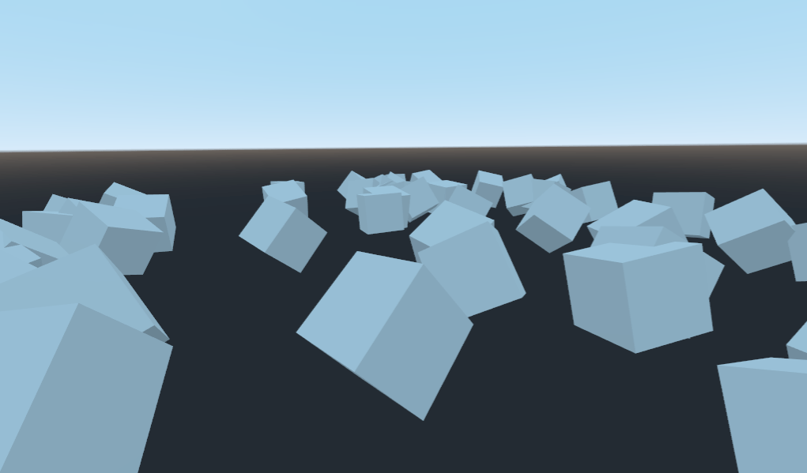
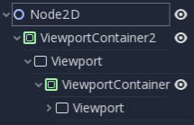

Custom post-processing
======================

Introduction
------------

Godot provides many post-processing effects out of the box, including Bloom, DOF, and SSAO. Sometimes you
want to write your own custom effect. Here's how you can do so.

Post-processing effects are shaders applied to a frame after Godot rendered it. You first want to render
your scene into a `Viewport`, then render the `Viewport`
inside a `ViewportTexture` and show it on the screen.

The easiest way to implement a custom post-processing shader is to use Godot's built-in ability to read from
the screen texture. If you're not familiar with this, you should read the `Screen Reading Shaders
Tutorial ( doc_screen-reading_shaders )` first.

Note:

    As of the time of writing, Godot does not support rendering to multiple buffers at the same time. Your
    post-processing shader will not have access to normals or other render passes. You only have
    access to the rendered frame.

Single pass post-processing
---------------------------

You will need a `Viewport` to render your scene to, and a scene to render your
`Viewport` on the screen. You can use a `ViewportContainer
( ViewportContainer )` to display your `Viewport` on the entire screen or inside
another `Control` node.

Note:

    Rendering using a `Viewport` gives you control over
    how the scene render, including the framerate, and you can use the
    `ViewportContainer` to render 3D objects in a 2D scene.

For this demo, we will use a `Node2D` with a `ViewportContainer` and finally a
`Viewport`. Your **Scene** tab should look like this:

Inside the `Viewport`, you can have whatever you want. This will contain
your main scene. For this tutorial, we will use a field of random boxes:

Add a new `ShaderMaterial` to the `ViewportContainer`, and assign a new
shader resource to it. You can access your rendered `Viewport` with the built-in `TEXTURE` uniform.

Note:

    You can choose not to use a `ViewportContainer`, but if you do so, you will
    need to create your own uniform in the shader and pass the `Viewport` texture in
    manually, like so:

    .. code-block:: glsl

      // Inside the Shader.
      uniform sampler2D ViewportTexture;

    And you can pass the texture into the shader from GDScript like so:

    ::

      # In GDScript.
      func _ready():
        $Sprite.material.set_shader_param("ViewportTexture", $Viewport.get_texture())

Copy the following code to your shader. The above code is a single pass edge detection filter, a
`Sobel filter ( https://en.wikipedia.org/wiki/Sobel_operator )`_.

.. code-block:: glsl

  shader_type canvas_item;

  void fragment() {
      vec3 col = -8.0 * texture(TEXTURE, UV).xyz;
      col += texture(TEXTURE, UV + vec2(0.0, SCREEN_PIXEL_SIZE.y)).xyz;
      col += texture(TEXTURE, UV + vec2(0.0, -SCREEN_PIXEL_SIZE.y)).xyz;
      col += texture(TEXTURE, UV + vec2(SCREEN_PIXEL_SIZE.x, 0.0)).xyz;
      col += texture(TEXTURE, UV + vec2(-SCREEN_PIXEL_SIZE.x, 0.0)).xyz;
      col += texture(TEXTURE, UV + SCREEN_PIXEL_SIZE.xy).xyz;
      col += texture(TEXTURE, UV - SCREEN_PIXEL_SIZE.xy).xyz;
      col += texture(TEXTURE, UV + vec2(-SCREEN_PIXEL_SIZE.x, SCREEN_PIXEL_SIZE.y)).xyz;
      col += texture(TEXTURE, UV + vec2(SCREEN_PIXEL_SIZE.x, -SCREEN_PIXEL_SIZE.y)).xyz;
      COLOR.xyz = col;
  }

Note:

    The Sobel filter reads pixels in a 9x9 grid around the current pixel and adds them together, using weight.
    What makes it interesting is that it assigns weights to each pixel; +1 for each of the eight around the
    center and -8 for the center pixel. The choice of weights is called a "kernel". You can use different
    kernels to create edge detection filters, outlines, and all sorts of effects.

    

Multi-pass post-processing
--------------------------

Some post-processing effects like blur are resource intensive. If you break them down in multiple passes
however, you can make them run a lot faster. In a multipass material, each pass takes the result from the
previous pass as an input and processes it.

To make a multi-pass post-processing shader, you stack `Viewport` nodes. In the example above, you
rendered the content of one `Viewport` object into the root `Viewport`, through a `ViewportContainer`
node. You can do the same thing for a multi-pass shader by rendering the content of one `Viewport` into
another and then rendering the last `Viewport` into the root `Viewport`.

Your scene hierarchy will look something like this:

Godot will render the bottom `Viewport` node first. So if the order of the passes matters for your
shaders, make sure that you assign the shader you want to apply first to the lowest `ViewportContainer` in
the tree.

Note:

    You can also render your Viewports separately without nesting them like this. You just
    need to use two Viewports and to render them one after the other.

Apart from the node structure, the steps are the same as with the single-pass post-processing shader.

As an example, you could write a full screen Gaussian blur effect by attaching the following pieces of code
to each of the `ViewportContainers`. The order in which you apply the shaders
does not matter:

.. code-block:: glsl

  shader_type canvas_item;

  // Blurs the screen in the X-direction.
  void fragment() {
      vec3 col = texture(TEXTURE, UV).xyz * 0.16;
      col += texture(TEXTURE, UV + vec2(SCREEN_PIXEL_SIZE.x, 0.0)).xyz * 0.15;
      col += texture(TEXTURE, UV + vec2(-SCREEN_PIXEL_SIZE.x, 0.0)).xyz * 0.15;
      col += texture(TEXTURE, UV + vec2(2.0 * SCREEN_PIXEL_SIZE.x, 0.0)).xyz * 0.12;
      col += texture(TEXTURE, UV + vec2(2.0 * -SCREEN_PIXEL_SIZE.x, 0.0)).xyz * 0.12;
      col += texture(TEXTURE, UV + vec2(3.0 * SCREEN_PIXEL_SIZE.x, 0.0)).xyz * 0.09;
      col += texture(TEXTURE, UV + vec2(3.0 * -SCREEN_PIXEL_SIZE.x, 0.0)).xyz * 0.09;
      col += texture(TEXTURE, UV + vec2(4.0 * SCREEN_PIXEL_SIZE.x, 0.0)).xyz * 0.05;
      col += texture(TEXTURE, UV + vec2(4.0 * -SCREEN_PIXEL_SIZE.x, 0.0)).xyz * 0.05;
      COLOR.xyz = col;
  }

.. code-block:: glsl

  shader_type canvas_item;

  // Blurs the screen in the Y-direction.
  void fragment() {
      vec3 col = texture(TEXTURE, UV).xyz * 0.16;
      col += texture(TEXTURE, UV + vec2(0.0, SCREEN_PIXEL_SIZE.y)).xyz * 0.15;
      col += texture(TEXTURE, UV + vec2(0.0, -SCREEN_PIXEL_SIZE.y)).xyz * 0.15;
      col += texture(TEXTURE, UV + vec2(0.0, 2.0 * SCREEN_PIXEL_SIZE.y)).xyz * 0.12;
      col += texture(TEXTURE, UV + vec2(0.0, 2.0 * -SCREEN_PIXEL_SIZE.y)).xyz * 0.12;
      col += texture(TEXTURE, UV + vec2(0.0, 3.0 * SCREEN_PIXEL_SIZE.y)).xyz * 0.09;
      col += texture(TEXTURE, UV + vec2(0.0, 3.0 * -SCREEN_PIXEL_SIZE.y)).xyz * 0.09;
      col += texture(TEXTURE, UV + vec2(0.0, 4.0 * SCREEN_PIXEL_SIZE.y)).xyz * 0.05;
      col += texture(TEXTURE, UV + vec2(0.0, 4.0 * -SCREEN_PIXEL_SIZE.y)).xyz * 0.05;
      COLOR.xyz = col;
  }

Using the above code, you should end up with a full screen blur effect like below.

For more information on how `Viewport` nodes work, see the `Viewports Tutorial ( doc_viewports )`.
