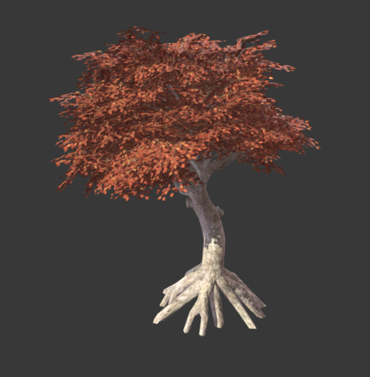

Making trees
============

This is a short tutorial on how to make trees and other types of vegetation from scratch.

The aim is to not focus on the modelling techniques (there are plenty of tutorials about that), but how to make them look good in Godot.


Start with a tree
-----------------

I took this tree from SketchFab:



https://sketchfab.com/models/ea5e6ed7f9d6445ba69589d503e8cebf

and opened it in Blender.

Paint with vertex colors
------------------------

The first thing you may want to do is to use the vertex colors to paint how much the tree will sway when there is wind. Just use the vertex color painting tool of your favorite 3D modelling program and paint something like this:


This is a bit exaggerated, but the idea is that color indicates how much sway affects every part of the tree. This scale here represents it better:


Write a custom shader for the leaves
------------------------------------

This is a simple example of a shader for leaves:

```
    shader_type spatial;
    render_mode depth_draw_alpha_prepass, cull_disabled, world_vertex_coords;
```

This is a spatial shader. There is no front/back culling (so leaves can be seen from both sides), and alpha prepass is used, so there are less depth artifacts that result from using transparency (and leaves cast shadow). Finally, for the sway effect, world coordinates are recommended, so the tree can be duplicated, moved, etc. and it will still work together with other trees.

```
    uniform sampler2D texture_albedo : hint_albedo;
    uniform vec4 transmission : hint_color;
```

Here, the texture is read, as well as a transmission color, which is used to add some back-lighting to the leaves, simulating subsurface scattering.


```
    uniform float sway_speed = 1.0;
    uniform float sway_strength = 0.05;
    uniform float sway_phase_len = 8.0;

    void vertex() {
        float strength = COLOR.r * sway_strength;
        VERTEX.x += sin(VERTEX.x * sway_phase_len * 1.123 + TIME * sway_speed) * strength;
        VERTEX.y += sin(VERTEX.y * sway_phase_len + TIME * sway_speed * 1.12412) * strength;
        VERTEX.z += sin(VERTEX.z * sway_phase_len * 0.9123 + TIME * sway_speed * 1.3123) * strength;
    }
```

This is the code to create the sway of the leaves. It's basic (just uses a sinewave multiplying by the time and axis position, but works well). Notice that the strength is multiplied by the color. Every axis uses a different small near 1.0 multiplication factor so axes don't appear in sync.


Finally, all that's left is the fragment shader:

```
    void fragment() {
        vec4 albedo_tex = texture(texture_albedo, UV);
        ALBEDO = albedo_tex.rgb;
        ALPHA = albedo_tex.a;
        METALLIC = 0.0;
        ROUGHNESS = 1.0;
        TRANSMISSION = transmission.rgb;
    }
```

And this is pretty much it.

The trunk shader is similar, except it does not write to the alpha channel (thus no alpha prepass is needed) and does not require transmission to work. Both shaders can be improved by adding normal mapping, AO and other maps.

Improving the shader
--------------------

There are many more resources on how to do this that you can read. Now that you know the basics, a recommended read is the chapter from GPU Gems3 about how Crysis does this
(focus mostly on the sway code, as many other techniques shown there are obsolete):

https://developer.nvidia.com/gpugems/GPUGems3/gpugems3_ch16.html
