.. _doc_your_first_spatial_shader:

Your first 3D shader
====================

You have decided to start writing your own custom Spatial shader. Maybe you saw
a cool trick online that was done with shaders, or you have found that the
`SpatialMaterial` isn't quite meeting your
needs. Either way, you have decided to write your own and now you need to figure
out where to start.

This tutorial will explain how to write a Spatial shader and will cover more
topics than the `CanvasItem <doc_your_first_canvasitem_shader>` tutorial.

Spatial shaders have more built-in functionality than CanvasItem shaders. The
expectation with spatial shaders is that Godot has already provided the
functionality for common use cases and all the user needs to do in the shader is
set the proper parameters. This is especially true for a PBR (physically based
rendering) workflow.

This is a two-part tutorial. In this first part we are going to go through how
to make a simple terrain using vertex displacement from a heightmap in the
vertex function. In the `second part <doc_your_second_spatial_shader>` we
are going to take the concepts from this tutorial and walk through how to set up
custom materials in a fragment shader by writing an ocean water shader.

.. note:: This tutorial assumes some basic shader knowledge such as types
          (`vec2`, `float`, `sampler2D`), and functions. If you are
          uncomfortable with these concepts it is best to get a gentle
          introduction from `The Book of Shaders
          <https://thebookofshaders.com>`_ before completing this tutorial.

Where to assign my material
---------------------------

In 3D, objects are drawn using `Meshes`. Meshes are a resource
type that store geometry (the shape of your object) and materials (the color and
how the object reacts to light) in units called "surfaces". A Mesh can have
multiple surfaces, or just one. Typically, you would import a mesh from another
program (e.g. Blender). But Godot also has a few `PrimitiveMeshes
<class_primitivemesh>` that allow you to add basic geometry to a scene without
importing Meshes.

There are multiple node types that you can use to draw a mesh. The main one is
`MeshInstance`, but you can also use `Particles
<class_particles>`, `MultiMeshes` (with a
`MultiMeshInstance`), or others.

Typically, a material is associated with a given surface in a mesh, but some
nodes, like MeshInstance, allow you to override the material for a specific
surface, or for all surfaces.

If you set a material on the surface or mesh itself, then all MeshInstances that
share that mesh will share that material. However, if you want to reuse the same
mesh across multiple mesh instances, but have different materials for each
instance then you should set the material on the Meshinstance.

For this tutorial we will set our material on the mesh itself rather than taking
advantage of the MeshInstance's ability to override materials.

Setting up
----------

Add a new `MeshInstance` node to your scene.

In the inspector tab beside "Mesh" click "[empty]" and select "New PlaneMesh".
Then click on the image of a plane that appears.

This adds a `PlaneMesh` to our scene.

Then, in the viewport, click in the upper left corner on the button that says
"Perspective". A menu will appear. In the middle of the menu are options for how
to display the scene. Select 'Display Wireframe'.

This will allow you to see the triangles making up the plane.

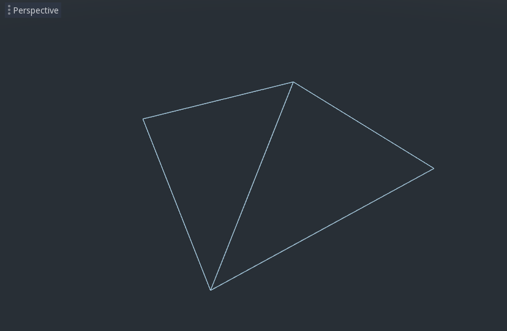

Now set `Subdivide Width` and `Subdivide Depth` to `32`.

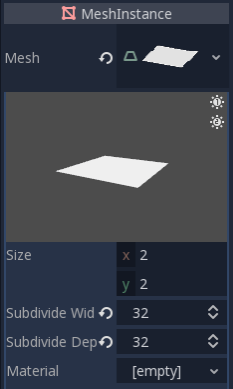

You can see that there are now many more triangles in the
`Mesh<class_MeshInstance>`. This will give us more vertices to work with
and thus allow us to add more detail.

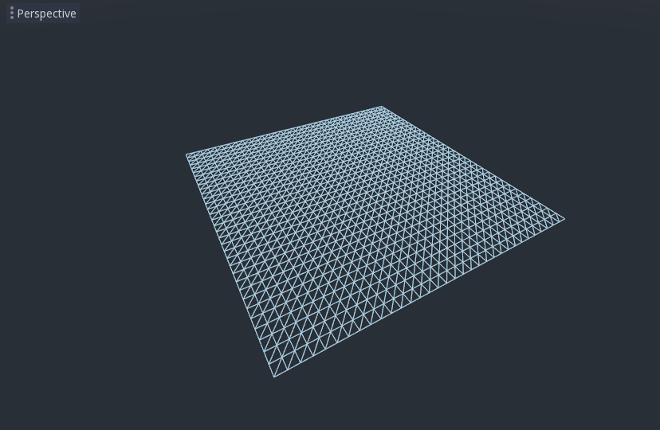

`PrimitiveMeshes`, like PlaneMesh, only have one
     surface, so instead of an array of materials there is only one. Click
     beside "Material" where it says "[empty]" and select "New ShaderMaterial".
     Then click the sphere that appears.

Now click beside "Shader" where it says "[empty]" and select "New Shader".

The shader editor should now pop up and you are ready to begin writing your
first Spatial shader!

Shader magic
------------

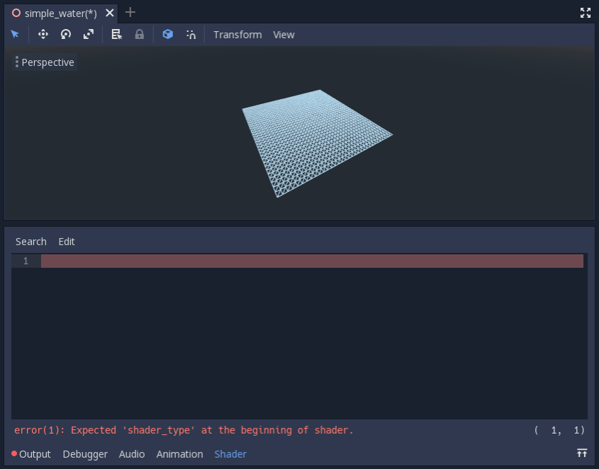

Notice how there is already error? This is because the shader editor reloads
shaders on the fly. The first thing Godot shaders need is a declaration of what
type of shader they are. We set the variable `shader_type` to `spatial`
because this is a spatial shader.

.. code-block:: glsl

  shader_type spatial;

Next we will define the `vertex()` function. The `vertex()` function
determines where the vertices of your `Mesh<class_MeshInstance>` appear in
the final scene. We will be using it to offset the height of each vertex and
make our flat plane appear like a little terrain.

We define the vertex shader like so:

.. code-block:: glsl

  void vertex() {

  }

With nothing in the `vertex()` function, Godot will use its default vertex
shader. We can easily start to make changes by adding a single line:

.. code-block:: glsl

  void vertex() {
    VERTEX.y += cos(VERTEX.x) * sin(VERTEX.z);
  }

Adding this line, you should get an image like the one below.

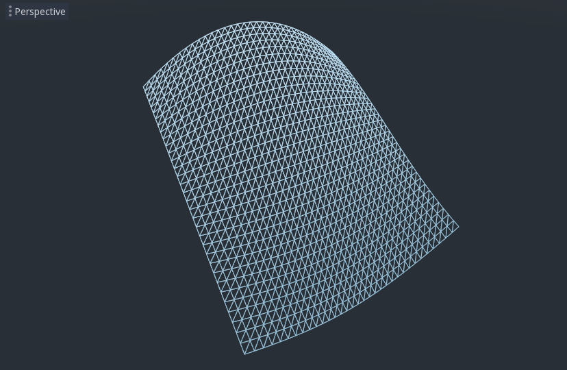

Okay, let's unpack this. The `y` value of the `VERTEX` is being increased.
And we are passing the `x` and `z` components of the `VERTEX` as arguments
to `cos` and `sin`; that gives us a wave-like appearance across the `x`
and `z` axes.

What we want to achieve is the look of little hills; after all. `cos` and
`sin` already look kind of like hills. We do so by scaling the inputs to the
`cos` and `sin` functions.

.. code-block:: glsl

  void vertex() {
    VERTEX.y += cos(VERTEX.x * 4.0) * sin(VERTEX.z * 4.0);
  }

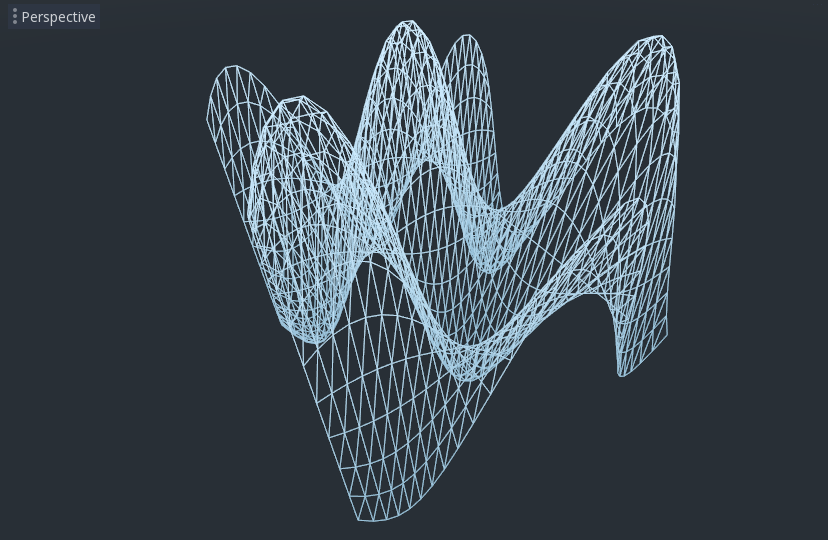

This looks better, but it is still too spiky and repetitive, let's make it a
little more interesting.

Noise heightmap
---------------

Noise is a very popular tool for faking the look of terrain. Think of it as
similar to the cosine function where you have repeating hills except, with
noise, each hill has a different height.

Godot provides the `NoiseTexture` resource for
generating a noise texture that can be accessed from a shader.

To access a texture in a shader add the following code near the top of your
shader, outside the `vertex()` function.

.. code-block:: glsl

  uniform sampler2D noise;

This will allow you to send a noise texture to the shader. Now look in the
inspector under your material. You should see a section called "Shader Params".
If you open it up, you'll see a section called "noise".

Click beside it where it says "[empty]" and select "New NoiseTexture". Then in
your NoiseTexture click beside where it says "Noise" and select "New
OpenSimplexNoise".

`OpenSimplexNoise` is used by the NoiseTexture to
     generate a heightmap.

Once you set it up and should look like this.

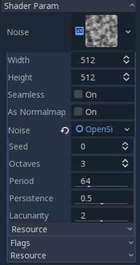

Now, access the noise texture using the `texture()` function. `texture()`
takes a texture as the first argument and a `vec2` for the position on the
texture as the second argument. We use the `x` and `z` channels of
`VERTEX` to determine where on the texture to look up. Note that the PlaneMesh
coordinates are within the [-1,1] range (for a size of 2), while the texture
coordinates are within [0,1], so to normalize we divide by the size of the
PlaneMesh 2.0 and add 0.5. `texture()` returns a `vec4` of the `r, g, b,
a` channels at the position. Since the noise texture is grayscale, all of the
values are the same, so we can use any one of the channels as the height. In
this case we'll use the `r`, or `x` channel.

.. code-block:: glsl

  float height = texture(noise, VERTEX.xz / 2.0 + 0.5).x;
  VERTEX.y += height;

Note: `xyzw` is the same as `rgba` in GLSL, so instead of `texture().x`
above, we could use `texture().r`. See the `OpenGL documentation
<https://www.khronos.org/opengl/wiki/Data_Type_(GLSL)#Vectors>`_ for more
details.

Using this code you can see the texture creates random looking hills.

Right now it is too spiky, we want to soften the hills a bit. To do that, we
will use a uniform. You already used a uniform above to pass in the noise
texture, now let's learn how they work.

Uniforms
--------

Uniform variables allow you to pass data from the game into the shader. They are
very useful for controlling shader effects. Uniforms can be almost any datatype
that can be used in the shader. To use a uniform, you declare it in your
`Shader<class_Shader>` using the keyword `uniform`.

Let's make a uniform that changes the height of the terrain.

.. code-block:: glsl

  uniform float height_scale = 0.5;

Godot lets you initialize a uniform with a value; here, `height_scale` is set
to `0.5`. You can set uniforms from GDScript by calling the function
`set_shader_param()` on the material corresponding to the shader. The value
passed from GDScript takes precedence over the value used to initialize it in
the shader.

::

  # called from the MeshInstance
  mesh.material.set_shader_param("height_scale", 0.5)

.. note:: Changing uniforms in Spatial-based nodes is different from
          CanvasItem-based nodes. Here, we set the material inside the PlaneMesh
          resource. In other mesh resources you may need to first access the
          material by calling `surface_get_material()`. While in the
          MeshInstance you would access the material using
          `get_surface_material()` or `material_override`.

Remember that the string passed into `set_shader_param()` must match the name
of the uniform variable in the `Shader<class_Shader>`. You can use the
uniform variable anywhere inside your `Shader<class_Shader>`. Here, we will
use it to set the height value instead of arbitrarily multiplying by `0.5`.

.. code-block:: glsl

  VERTEX.y += height * height_scale;

Now it looks  much better.

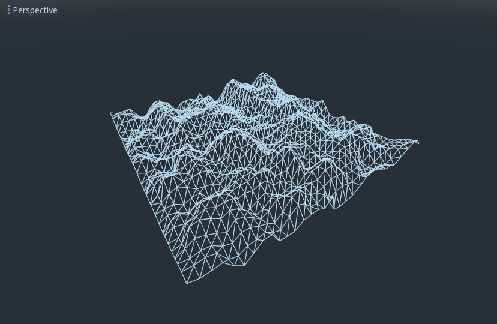

Using uniforms, we can even change the value every frame to animate the height
of the terrain. Combined with `Tweens`, this can be
especially useful for simple animations.

Interacting with light
----------------------

First, turn wireframe off. To do so, click in the upper-left of the Viewport
again, where it says "Perspective", and select "Display Normal".

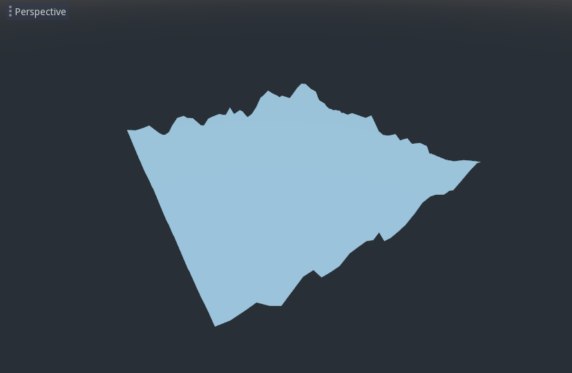

Note how the mesh color goes flat. This is because the lighting on it is flat.
Let's add a light!

First, we will add an `OmniLight<class_OmniLight>` to the scene.

You can see the light affecting the terrain, but it looks odd. The problem is
the light is affecting the terrain as if it were a flat plane. This is because
the light shader uses the normals from the `Mesh` to calculate
light.

The normals are stored in the Mesh, but we are changing the shape of the Mesh in
the shader, so the normals are no longer correct. To fix this, we can
recalculate the normals in the shader or use a normal texture that corresponds
to our noise. Godot makes both easy for us.

You can calculate the new normal manually in the vertex function and then just
set `NORMAL`. With `NORMAL` set, Godot will do all the difficult lighting
calculations for us. We will cover this method in the next part of this
tutorial, for now we will read normals from a texture.

Instead we will rely on the NoiseTexture again to calculate normals for us. We
do that by passing in a second noise texture.

.. code-block:: glsl

  uniform sampler2D normalmap;

Set this second uniform texture to another NoiseTexture with another
OpenSimplexNoise. But this time, check off "As Normalmap".

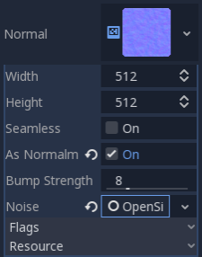

Now, because this is a normalmap and not a per-vertex normal, we are going to
assign it in the `fragment()` function. The `fragment()` function will be
explained in more detail in the next part of this tutorial.

.. code-block:: glsl

  void fragment() {
  }

When we have normals that correspond to a specific vertex we set `NORMAL`, but
if you have a normalmap that comes from a texture, set the normal using
`NORMALMAP`. This way Godot will handle the wrapping the texture around the
mesh automatically.

Lastly, in order to ensure that we are reading from the same places on the noise
texture and the normalmap texture, we are going to pass the `VERTEX.xz`
position from the `vertex()` function to the `fragment()` function. We do
that with varyings.

Above the `vertex()` define a `vec2` called `tex_position`. And inside the
`vertex()` function assign `VERTEX.xz` to `tex_position`.

.. code-block:: glsl

  varying vec2 tex_position;

  void vertex() {
    ...
    tex_position = VERTEX.xz / 2.0 + 0.5;
    float height = texture(noise, tex_position).x;
    ...
  }

And now we can access `tex_position` from the `fragment()` function.

.. code-block:: glsl

  void fragment() {
    NORMALMAP = texture(normalmap, tex_position).xyz;
  }

With the normals in place the light now reacts to the height of the mesh
dynamically.

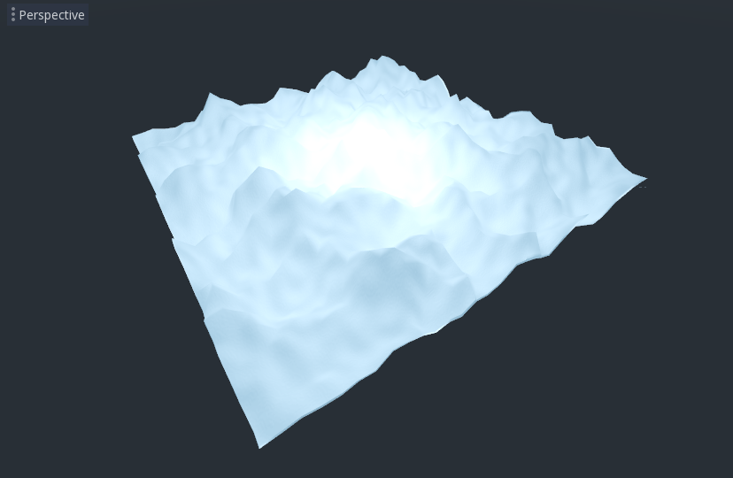

We can even drag the light around and the lighting will update automatically.

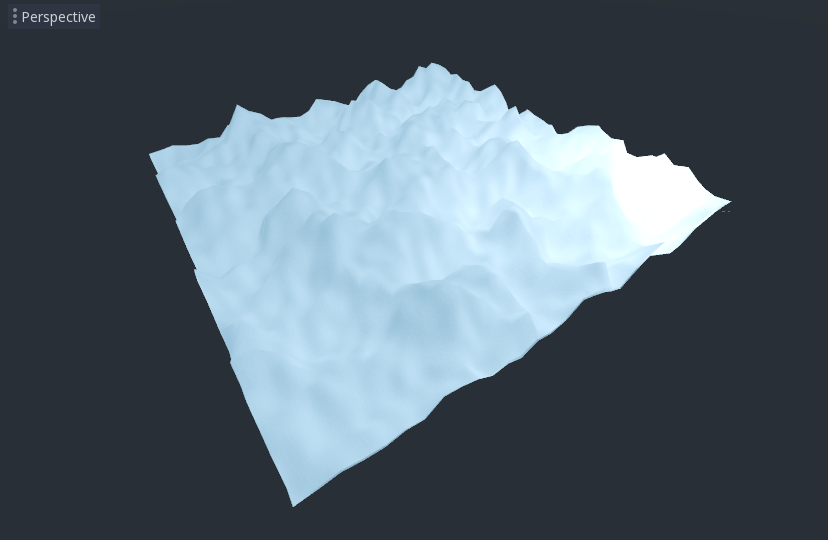

Here is the full code for this tutorial. You can see it is not very long as
Godot handles most of the difficult stuff for you.

.. code-block:: glsl

  shader_type spatial;

  uniform float height_scale = 0.5;
  uniform sampler2D noise;
  uniform sampler2D normalmap;

  varying vec2 tex_position;

  void vertex() {
    tex_position = VERTEX.xz / 2.0 + 0.5;
    float height = texture(noise, tex_position).x;
    VERTEX.y += height * height_scale;
  }

  void fragment() {
    NORMALMAP = texture(normalmap, tex_position).xyz;
  }

That is everything for this part. Hopefully, you now understand the basics of
vertex shaders in Godot. In the next part of this tutorial we will write a
fragment function to accompany this vertex function and we will cover a more
advanced technique to turn this terrain into an ocean of moving waves.
