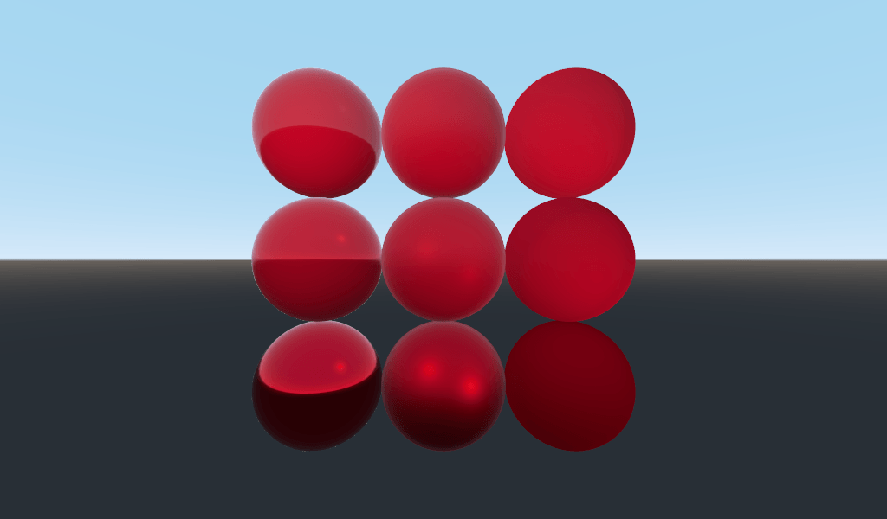
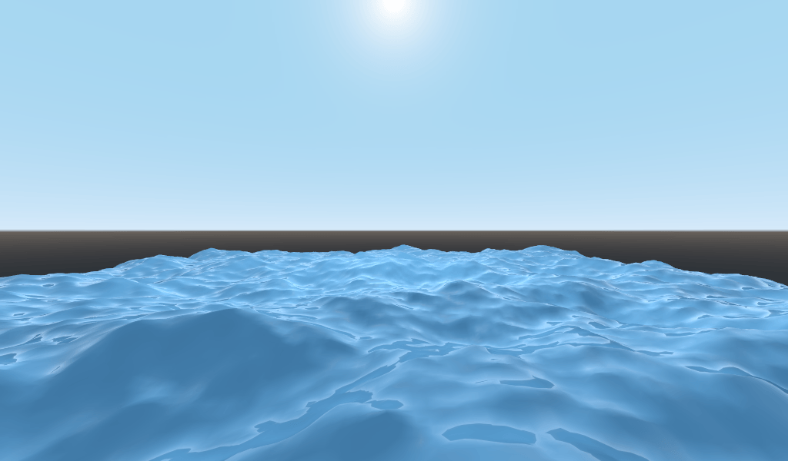
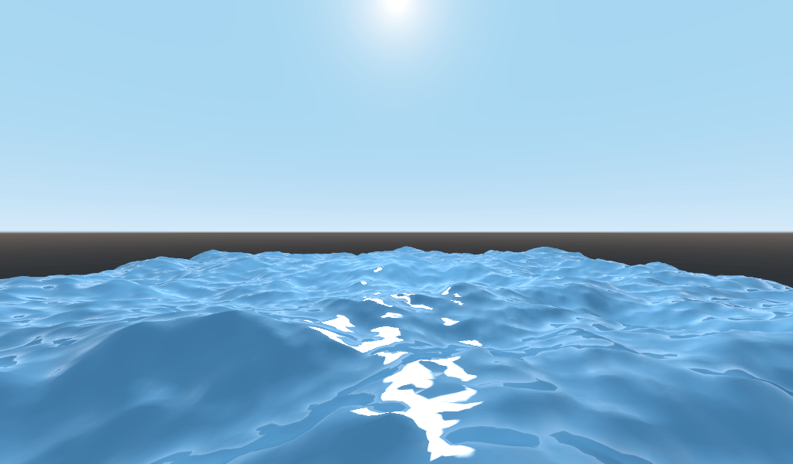
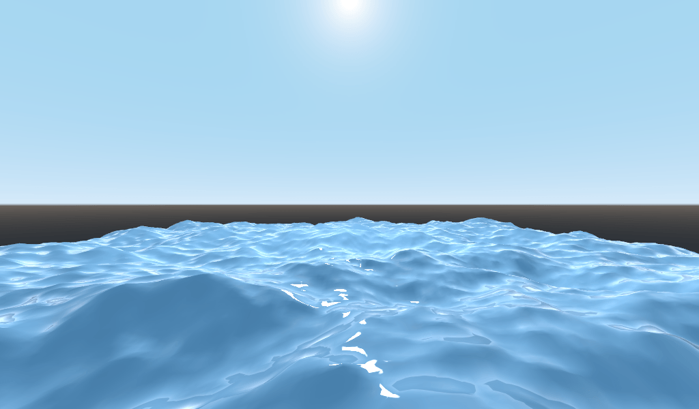
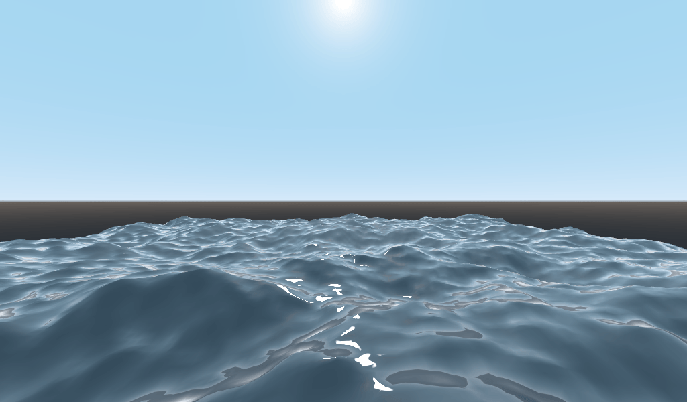
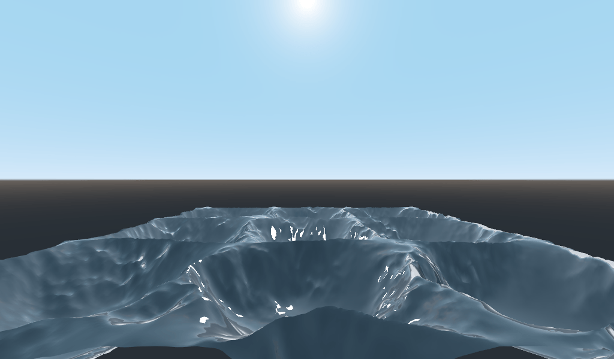
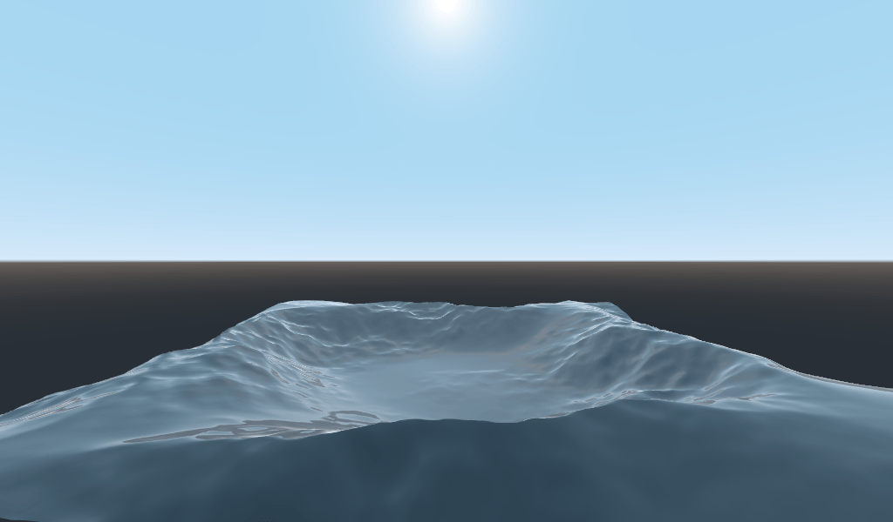
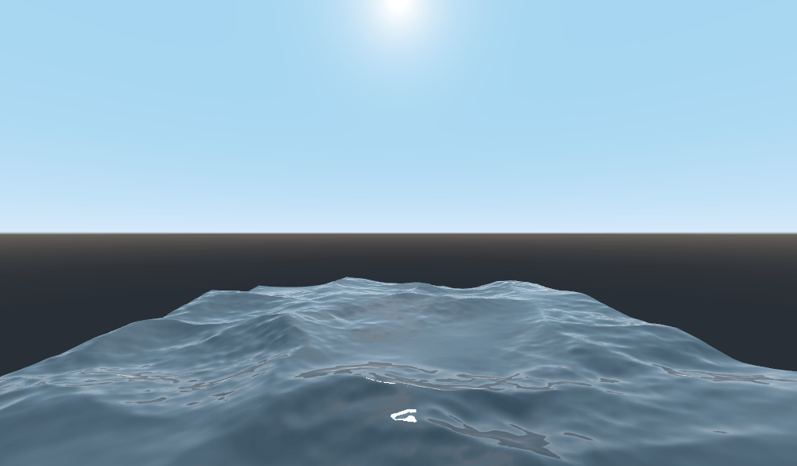

.. _doc_your_second_spatial_shader:

Your second 3D shader
=====================

From a high-level, what Godot does is give the user a bunch of parameters that
can be optionally set (`AO`, `SSS_Strength`, `RIM`, etc.). These
parameters correspond to different complex effects (Ambient Occlusion,
SubSurface Scattering, Rim Lighting, etc.). When not written to, the code is
thrown out before it is compiled and so the shader does not incur the cost of
the extra feature. This makes it easy for users to have complex PBR-correct
shading, without writing complex shaders. Of course, Godot also allows you to
ignore all these parameters and write a fully customized shader.

For a full list of these parameters see the `spatial shader
<doc_spatial_shader>` reference doc.

A difference between the vertex function and a fragment function is that the
vertex function runs per vertex and sets properties such as `VERTEX`
(position) and `NORMAL`, while the fragment shader runs per pixel and, most
importantly, sets the `ALBEDO` color of the `Mesh<class_MeshInstance>`.

Your first spatial fragment function
------------------------------------

As mentioned in the previous part of this tutorial. The standard use of the
fragment function in Godot is to set up different material properties and let
Godot handle the rest. In order to provide even more flexibility, Godot also
provides things called render modes. Render modes are set at the top of the
shader, directly below `shader_type`, and they specify what sort of
functionality you want the built-in aspects of the shader to have.

For example, if you do not want to have lights affect an object, set the render
mode to `unshaded`:

.. code-block:: glsl

  render_mode unshaded;

You can also stack multiple render modes together. For example, if you want to
use toon shading instead of more-realistic PBR shading, set the diffuse mode and
specular mode to toon:

.. code-block:: glsl

  render_mode diffuse_toon, specular_toon;

This model of built-in functionality allows you to write complex custom shaders
by changing only a few parameters.

For a full list of render modes see the `Spatial shader reference
<doc_spatial_shader>`.

In this part of the tutorial, we will walk through how to take the bumpy terrain
from the previous part and turn it into an ocean.

First let's set the color of the water. We do that by setting `ALBEDO`.

`ALBEDO` is a `vec3` that contains the color of the object.

Let's set it to a nice shade of blue.

.. code-block:: glsl

  void fragment() {
    ALBEDO = vec3(0.1, 0.3, 0.5);
  }

We set it to a very dark shade of blue because most of the blueness of the water
will come from reflections from the sky.

The PBR model that Godot uses relies on two main parameters: `METALLIC` and
`ROUGHNESS`.

`ROUGHNESS` specifies how smooth/rough the surface of a material is. A low
`ROUGHNESS` will make a material appear like a shiny plastic, while a high
roughness makes the material appear more solid in color.

`METALLIC` specifies how much like a metal the object is. It is better set
close to `0` or `1`. Think of `METALLIC` as changing the balance between
the reflection and the `ALBEDO` color. A high `METALLIC` almost ignores
`ALBEDO` altogether, and looks like a mirror of the sky. While a low
`METALLIC` has a more equal representation of sky color and `ALBEDO` color.

`ROUGHNESS` increases from `0` to `1` from left to right while
`METALLIC` increase from `0` to `1` from top to bottom.

.. note:: `METALLIC` should be close to `0` or `1` for proper PBR shading.
          Only set it between them for blending between materials.

Water is not a metal, so we will set its `METALLIC` property to `0.0`. Water
is also highly reflective, so we will set its `ROUGHNESS` property to be quite
low as well.

.. code-block:: glsl

  void fragment() {
    METALLIC = 0.0;
    ROUGHNESS = 0.01;
    ALBEDO = vec3(0.1, 0.3, 0.5);
  }

Now we have a smooth plastic looking surface. It is time to think about some
particular properties of water that we want to emulate. There are two main ones
that will take this from a weird plastic surface to nice stylized water. The
first is specular reflections. Specular reflections are those bright spots you
see from where the sun reflects directly into your eye. The second is fresnel
reflectance. Fresnel reflectance is the property of objects to become more
reflective at shallow angles. It is the reason why you can see into water below
you, but farther away it reflects the sky.

In order to increase the specular reflections, we will do two things. First, we
will change the render mode for specular to toon because the toon render mode
has larger specular highlights.

.. code-block:: glsl

  render_mode specular_toon;

Second we will add rim lighting. Rim lighting increases the effect of light at
glancing angles. Usually it is used to emulate the way light passes through
fabric on the edges of an object, but we will use it here to help achieve a nice
watery effect.

.. code-block:: glsl

  void fragment() {
    RIM = 0.2;
    METALLIC = 0.0;
    ROUGHNESS = 0.01;
    ALBEDO = vec3(0.1, 0.3, 0.5);
  }

In order to add fresnal reflectance, we will compute a fresnel term in our
fragment shader. Here, we aren't going to use a real fresnel term for
performance reasons. Instead, we'll approximate it using the dot product of the
`NORMAL` and `VIEW` vectors. The `NORMAL` vector points away from the
mesh's surface, while the `VIEW` vector is the direction between your eye and
that point on the surface. The dot product between them is a handy way to tell
when you are looking at the surface head-on or at a glancing angle.

.. code-block:: glsl

  float fresnel = sqrt(1.0 - dot(NORMAL, VIEW));

And mix it into both `ROUGHNESS` and `ALBEDO`. This is the benefit of
ShaderMaterials over SpatialMaterials. With SpatialMaterial, we could set
these properties with a texture, or to a flat number. But with shaders we can
set them based on any mathematical function that we can dream up.

.. code-block:: glsl

  void fragment() {
    float fresnel = sqrt(1.0 - dot(NORMAL, VIEW));
    RIM = 0.2;
    METALLIC = 0.0;
    ROUGHNESS = 0.01 * (1.0 - fresnel);
    ALBEDO = vec3(0.1, 0.3, 0.5) + (0.1 * fresnel);
  }

And now, with only 5 lines of code, you can have complex looking water. Now that
we have lighting, this water is looking too bright. Let's darken it. This is
done easily by decreasing the values of the `vec3` we pass into `ALBEDO`.
Let's set them to `vec3(0.01, 0.03, 0.05)`.

Animating with `TIME`
-----------------------

Going back to the vertex function, we can animate the waves using the built-in
variable `TIME`.

`TIME` is a built-in variable that is accessible from the vertex and fragment
functions.

In the last tutorial we calculated height by reading from a heightmap. For this
tutorial, we will do the same. Put the heightmap code in a function called
`height()`.

.. code-block:: glsl

  float height(vec2 position) {
    return texture(noise, position / 10.0).x; // Scaling factor is based on mesh size (this PlaneMesh is 10×10).
  }

In order to use `TIME` in the `height()` function, we need to pass it in.

.. code-block:: glsl

  float height(vec2 position, float time) {
  }

And make sure to correctly pass it in inside the vertex function.

.. code-block:: glsl

  void vertex() {
    vec2 pos = VERTEX.xz;
    float k = height(pos, TIME);
    VERTEX.y = k;
  }

Instead of using a normalmap to calculate normals. We are going to compute them
manually in the `vertex()` function. To do so use the following line of code.

.. code-block:: glsl

  NORMAL = normalize(vec3(k - height(pos + vec2(0.1, 0.0), TIME), 0.1, k - height(pos + vec2(0.0, 0.1), TIME)));

We need to compute `NORMAL` manually because in the next section we will be
using math to create complex-looking waves.

Now, we are going to make the `height()` function a little more complicated by
offsetting `position` by the cosine of `TIME`.

.. code-block:: glsl

  float height(vec2 position, float time) {
    vec2 offset = 0.01 * cos(position + time);
    return texture(noise, (position / 10.0) - offset).x;
  }

This results in waves that move slowly, but not in a very natural way. The next
section will dig deeper into using shaders to create more complex effects, in
this case realistic waves, by adding a few more mathematical functions.

Advanced effects: waves
-----------------------

What makes shaders so powerful is that you can achieve complex effects by using
math. To illustrate this, we are going to take our waves to the next level by
modifying the `height()` function and by introducing a new function called
`wave()`.

`wave()` has one parameter, `position`, which is the same as it is in
`height()`.

We are going to call `wave()` multiple times in `height()` in order to fake
the way waves look.

.. code-block:: glsl

  float wave(vec2 position){
    position += texture(noise, position / 10.0).x * 2.0 - 1.0;
    vec2 wv = 1.0 - abs(sin(position));
    return pow(1.0 - pow(wv.x * wv.y, 0.65), 4.0);
  }

At first this looks complicated. So let's go through it line-by-line.

.. code-block:: glsl

    position += texture(noise, position / 10.0).x * 2.0 - 1.0;

Offset the position by the `noise` texture. This will make the waves curve, so
they won't be straight lines completely aligned with the grid.

.. code-block:: glsl

    vec2 wv = 1.0 - abs(sin(position));

Define a wave-like function using `sin()` and `position`. Normally `sin()`
waves are very round. We use `abs()` to absolute to give them a sharp ridge
and constrain them to the 0-1 range. And then we subtract it from `1.0` to put
the peak on top.

.. code-block:: glsl

    return pow(1.0 - pow(wv.x * wv.y, 0.65), 4.0);

Multiply the x-directional wave by the y-directional wave and raise it to a
power to sharpen the peaks. Then subtract that from `1.0` so that the ridges
become peaks and raise that to a power to sharpen the ridges.

We can now replace the contents of our `height()` function with `wave()`.

.. code-block:: glsl

  float height(vec2 position, float time) {
    float h = wave(position);
    return h;
  }

Using this, you get:

The shape of the sin wave is too obvious. So let's spread the waves out a bit.
We do this by scaling `position`.

.. code-block:: glsl

  float height(vec2 position, float time) {
    float h = wave(position * 0.4);
    return h;
  }

Now it looks much better.

We can do even better if we layer multiple waves on top of each other at varying
frequencies and amplitudes. What this means is that we are going to scale
position for each one to make the waves thinner or wider (frequency). And we are
going to multiply the output of the wave to make them shorter or taller
(amplitude).

Here is an example for how you could layer the four waves to achieve nicer
looking waves.

.. code-block:: glsl

  float height(vec2 position, float time) {
    float d = wave((position + time) * 0.4) * 0.3;
    d += wave((position - time) * 0.3) * 0.3;
    d += wave((position + time) * 0.5) * 0.2;
    d += wave((position - time) * 0.6) * 0.2;
    return d;
  }

Note that we add time to two and subtract it from the other two. This makes the
waves move in different directions creating a complex effect. Also note that the
amplitudes (the number the result is multiplied by) all add up to `1.0`. This
keeps the wave in the 0-1 range.

With this code you should end up with more complex looking waves and all you had
to do was add a bit of math!

For more information about Spatial shaders read the `Shading Language
<doc_shading_language>` doc and the `Spatial Shaders <doc_spatial_shader>`
doc. Also look at more advanced tutorials in the `Shading section
<toc-learn-features-shading>` and the `3D <toc-learn-features-3d>`
sections.
