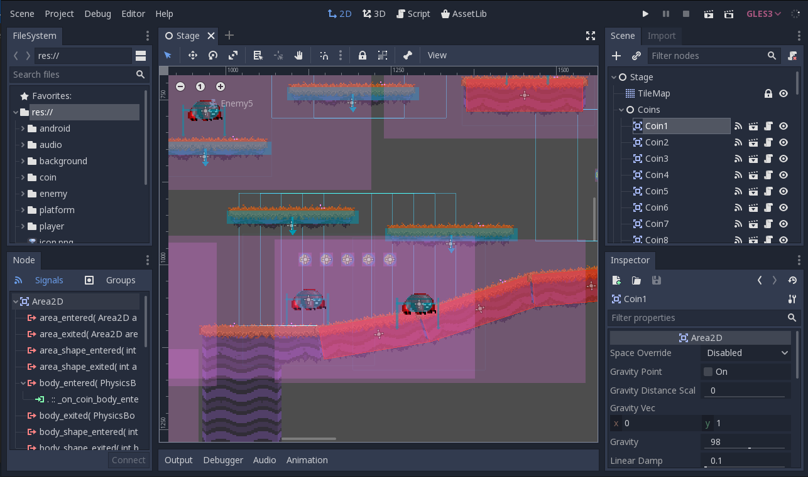
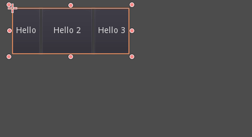
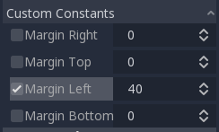
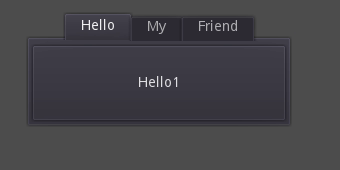
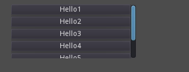

.. _doc_gui_containers:

Using Containers
================

`Anchors <doc_size_and_anchors )` are an efficient way to handle
different aspect ratios for basic multiple resolution handling in GUIs,

For more complex user interfaces, they can become difficult to use.

This is often the case of games, such as RPGs, online chats, tycoons or simulations. Another
common case where more advanced layout features may be required is in-game tools (or simply just tools).

All these situations require a more capable OS-like user interface, with advanced layout and formatting.
For that, `Containers` are more useful.

Container layout
----------------

Containers provide a huge amount of layout power (as an example, the Godot editor user interface is entirely done using them):

   

When a `Container` nodes give up their
own positioning ability. This means the *Container* will control their positioning and any attempt to manually alter these
nodes will be either ignored or invalidated the next time their parent is resized.

Likewise, when a *Container* derived node is resized, all its children will be re-positioned according to it,
with a behavior based on the type of container used:

   

Example of *HBoxContainer* resizing children buttons.

The real strength of containers is that they can be nested (as nodes), allowing the creation of very complex layouts that resize effortlessly.

Size flags
----------

When adding a node to a container, the way the container treats each child depends mainly on their *size flags*. These flags
can be found by inspecting any control that is a child of a *Container*.

   

Size flags are independent for vertical and horizontal sizing and not all containers make use of them (but most do):

* **Fill**: Ensures the control *fills* the designated area within the container. No matter if
  a control *expands* or not (see below), it will only *fill* the designated area when this is toggled on (it is by default).
* **Expand**: Attempts to use as much space as possible in the parent container (in each axis).
  Controls that don't expand will be pushed away by those that do. Between expanding controls, the
  amount of space they take from each other is determined by the *Ratio* (see below).
* **Shrink Center** When expanding (and if not filling), try to remain at the center of the expanded
  area (by default it remains at the left or top).
* **Ratio** Simple ratio of how much expanded controls take up the available space in relation to each
  other. A control with "2", will take up twice as much available space as one with "1".

Experimenting with these flags and different containers is recommended to get a better grasp on how they work.

Container types
---------------

Godot provides several container types out of the box as they serve different purposes:

Box Containers
^^^^^^^^^^^^^^

Arranges child controls vertically or horizontally (via `HBoxContainer` and
`VBoxContainer`). In the opposite of the designated direction
(as in, vertical for an horizontal container), it just expands the children.

   

These containers make use of the *Ratio* property for children with the *Expand* flag set.

Grid Container
^^^^^^^^^^^^^^

Arranges child controls in a grid layout (via `GridContainer`, amount
of columns must be specified). Uses both the vertical and horizontal expand flags.

   

Margin Container
^^^^^^^^^^^^^^^^

Child controls are expanded towards the bounds of this control (via
`MarginContainer`). Padding will be added on the margins
depending on the theme configuration.

   

Again, keep in mind that the margins are a *Theme* value, so they need to be edited from the
constants overrides section of each control:

   

Tab Container
^^^^^^^^^^^^^

Allows you to place several child controls stacked on top of each other (via
`TabContainer`), with only the *current* one visible.

   

Changing the *current* one is done via tabs located at the top of the container, via clicking:

   

The titles are generated from the node names by default (although they can be overridden via *TabContainer* API).

Settings such as tab placement and *StyleBox* can be modified in the *TabContainer* theme overrides.

Split Container
^^^^^^^^^^^^^^^

Accepts only one or two children controls, then places them side to side with a divisor
(via `HSplitContainer`).
Respects both horizontal and vertical flags, as well as *Ratio*.

   

The divisor can be dragged around to change the size relation between both children:

   


PanelContainer
^^^^^^^^^^^^^^

Simple container that draws a *StyleBox*, then expands children to cover its whole area
(via `PanelContainer`, respecting the *StyleBox* margins).
It respects both the horizontal and vertical size flags.

   

This container is useful as top-level, or just to add custom backgrounds to sections of a layout.

ScrollContainer
^^^^^^^^^^^^^^^

Accepts a single child node. If this node is bigger than the container, scrollbars will be added
to allow panning the node around (via `ScrollContainer`). Both
vertical and horizontal size flags are respected, and the behavior can be turned on or off
per axis in the properties.

   

Mouse wheel and touch drag (when touch is available) are also valid ways to pan the child control around.

   

As in the example above, one of the most common ways to use this container is together with a *VBoxContainer* as child.


ViewportContainer
^^^^^^^^^^^^^^^^^

This is a special control that will only accept a single *Viewport* node as child, and it will display
it as if it was an image (via `ViewportContainer`).

Creating custom Containers
--------------------------

It is possible to easily create a custom container using script. Here is an example of a simple container that fits children
to its rect size:

gdscript GDScript

```
    extends Container

    func _notification(what):
        if what == NOTIFICATION_SORT_CHILDREN:
            # Must re-sort the children
            for c in get_children():
                # Fit to own size
                fit_child_in_rect( c, Rect2( Vector2(), rect_size ) )

    func set_some_setting():
        # Some setting changed, ask for children re-sort
        queue_sort()
```
