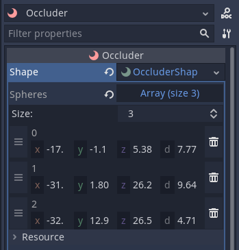
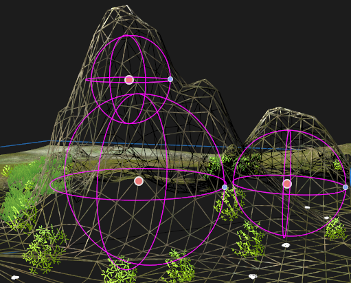
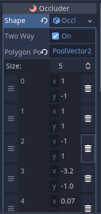
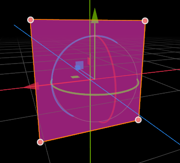
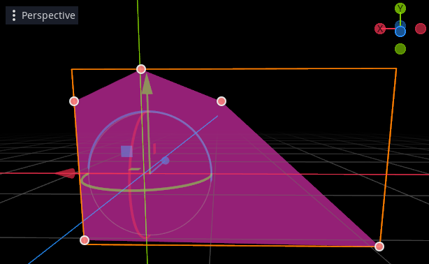
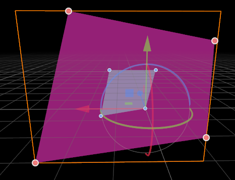

Occluder Nodes
==============

In addition to occlusion via `doc_rooms_and_portals`, Pandemonium also has the ability to provide basic occlusion using simple geometric `Occluder` nodes. These are geometric shapes that are shown in the editor using gizmos, but are invisible at runtime.

Any object that is fully occluded by the shape (behind or in some cases inside) will be culled at runtime. They are designed to be simple to use and inexpensive at runtime, but the trade off is they may not be as effective at culling as `doc_rooms_and_portals`. Nevertheless they can still significantly boost performance in some situations.

Note:
 It is important to understand that geometric occluders work by testing the axis aligned bounding box (`AABB`) of the occludee against the occluder. The AABB must be *fully occluded* to be culled. The consequence of this is that smaller objects are more likely to be effectively culled than larger objects, and larger occluders tend to be much more effective than smaller ones.

A major advantage to Occluder nodes is that they are fully dynamic. For example if you place an occluder node as a child of a spaceship, it will move as you move the parent object.

The reason that Occluder nodes are so cheap in performance terms is that the engine dynamically chooses the most relevant occluders at runtime, based on the current viewpoint of the Camera. This means you can often have hundreds of occluders present in the scene. Only the most relevant will be active at any one time.

The Occluder node itself is a holder for an OccluderShape resource, which determines the functionality. To get started, add an Occluder node to your scene tree.

Tip:
 You will see a yellow warning triangle that lets you know that you must set an OccluderShape from the inspector before the `Occluder` becomes functional.

OccluderShapeSphere
-------------------

The sphere is one of the simplest and fastest occluders, and is easy to setup and position. The downside is that the sphere only tends to make sense in certain game level designs, and is more suited to terrain or organic background geometry.

Once you have added an OccluderNode and chosen to add a new `OccluderShapeSphere` in the inspector, click the OccluderShapeSphere in the inspector to bring up the parameters.

Unlike many Nodes, the `OccluderShapeSphere` can store multiple spheres in the same object. This is more efficient in the engine, and keeps your SceneTree clearer. You don't have to store all your spheres in one Occluder as it could become tricky to manage, but it is perfectly reasonable to add 10 or so spheres or more. They are very cheap, and often the more you place, the better the match you will get to your geometry.

In order to store multiple spheres, they are stored as an Array. If you click on the Array in the inspector, you can increase the size of the Array to add one.

The sphere will appear as a small pink spherical object in the editor window. There are two handles on each sphere. The larger middle handle enables you to move the sphere around in the local space of the Occluder, and the small handle enables you to adjust the radius.

Although you can change the position of the sphere using the Occluder Node transform in the inspector, this moves *the entire array* of spheres. When you want to use multiple spheres in one occluder, the handles do this job. In order to allow positioning in 3D, the gizmo will only move the 3D position in the two principal axes depending on the viewpoint in the editor. This is easier for you to get the hang of by trying it out than by explanation.

Tip:
 There is one more handy function in the editor when using multiple spheres. If you click the `Center Node` toolbar button it will recalculate the local positions of the spheres relative to the average of the entire node, and change the transform of the Occluder Node. This is a handy convenience function to make it easier to place them.

At runtime the spheres can be switched on and off changing the Occluder node visibility, and the Node can be moved and scaled and rotated etc.

A common use case for occluder spheres is providing occlusion on mountainous / hilly terrain. By placing spheres inside mountains you can prevent trees, plants, building and objects rendering behind mountains. With some creativity they can also be used for moving objects such as large spacecraft, planets etc.

OccluderShapePolygon
--------------------

The polygon is a generalist occluder. It can be made to work well in almost all situations, and can quickly provide a degree of occlusion culling to most scenes.

As with all geometric occluders, the key to success is to make them large. They do not have to match rendered geometry, and in many cases they will work better if you extend them past rendered geometry to make them as big as possible (without blocking legitimate lines of sight). The reason why they need to be large is that in general, they will only cull objects whose `AABB` is completely hidden by the polygon. For large objects to be culled, you will need large occluders.

Note:
 Like all occluders, polygons **can** overlap, and in many cases they will work better if you overlap them (they are more likely to cull objects on boundaries).

Editing and details
~~~~~~~~~~~~~~~~~~~

Occluder polygons are edited as a list of points which define a *convex* polygon, on a single plane. In order to confine the polygon to a single plane, the points are defined in 2D space rather than 3D. The orientation, position and scale of the polygon is taken instead from the transform of the `Occluder` Node.

If you create an Occluder and add to it a `OccluderShapePolygon` resource, by default it will create 4 starting points forming a rectangle. If you move the position and rotation of the Occluder Node you will see how the rectangle follows the node. When the Occluder is selected in the editor, handles will appear for each of the points. You can actually click and drag these handles, to match your polygon to the environment of your scene.

You are not restricted to 4 points, you can add and remove points in the Inspector, but note that:

-  The editor will automatically sanitize your points to form a convex polygon. If you drag a point into a position that would form a concave polygon, it will be ignored.
-  In general, the less edges (and thus points), the faster the polygon will work at runtime. A polygon with 6 edges will have to make twice the calculations of a polygon with 3 edges. In most cases 4 is a good number.

Holes
~~~~~

Real world game levels don't always have large continuous areas that should be occluded. Often walls will have a door or windows, caves will have an entrance, etc. In some cases we have to make do by placing several OccluderShapePolygons around such an opening, but Occluder polygons have one more trick up their sleeve - they can have "holes".

In the inspector you will notice that as well as a set of points for the polygon, the polygon has a set of points for a single "hole". If you add 3 or 4 to your polygon, you will see they appear in the editor as smaller handles. You can drag these around just like the polygon handles, to form a convex hole.

The hole can be totally within the polygon (such as a window), abutting the edge (like a door) or crossing the edge of the polygon completely, to make the occluder concave. The way the hole works is that the culling follows a simple rule:

-  If the object to be culled is totally hidden by the polygon, it then looks to see whether it can be seen *through* the hole. If the object touches the hole, it is not culled, but if hidden by the polygon and not seen through the hole it is culled.

Note:
 Placing holes is usually far more convenient, and works faster and better at runtime, than creating lots of smaller OccluderShapePolygons.

Hole Limits
^^^^^^^^^^^

The main limitation of holes is that there can only be one per polygon. If you have a situation which requires two or more holes, you have a choice:

-  Combine the area of the two holes into one bigger hole (if they are close together).
-  Use two or more OccluderPolygons.

Tip:
 Remember that if you are using more than one polygon, they can overlap, and you should use this to your advantage.

How many Occluder polys are needed?
^^^^^^^^^^^^^^^^^^^^^^^^^^^^^^^^^^^

This very much depends on your scene, but generally you can start getting a good benefit from 3 or 4 well placed polygons. After that it is totally up to you how much time you want to spend.
Placing occluders is a bit of an art form, and you will get better at it and learn new tricks the more you work with them.

Some ideas:
^^^^^^^^^^^

-  Build your levels to take advantage of occlusion.

This is one of the secrets of the pros. A good level design is not just about what the gameplay demands, it should also be built with occlusion in mind.

-  When in a building with multiple floors, try placing an occluder polygon between each floor, with a hole for where the staircase transitions between them. This can potentially cull out entire floors and greatly improve performance.
-  Don't be afraid to extend your occluder polygons far past the edges of visible geometry to cull more objects - for instance far into the ground or sky.

Using polygons dynamically
~~~~~~~~~~~~~~~~~~~~~~~~~~

Like all geometric occluders, polygons are not confined to static (non-moving) geometry. You can place them on moving objects. You can even change the relative position of the points in realtime.

Some guidelines:

-  There is a slight cost to moving polygons, the points of the polygons must be transformed on the CPU each time their transform changes.

This is not something to worry excessively about, even CPUs are reasonably fast at transforming points, and generally polygons have very few points compared to rendered geometry. But it is something to consider, if you wanted to create e.g. 10,000 simultaneous spaceships all with occluder polys.

-  Changing the transform of the polygon Node (e.g. by moving the parent object) is cheaper than changing the points themselves. Use the former rather than the latter wherever possible.
