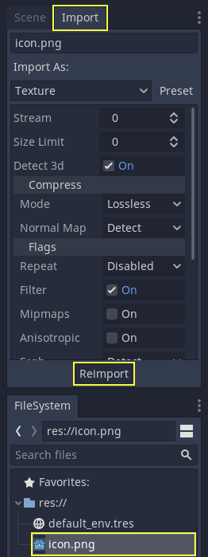
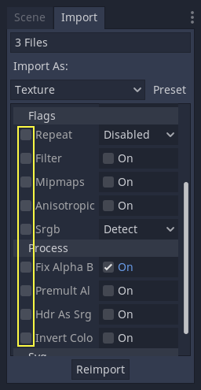
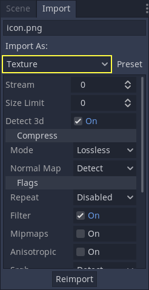
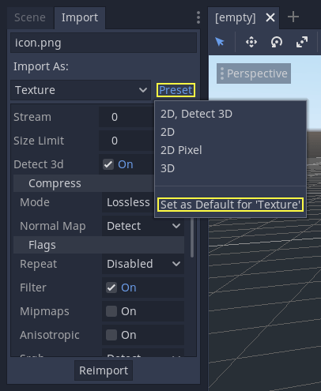

Import process
==============

Importing assets in Pandemonium 3.0+
------------------------------

Previously, importing assets in Pandemonium 2.x required manual maintenance
of a separate directory with source assets. Without doing this, it was
impossible to specify how to convert and change import flags for
textures, audio files, scenes, etc.

In Pandemonium 3.0+, we use a more modern approach to importing: Simply drop
your assets (image files, scenes, audio files, fonts, etc) directly in the
project folder (copy them manually with your OS file explorer).
Pandemonium will automatically import these files internally
and keep the imported resources hidden in a `res://.import` folder.

This means that when trying to access imported assets through code you
need to use the `Resource Loader( ResourceLoader )` as it will
automatically take into account where the internal files are saved. If you
try and access an imported asset using the `File` class
it will work in the editor, but break in the exported project.

However, the `Resource Loader( ResourceLoader )` cannot access
non imported files, only the `File` class can.

Changing import parameters
--------------------------

To change the import parameters of an asset in Pandemonium (again, keep in mind
import parameters are only present in non-native Pandemonium resource types)
select the relevant resource in the filesystem dock:

Then, after adjusting the parameters, press "Reimport". These parameters
will only be used for this asset and on future reimports.

Changing the import parameters of several assets at the same time is also
possible. Simply select all of them together in the resources dock and the
exposed parameters will apply to all of them when reimporting.

Reimporting multiple assets
---------------------------

While working on a project you may find that several assets need to have
the same parameters changed, such as enabling mipmaps, but you only want
those specific parameters changed. To do this, select every asset you want
to reimport in the file system. In the import tab there will now be a
checkbox to the left of every import parameter.

Select the checkbox of the parameters you want to change on your imported
assets, then change the parameters normally. Finally, click the reimport
button and every selected asset will be reimported with only those
parameters changed.

Automatic reimport
------------------

When the MD5 checksum of the source asset changes, Pandemonium will perform an
automatic reimport of it, applying the preset configured for that specific
asset.

Files generated
-----------------

Importing will add an extra `<asset>.import` file, containing the import
configuration. Make sure to commit these to your version control system!

Additionally, extra assets will be preset in the hidden `res://.import` folder:

If any of the files present in this folder is erased (or the whole folder), the
asset or assets will be reimported automatically. As such, committing this folder
to the version control system is optional. It can shorten
reimporting time when checking out on another computer, but it takes considerably
more space and transfer time. Pick your poison!

Changing import resource type
-----------------------------

Some source assets can be imported as different types of resources.
For this, select the relevant type of resource desired and
press "Reimport":

Changing default import parameters
-----------------------------------

Different types of games might require different defaults.
Changing the defaults per project can be achieved by using the
"Preset.." Menu. Besides some resource types offering presets,
the default setting can be saved and cleared too:

Simplicity is key!
------------------

This is a very simple workflow which should take very little time to get used to. It also enforces a more
correct way to deal with resources.

There are many types of assets available for import, so please continue reading to understand how to work
with all of them!
