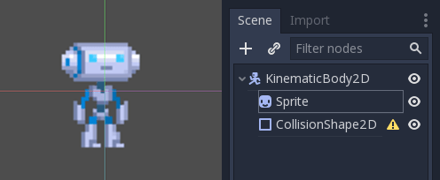
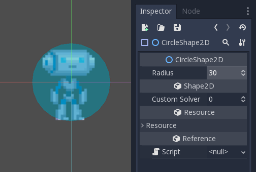
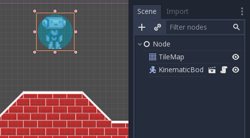

Kinematic character (2D)
========================

Introduction
~~~~~~~~~~~~

Yes, the name sounds strange. "Kinematic Character". What is that?
The reason for the name is that, when physics engines came out, they were called
"Dynamics" engines (because they dealt mainly with collision
responses). Many attempts were made to create a character controller
using the dynamics engines, but it wasn't as easy as it seemed. Pandemonium
has one of the best implementations of dynamic character controller
you can find (as it can be seen in the 2d/platformer demo), but using
it requires a considerable level of skill and understanding of
physics engines (or a lot of patience with trial and error).

Some physics engines, such as Havok seem to swear by dynamic character
controllers as the best option, while others (PhysX) would rather
promote the kinematic one.

So, what is the difference?:

-  A **dynamic character controller** uses a rigid body with an infinite
   inertia tensor. It's a rigid body that can't rotate.
   Physics engines always let objects move and collide, then solve their
   collisions all together. This makes dynamic character controllers
   able to interact with other physics objects seamlessly, as seen in
   the platformer demo. However, these interactions are not always
   predictable. Collisions can take more than one frame to be
   solved, so a few collisions may seem to displace a tiny bit. Those
   problems can be fixed, but require a certain amount of skill.
-  A **kinematic character controller** is assumed to always begin in a
   non-colliding state, and will always move to a non-colliding state.
   If it starts in a colliding state, it will try to free itself like
   rigid bodies do, but this is the exception, not the rule. This makes
   their control and motion a lot more predictable and easier to
   program. However, as a downside, they can't directly interact with
   other physics objects, unless done by hand in code.

This short tutorial will focus on the kinematic character controller.
Basically, the old-school way of handling collisions (which is not
necessarily simpler under the hood, but well hidden and presented as a
nice and simple API).

Physics process
~~~~~~~~~~~~~~~

To manage the logic of a kinematic body or character, it is always
advised to use physics process, because it's called before physics step and its execution is
in sync with physics server, also it is called the same amount of times
per second, always. This makes physics and motion calculation work in a
more predictable way than using regular process, which might have spikes
or lose precision if the frame rate is too high or too low.

gdscript GDScript

```
    extends KinematicBody2D

    func _physics_process(delta):
        pass
```


Scene setup
~~~~~~~~~~~

To have something to test, here's the scene (from the tilemap tutorial):
:download:`kbscene.zip <files/kbscene.zip )`. We'll be creating a new scene
for the character. Use the robot sprite and create a scene like this:



You'll notice that there's a warning icon next to our CollisionShape2D node;
that's because we haven't defined a shape for it. Create a new CircleShape2D
in the shape property of CollisionShape2D. Click on <CircleShape2D> to go to the
options for it, and set the radius to 30:



**Note: As mentioned before in the physics tutorial, the physics engine
can't handle scale on most types of shapes (only collision polygons,
planes and segments work), so always change the parameters (such as
radius) of the shape instead of scaling it. The same is also true for
the kinematic/rigid/static bodies themselves, as their scale affects the
shape scale.**

Now, create a script for the character, the one used as an example
above should work as a base.

Finally, instance that character scene in the tilemap, and make the
map scene the main one, so it runs when pressing play.



Moving the kinematic character
~~~~~~~~~~~~~~~~~~~~~~~~~~~~~~

Go back to the character scene, and open the script, the magic begins
now! Kinematic body will do nothing by default, but it has a
useful function called
`KinematicBody2D.move_and_collide()`.
This function takes a `Vector2` as
an argument, and tries to apply that motion to the kinematic body. If a
collision happens, it stops right at the moment of the collision.

So, let's move our sprite downwards until it hits the floor:

gdscript GDScript

```
    extends KinematicBody2D

    func _physics_process(delta):
        move_and_collide(Vector2(0, 1)) # Move down 1 pixel per physics frame
```

The result is that the character will move, but stop right when
hitting the floor. Pretty cool, huh?

The next step will be adding gravity to the mix, this way it behaves a
little more like a regular game character:

gdscript GDScript

```
    extends KinematicBody2D

    const GRAVITY = 200.0
    var velocity = Vector2()

    func _physics_process(delta):
        velocity.y += delta * GRAVITY

        var motion = velocity * delta
        move_and_collide(motion)
```

Now the character falls smoothly. Let's make it walk to the sides, left
and right when touching the directional keys. Remember that the values
being used (for speed at least) are pixels/second.

This adds simple walking support by pressing left and right:

gdscript GDScript

```
    extends KinematicBody2D

    const GRAVITY = 200.0
    const WALK_SPEED = 200

    var velocity = Vector2()

    func _physics_process(delta):
        velocity.y += delta * GRAVITY

        if Input.is_action_pressed("ui_left"):
            velocity.x = -WALK_SPEED
        elif Input.is_action_pressed("ui_right"):
            velocity.x =  WALK_SPEED
        else:
            velocity.x = 0

        # We don't need to multiply velocity by delta because "move_and_slide" already takes delta time into account.

        # The second parameter of "move_and_slide" is the normal pointing up.
        # In the case of a 2D platformer, in Pandemonium, upward is negative y, which translates to -1 as a normal.
        move_and_slide(velocity, Vector2(0, -1))
```

And give it a try.

This is a good starting point for a platformer. A more complete demo can be found in the demo zip distributed with the
engine, or in the
https://github.com/pandemoniumengine/pandemonium-demo-projects/tree/master/2d/kinematic_character.
